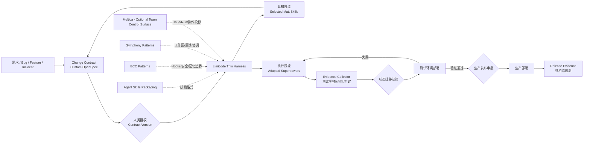

# AI Native Harness 开源项目深度调研与选型建议

> 调研日期：2026-09-17  
> 调研对象：Matt Pocock Skills、obra/superpowers、Fission-AI/OpenSpec、affaan-m/ECC、Multica，以及 Agent Skills、OpenAI Symphony、GitHub Spec Kit、OPA、Argo Rollouts、OpenTelemetry、OpenHands  
> 目标：不是选择一个“最好用的 Agent 工具”，而是判断哪些开源能力可以支撑已经对齐的 AI Native 软件研发新范式。

---

## 一、结论先行

四个核心项目并不是同一层面的竞品：

| 项目 | 本质定位 | 最适合承担的职责 | 不应承担的职责 | 建议 |
|---|---|---|---|---|
| Matt Pocock Skills | 可组合的工程判断与访谈方法库 | 意图澄清、领域建模、诊断、架构审视、双轴评审 | Change 生命周期、审批、部署编排 | **选择性吸收** |
| Superpowers | 强约束、可验证的软件开发执行方法 | 工作区隔离、TDD、调试、验证、代码评审、任务执行 | 成为业务意图与 Change 的唯一真相源 | **作为执行内核改造使用** |
| OpenSpec | Spec/Change 工件与依赖图 | Change Contract、规格增量、设计/任务工件、机器可读状态 | Runtime、策略执行、真正的阶段门禁、部署闭环 | **作为契约与工件底座** |
| ECC | 大型 Agent Harness 能力集合与参考架构 | Hooks、安全、记忆信任边界、能力盘点、自改进闭环参考 | V1 的整套基础设施 | **参考并择取，不整体引入** |
| Multica | 人机协作工作台与多 Runtime 控制面 | Issue/Agent/Squad 协作、运行队列、审计记录、远程 Runtime 管理 | Change Contract、证据门禁、开发方法、CI/CD 闭环 | **V1 参考，团队化阶段再评估接入** |

推荐的组合不是“Matt + Superpowers + OpenSpec + ECC 全量安装”，而是：

> **以自定义 OpenSpec 为契约底座，以 cimicode 为 Runtime，以精选 Matt Skills 负责认知与决策，以裁剪后的 Superpowers 负责工程执行，再由一个自研的薄 Harness 负责状态迁移、人工授权、证据归集和部署编排。**

ECC、OpenAI Symphony、Agent Skills 等项目为这个薄 Harness 提供设计参考，但不成为新的中心平台。Multica 则代表另一条更重的路线：建设带数据库、协作 UI、权限和远程 Runtime 的团队控制面；它对后续多人多 Agent 运营有价值，但不应成为 V1 的前置依赖。

这一组合与此前已经确认的原则一致：

- Change 是最小交付单元，同一项目可并存多个处于不同状态、不同 N 等级的 Change；
- N1–N5 是价值/自治成熟度的上层模型，不直接充当细粒度工作流状态；
- Change Contract 是授权边界，Agent 只能在已授权版本内执行；
- Repo 保存持久真相，cimicode 承担运行时协调，不额外建设独立 Control Plane 数据库；
- V1 采用 A1 监督式自治：测试环境内可以自动迭代，所有生产发布必须人工明确批准；
- 阶段门禁不检查“文件是否存在”，而检查 Decision Package 中的证据是否足以支持下一次状态迁移。

---

## 二、评估框架

本次不是按 Star 数或功能数量评估，而是按新范式真正需要的七类能力评估：

1. **契约能力**：是否能表达意图、边界、验收标准、风险和授权版本；
2. **生命周期能力**：是否支持一个 Change 的状态迁移、并发 Change 和中断恢复；
3. **执行能力**：是否能把计划稳定地转化为代码、测试和可审查变更；
4. **证据能力**：是否要求以测试、检查、部署结果支持“已完成”的判断；
5. **治理能力**：是否具备权限、审批、安全、审计、策略和信任边界；
6. **反馈闭环**：是否覆盖测试部署、生产发布、运行反馈与回滚；
7. **Runtime 适配性**：是否能被 cimicode/OpenCode 接入，而不反客为主。

下面的评分表示“对本方案的适配度”，不是对项目质量的普遍评价，5 分为最高。

| 项目 | 契约 | 生命周期 | 执行 | 证据 | 治理 | 部署反馈 | cimicode 适配 |
|---|---:|---:|---:|---:|---:|---:|---:|
| Matt Skills | 2 | 1 | 3 | 3 | 1 | 1 | 4 |
| Superpowers | 2 | 2 | 5 | 5 | 3 | 1 | 4 |
| OpenSpec | 5 | 4 | 1 | 2 | 2 | 1 | 4 |
| ECC | 2 | 2 | 4 | 4 | 4 | 2 | 2 |
| Multica | 2 | 3 | 3 | 4 | 3 | 1 | 3（协议兼容时） |
| OpenAI Symphony | 2 | 4 | 3 | 3 | 3 | 1 | 参考价值 5 |

没有一个项目独立覆盖完整闭环。这不是偶然：它们分别解决“Agent 应如何思考”“Agent 应如何开发”“Change 如何表达”“Agent Harness 如何增强”或“多个任务如何调度”，而用户要构建的是这些能力之上的研发操作系统。

---

## 三、五个核心项目深度判断

## 3.1 Matt Pocock Skills：放大工程判断，不接管流程

### 它解决了什么

Matt Pocock 明确反对由单一框架“接管整个流程”，强调技能应当小型、可修改、可组合并与模型无关。其核心不是自动生成更多代码，而是修复 Agent 的几个常见失效模式：意图错位、缺少共享语言、反馈回路不足和代码熵加速。[项目 README](https://github.com/mattpocock/skills)

其中最值得纳入本范式的能力是：

- `grill-with-docs`：不只追问需求，还持续建立领域语言、`CONTEXT.md` 与 ADR；
- `domain-modeling`：挑战模糊术语，用边界场景检验领域模型；
- `prototype`：通过一次性原型回答设计问题，而不是提前建设正式系统；
- `diagnosing-bugs`：建立“复现为红 → 最小化 → 假设 → 插桩 → 修复 → 回归”的诊断闭环；
- `codebase-design` / `improve-codebase-architecture`：抑制 Agent 加速产生的架构熵；
- `code-review`：将“是否符合工程标准”与“是否忠实实现规格”拆成两个独立评审轴。

### 它与新范式的契合点

它非常适合 Change Contract 形成前后的“认知工作”。尤其是 `grill-with-docs`，可以成为复杂 Change 的意图澄清器：把模糊需求转化为稳定术语、决策记录、边界条件和待确认问题。

Matt 将用户显式调用的编排技能和模型自动调用的工程技能分开，这对 cimicode 的 Skill Router 很有价值：**编排权在 Harness，专业方法在 Skill**，不能让某个 Skill 自己决定完整生命周期。

### 局限与改造要求

- 它没有统一 Change 状态、审批、权限、部署和审计机制；
- `to-spec`、`to-tickets`、`implement` 会与 OpenSpec/Superpowers 产生职责重叠；
- Skills 自身主要是提示与方法，不能把“Agent 按要求做了”当成可强制保证；
- 上游会持续更新，不应在企业流程中自动漂移。

### 采用建议

不要全量安装后让模型自由触发。应当选择、Fork、固定版本，并对每个技能增加 Skill Contract：

- 允许在哪类 Change、哪个内部状态被调用；
- 输入必须来自哪个 Contract 版本；
- 允许使用哪些工具、数据和外部副作用；
- 必须输出哪些结构化工件与证据；
- 失败、信息不足和越界时如何返回；
- 哪些测试用例证明该 Skill 在升级后仍保持预期行为。

建议 V1 引入：`grill-with-docs`、`domain-modeling`、`prototype`、`diagnosing-bugs`、`codebase-design`、`code-review`。暂不引入 `to-spec`、`to-tickets` 和 `implement`，避免产生第二套权威规格与任务系统。

---

## 3.2 Superpowers：强执行内核，但不能成为总流程

### 它解决了什么

Superpowers 把 Agent 软件开发定义成一套强制方法：先做 brainstorming，再创建隔离工作区、形成实施计划、按任务执行、进行 TDD、代码评审，最后完成分支。项目强调“证据高于声明”，其 Skills 被设计为必须遵守的工作流，而非可有可无的建议。[项目 README](https://github.com/obra/superpowers)

它最有价值的部分不是 brainstorming，而是执行纪律：

- `using-git-worktrees`：为 Change 创建隔离工作区；
- `test-driven-development`：以红绿重构形成高频反馈；
- `systematic-debugging`：在修复前先定位根因；
- `verification-before-completion`：禁止在没有新鲜证据时声明完成；
- `subagent-driven-development`：任务执行、规格符合性评审、代码质量评审分离；
- `requesting-code-review` / `finishing-a-development-branch`：规范变更交付与收尾。

Superpowers 还维护专门的 eval 仓库来检验技能是否真正改变 Agent 行为，这比“写了一份很好的 SKILL.md”更接近可工程化的 Harness。[superpowers-evals](https://github.com/obra/superpowers-evals)

### 它与新范式的契合点

它适合作为 Change 进入“允许实施”之后的执行内核。其 TDD、调试、验证和双重评审机制能够直接支持 Delivery Evidence，而不是让 Agent 用自然语言自证完成。

其 subagent 模式中“实施者、规格评审者、质量评审者分离”的思想值得保留，即使 V1 暂时不真正并发运行多个 Agent，也应在逻辑上保持不同评审上下文，减少同一模型自我确认。

### 主要冲突

1. **双重权威**：Superpowers 默认把自己的 brainstorming/plan 当作流程起点，而本范式必须以当前 Change Contract 版本为授权源；
2. **双重任务图**：Superpowers 通常将计划写入 `docs/plans`，OpenSpec 又维护 `tasks`，会出现两个完成度；
3. **一刀切 TDD**：TDD 对多数业务功能和缺陷很有效，但对配置变更、文档、探索性原型、紧急缓解措施不应机械强制；
4. **“强制技能”越权**：其 bootstrap 思路可能优先于 Harness 的状态与风险策略；
5. **止于分支/PR**：它不负责测试环境部署循环、生产审批和上线清单。

### 采用建议

将 Superpowers 拆成“执行能力包”，而非引入其整套总流程：

- OpenSpec/Change Contract 是唯一规格和任务权威；
- Harness 根据 Change Profile 生成 Execution Package，Superpowers 只能消费它；
- `writing-plans` 的输出应回写 OpenSpec 的 design/tasks，而不是产生平行目录；
- TDD 是 Feature/Bugfix 的默认策略，但可由 Profile 明确替换为迁移演练、契约测试、快照验证或人工检查；
- `verification-before-completion` 只生成候选证据，是否允许状态迁移仍由 Harness 与人工门禁决定；
- 保留 OpenCode 适配层，但锁定版本并运行本地行为 eval。官方仓库已经包含 OpenCode 安装/适配内容，但跨 Harness 移植仍取决于技能发现、文件、Shell、子 Agent 等底层能力。[移植说明](https://github.com/obra/superpowers/blob/main/docs/porting-to-a-new-harness.md)

---

## 3.3 OpenSpec：最接近 Change Contract，但仍只是协议层

### 它解决了什么

OpenSpec 的核心模型与我们已经形成的模型高度接近：`specs` 表达当前系统真相，`changes` 表达一个待实施工作单元，Change 通过 delta spec 描述新增、修改和删除，并由 proposal、specs、design、tasks 等工件组成；归档时再将 delta 合并回主规格。[OpenSpec Overview](https://github.com/Fission-AI/OpenSpec/blob/main/docs/overview.md)

它还提供了适合 Runtime 接入的机器接口：状态、工件依赖、apply 指令、任务进度以及 `blocked / all_done / ready` 等结构化结果，可以避免 cimicode 解析自由文本。[Agent Contract](https://github.com/Fission-AI/OpenSpec/blob/main/docs/agent-contract.md)

OpenSpec 支持：

- 同一 Repo 内存在多个并行 Change；
- 中断后按工件状态恢复；
- 自定义 schema，以有向依赖图定义不同工件；
- 对 Change 完整性、一致性和正确性执行 verify；
- 归档后把变更增量合并到长期规格。

这些能力使它成为四个项目中最适合承载 Change Contract 的底座。

### 为什么不能直接原样采用

OpenSpec 自己强调工件是“enablers, not gates”，允许回访和调整，不试图做刚性阶段门禁。这一点适合探索，但意味着它不会替我们完成状态授权。[工作流说明](https://github.com/Fission-AI/OpenSpec/blob/main/docs/workflows.md)

更关键的是：自定义 schema 主要校验工件及其依赖是否存在，模板中的规则和指导仍属于 Agent 提示，并不是可强制执行的策略；`verify` 也不会自动阻止归档。[自定义说明](https://github.com/Fission-AI/OpenSpec/blob/main/docs/customization.md)

因此，OpenSpec 不等于：

- Change 状态机；
- 人工审批系统；
- 策略引擎；
- Agent Runtime；
- 测试与部署编排器；
- 生产反馈闭环。

### 应如何改造成 Change Contract 底座

建议 Fork 或自建 OpenSpec Schema，形成下列工件图：

```text
Change Contract
├── Intent Decision Package
│   ├── outcome / non-goals / constraints
│   ├── scenarios / acceptance / open questions
│   └── contract version + human authorization
├── Execution Decision Package
│   ├── design / task graph / affected modules
│   ├── risk / verification strategy
│   └── execution authorization
├── Delivery Evidence Package
│   ├── diff / tests / static checks / reviews
│   └── residual risks
└── Test & Release Evidence Package
    ├── test-env deploy and validation history
    ├── production checklist / rollback plan
    └── production approval and deployment result
```

Change Contract 的元数据至少包括：

- `change_id`、`type/profile`、N 等级、风险等级、责任人；
- 当前状态和请求迁移的目标状态；
- 当前授权的 Contract 版本与版本差异；
- 目标结果、范围、非目标、约束和验收标准；
- 所需证据、人工决策点和审批记录；
- 代码、构建物、环境、部署与回滚引用。

需要修改 OpenSpec 的一句隐含假设：“specs are truth”只能解释为**产品行为规格的长期真相**。完整交付真相来自多个相互关联的来源：Change Contract、代码、测试结果、构建物、环境状态、部署记录和人工授权，不能由 Markdown 单独代表。

---

## 3.4 ECC：最像 Harness 百科全书，但不适合成为 V1 底座

### 它解决了什么

ECC 将 Skills、Agents、Commands、Hooks、Rules、Memory、安全扫描和持续学习打包成大型 Harness 增强系统。它不仅关注开发方法，也关注运行时拦截、记忆沉淀、能力发现、上下文优化和安全。[项目 README](https://github.com/affaan-m/ECC)

对本方案最有价值的不是“大量技能”，而是四个设计观念：

1. **Hooks 是确定性边界**：提示负责指导，Hook 负责在工具调用前后执行可验证动作；
2. **记忆不是策略**：本地 Memory Vault 是可检查的上下文，但不应被视为已经审查的可执行规则；
3. **安全独立于模型自觉**：对命令、提示注入、密钥和危险模式进行独立检查；
4. **自改进需要晋升流程**：观察 → 提案 → 验证 → 晋升 → 回滚，而不是 Agent 学到一次经验就立刻改写全局规则。

ECC 2.0 参考架构提出 Operator Surface、Harness Adapter、Session/Queue Runtime、Observability/Evaluation 和 Security 等分层，对未来 cimicode Harness 的模块边界很有参考价值。[ECC 2.0 Reference Architecture](https://github.com/affaan-m/ECC/blob/main/docs/ECC-2.0-REFERENCE-ARCHITECTURE.md)

### 为什么不建议整体采用

- 能力面很大，会与 Matt、Superpowers、OpenSpec 产生大量重复触发器和规则冲突；
- 技能数量不是优势本身：它扩大了上下文、路由歧义、供应链和版本治理面；
- ECC 以 Claude Code 为主要成熟环境，OpenCode 适配仍标注为 beta/能力受限；
- Windows 原生环境的部分 Memory/Hook 路径存在已知限制；
- 2.0 文档中的不少组件使用 `should`、`backlog` 或 reference architecture 表述，应视为路线与设计建议，而不是全部已经稳定实现的产品能力。

### 采用建议

V1 不安装完整 ECC。选择性借鉴或移植：

- Hook Profile：按 Change Profile 决定允许/禁止/需审批的工具动作；
- Memory Trust Boundary：记忆只作为线索，晋升为规范必须有人审查并通过 eval；
- 安全扫描：危险命令、凭据泄漏、提示注入与依赖风险；
- Skill Inventory：记录来源、版本、校验和、权限与兼容性；
- Improvement Proposal：将失败模式转化为可审查的 Skill/Rule 修改提案。

这些能力应融入自研薄 Harness，而不是再叠加一个会竞争控制权的“大 Harness”。

---

## 3.5 Multica：成熟度较高的人机协作控制面，但不是研发范式本身

### 它究竟是什么

[Multica](https://github.com/multica-ai/multica) 不是 Matt Skills/Superpowers 一类开发方法库，也不是 OpenSpec 一类规格协议。它是一个可自托管的人机协作工作台：由 Web/Desktop/Mobile、Go Backend、PostgreSQL 和运行在开发机器上的 Agent Daemon 组成；服务端保存 Issue、Agent、评论、状态与 Run 记录，Daemon 在本机领取 Run，再启动 Codex、Claude Code、OpenCode 等 CLI。[工作原理](https://multica.ai/docs/how-multica-works)

它的核心对象模型是：

- `Workspace`：团队、配置和权限边界；
- `Project`：组织一组 Issue，并绑定仓库或本地目录；
- `Issue`：日常工作的基本单元，可表示 Feature、Bug 或 Investigation；
- `Agent`：名称、指令、模型、Skills、访问范围和 Runtime 的持久配置；
- `Run`：Agent 的一次具体执行记录，一个 Issue 可以产生多个 Run；
- `Runtime`：一台连接的电脑加一种 Agent CLI；
- `Squad`：由 Leader Agent 路由给其他 Agent 或人的协作组；
- `Autopilot`：定时或 Webhook 触发的自动工作。

Multica 把“人和 Agent 出现在同一看板上”做得比前述项目完整：Issue 分派、运行队列、心跳、并发目录锁、失败分类、有限重试、会话续接、实时执行日志、工具调用回放、Token 使用、通知、角色权限和自托管均已进入产品结构。[Core Concepts](https://multica.ai/docs/concepts) [Runs](https://multica.ai/docs/tasks)

因此，它更接近此前讨论过但 V1 暂不建设的 **Control Plane / Collaboration Plane**，而 cimicode 仍属于真正执行代码与 Skills 的 **Agent Runtime**。

### 最值得借鉴的能力

1. **Issue 与 Run 分离**：一次 Run 完成不等于工作完成，历史 Run 不覆盖；这与“Agent 执行成功不等于 Change 达成”完全一致；
2. **本地执行、中心协调**：代码与 CLI 凭据留在执行机器，服务端负责任务、协作和运行记录；
3. **运行事件可见**：工具调用、命令、错误和进度都进入 Execution Log，适合构建 Agent 可观测性；
4. **错误分类与选择性重试**：只对 Runtime 离线、网络中断、Daemon 恢复等瞬态错误自动重试，而认证、配额、配置和模型问题要求修复后人工重试；
5. **Agent / Runtime 分离**：Agent 是职责与能力配置，Runtime 是执行环境，避免把角色绑定到某台机器或某个模型；
6. **Run-scoped 身份**：Run 使用受限 API Token，不能通过平台 API 冒充其他 Agent 或用户；
7. **Squad Leader 负责路由而不是亲自实施**：适合作为未来多 Agent 调度的参考，且最终 `done` 留给人类或明确集成；
8. **Autopilot 具有触发记录、幂等键、失败历史和自动暂停**，比直接使用 cron 启动 Agent 更可运营。[Squads](https://multica.ai/docs/squads) [Autopilots](https://multica.ai/docs/autopilots)

### 与 Change Contract 范式的关键冲突

#### 1. Issue 太轻，不能直接等同于 Change Contract

Multica 的 Issue 可以只有标题，主要保存描述、评论、状态、负责人和执行历史；它没有原生表达 Contract Version、Profile、风险、必需证据、决策包、环境部署与授权版本。Issue 可以作为协作入口或 Change 的投影，但不能成为权威 Change Contract。[Issues](https://multica.ai/docs/issues)

#### 2. 状态流不是证据驱动的状态机

Multica 内置 `backlog / todo / in_progress / in_review / done / blocked / cancelled`，但官方明确说明状态之间没有固定流转规则，成员和 Agent 可以直接修改。Agent 开始工作会改为 `in_progress`，交付结果会改为 `in_review`。这适合通用任务看板，但不满足“只有 Decision Package 和授权才能迁移”的要求。

#### 3. Run Log 不是 Delivery Evidence

完整 Transcript 和工具调用历史解决了可观察性与审计问题，但它们仍是原始运行事实。测试是否覆盖验收标准、构建物是否对应当前 Contract、测试环境是否验证通过、生产 checklist 是否完成，仍需 Harness 生成结构化 Evidence Package。

#### 4. 没有测试到生产的交付状态机

Multica 的默认路径以 Issue 从执行到 Review 为中心，并不原生编排测试环境部署、修复重部署、生产审批、回滚计划和生产部署结果。因此它不能取代 CI/CD Adapter 或 Release Evidence。

#### 5. 默认安全边界与 A1 监督式自治不一致

Multica 明确说明：Daemon 子进程默认拥有运行它的操作系统用户全部权限，不提供文件系统沙箱保证；无人值守运行时，Codex 默认可使用 `danger-full-access`，Claude Code 默认使用 bypass permissions。官方建议通过专用 Unix 用户、容器或 VM 建立外部隔离边界。[Security Model](https://multica.ai/docs/security-model)

这意味着不能把它直接装在开发者个人账号下并连接生产凭据。若未来采用，至少需要：专用执行身份、最小权限凭据、每个环境独立 Runtime、网络出口限制，以及生产动作必须回到 Harness 审批。

#### 6. Skill 更新机制需要额外治理

Multica 能导入 `SKILL.md`、附件、脚本和模板，也能从 GitHub/Skills.sh 更新。但从上游刷新会直接替换 Skill 内容并覆盖本地编辑；它保留来源引用，却没有替代前面定义的 Skill Contract、行为 eval 和晋升流程。[Skills](https://multica.ai/docs/skills)

#### 7. 许可证不是纯 Apache 2.0

仓库采用带附加条件的 `Multica License`：组织内部使用不要求商业许可，但向第三方提供托管服务、商业产品嵌入、品牌修改和再分发有额外条件。若只是企业内部自托管，文本允许该场景；若将其嵌入 cimicode 产品或对外服务，需要法务评估或商业授权。[LICENSE](https://github.com/multica-ai/multica/blob/main/LICENSE)

### 与 cimicode 的关系

Multica 已支持 OpenCode，并允许创建 Custom Runtime Profile，但自定义 Profile 只能选择已有的协议族，不能定义新的通信协议。[Custom Runtime Profiles](https://github.com/multica-ai/multica/blob/main/docs/custom-runtimes.md)

因此有三种关系：

| 关系 | 做法 | 判断 |
|---|---|---|
| 替代 cimicode | 直接使用 Multica + 现有 Agent CLI | 不推荐；Multica 本身也不提供模型执行能力，仍需底层 CLI，而且会放弃 cimicode 的 Harness 定制 |
| Multica 调度 cimicode | 将 cimicode 包装成 OpenCode 兼容 Runtime，由 Multica Daemon 启动 | 技术上最值得验证，但必须确认协议、会话续接、事件解析和权限参数兼容 |
| cimicode 独立，Multica 只作协作面 | Change 状态由 cimicode/Repo 掌握，Multica 通过 API/Webhook 展示与触发 | 架构最稳，但集成工作较多，且需要避免双状态源 |

如果未来接入，推荐第三种或第二种，绝不能让 Multica Issue 状态取代 Change Contract 状态。

### 推荐的语义映射

| Multica 对象 | 本范式中的定位 | 权威性 |
|---|---|---|
| Issue | Change 的协作入口/看板投影 | 非权威；保存 `change_id` 与摘要 |
| Issue Status | Change 状态的 UI 投影 | 只读或由 Harness 同步 |
| Run | 一次 Execution Attempt | 是运行事实，不是完成结论 |
| Execution Log | Raw Runtime Evidence | 进入证据归集器后才能参与决策 |
| Agent | 可执行角色配置 | 不等于组织角色或审批人 |
| Skill | 技能分发快照 | 必须受 Skill Contract 和版本锁约束 |
| Squad | 路由与协调机制 | 无状态授权权力 |
| Autopilot | 低风险触发器 | 不能绕过 Change 创建和人工门禁 |
| Project | 一组 Change/Issue 的协作容器 | 不等于 Repo 或产品规格真相 |

### 最终采用判断

**V1：不作为依赖引入，但应把它作为重要产品参考。** 当前目标是单人/小团队、Repo 持久化、本地 cimicode 和 CI/CD 闭环；引入 Multica 会同时引入 PostgreSQL、服务端、Daemon、协作 UI 和第二套 Issue 状态，扩大范围且重新引入此前暂缓的 Control Plane。

**V2/V3：当出现多人、多机器、多 Agent 队列和统一运营诉求时，做一个限界 PoC。** PoC 只验证：

1. cimicode 能否作为 OpenCode 协议兼容 Runtime 被稳定启动；
2. Change Contract 能否通过 `change_id` 与 Multica Issue/Run 双向关联；
3. Agent 是否能被禁止直接决定权威 Change 状态；
4. Execution Log 能否结构化导出给 Evidence Collector；
5. 独立容器/VM Runtime 能否满足安全与凭据隔离；
6. 许可证是否覆盖预期部署和二次集成方式。

Multica 的真正价值不是定义新范式，而是展示当范式扩展到团队协作时，Agent 如何成为可分派、可观察、可审计的“数字团队成员”。它补的是协作与运营面，不是 Change Contract、工程方法和交付闭环本身。

---

## 四、三个组合方案及取舍

## 方案 A：以 ECC 为总 Harness

优点是开箱覆盖面广，安全、记忆、Hooks 和技能目录看起来完整。缺点是 OpenCode 适配成熟度、Windows 限制、重复能力和复杂性都与 V1 目标冲突，而且 cimicode 会退化为 ECC 的执行壳。

**判断：不推荐。** 可以用于能力盘点和设计参考，不能作为总架构。

## 方案 B：四个项目全量叠加

表面上能力最全，实际会出现至少四套入口、三套计划/任务表达、多个 Skill Router，以及谁有权批准“完成”的冲突。Agent 的上下文还会被大量重复方法污染。

**判断：强烈不推荐。** 这会把“AI Native 新范式”做成工具拼盘。

## 方案 C：薄 Harness + 强契约（推荐）

只保留一个权威 Change Contract、一个状态机和一个 Runtime。开源项目都作为可替换能力模块接入：



这个方案的关键不是组合更多工具，而是把控制权放在正确的位置：

- OpenSpec 管“Change 说了什么”；
- Skill 管“某类认知或工程任务怎么做好”；
- cimicode 管“现在允许做什么、调用谁、何时停止”；
- CI/CD 管“代码与部署实际上发生了什么”；
- 人管“风险与价值判断是否允许继续”。

---

## 五、推荐补充调研与采用的开源项目

## 5.1 Agent Skills：技能包装基线，建议采用

[Agent Skills](https://github.com/agentskills/agentskills) 是一个轻量开放格式：每个 Skill 至少包含 `SKILL.md`，可附带 scripts、references、assets，并通过逐级加载减少上下文占用。[格式规范](https://github.com/agentskills/agentskills/blob/main/docs/specification.mdx)

建议把它作为 cimicode 的技能目录标准，但不能把它等同于企业级 Skill Contract。当前标准主要规范名称、描述、目录和渐进加载，`allowed-tools` 仍是实验字段；触发条件、风险、版本、输出证据、eval、回退和审批语义仍需自定义扩展。

建议新增 `skill.contract.yaml`：

```yaml
id: systematic-debugging
source: obra/superpowers
version: <pinned-commit>
profiles: [bugfix, incident]
allowed_states: [implementation, test-failed]
inputs: [change-contract, failure-evidence]
outputs: [root-cause-report, regression-evidence]
side_effects: workspace-only
approval: none
eval_suite: evals/systematic-debugging
fallback: human-escalation
```

## 5.2 OpenAI Symphony：Runtime/协调架构参照，建议重点借鉴

[OpenAI Symphony](https://github.com/openai/symphony) 的 Draft v1 规范描述了一个长期运行的 coding-agent 协调服务：从 Issue Tracker 读取任务，为每个 Issue 创建隔离工作区，限制并发，负责重试与状态协调，并把 Workflow Policy 保存在 Repo 中的 `WORKFLOW.md`。它明确不追求富 UI、通用工作流引擎或强制独立数据库。[Symphony SPEC](https://github.com/openai/symphony/blob/main/SPEC.md)

它与当前选择“本地 cimicode + Repo 持久化 + 无独立 Control Plane”的方向高度一致。建议借鉴：

- Policy、Configuration、Coordination、Execution、Integration、Observability 分层；
- 每个 Change 独立工作区；
- 调度状态由单一协调器修改；
- 有界并发、重试、退避和 reconciliation；
- Repo 内版本化 Runtime Policy；
- 凭据不传给 Agent 子进程；
- 结构化运行事件，不把自然语言输出当状态。

不建议直接照搬它的 Issue Tracker 驱动模型：本范式的核心对象是更丰富的 Change Contract，而不是普通 Issue。Symphony 是 cimicode Harness 的架构参照，不是替代 Runtime。

## 5.3 GitHub Spec Kit：对标参考，不与 OpenSpec 并行采用

[GitHub Spec Kit](https://github.com/github/spec-kit) 提供 Specify → Plan → Tasks → Implement → Converge 的 SDD 流程，并包含 constitution、clarify、analyze 等能力。它适合参考两点：

- 用 constitution 表达跨 Change 的项目级不变量；
- 在执行前进行跨规格、计划和任务的一致性分析。

但它与 OpenSpec 都试图成为规格流程入口。V1 同时采用两者只会形成双规格系统。建议保留 OpenSpec，把 Spec Kit 当作设计对标，并将 constitution/analyze 的思想移植进自定义 schema 与验证器。

## 5.4 OPA：策略复杂后再引入

[Open Policy Agent](https://github.com/open-policy-agent/opa) 是通用 Policy-as-Code 引擎，适合未来表达“何种风险、环境、证据和审批组合允许状态迁移”。

V1 不建议立即引入 Rego。先用版本化 YAML/JSON 规则和代码校验实现少量清晰门禁；当策略开始跨团队、跨仓库、跨环境复用，或者需要审计复杂例外时，再把策略决策抽成 OPA。否则会过早建设第二个规则平台。

## 5.5 Argo Rollouts：部署在 Kubernetes 时的后续能力

[Argo Rollouts](https://github.com/argoproj/argo-rollouts) 支持蓝绿、金丝雀、人工 promotion、指标分析与自动回滚；AnalysisRun 可以在流量切换前后阻断、继续或回退发布。[官方说明](https://github.com/argoproj/argo-rollouts/blob/master/docs/index.md)

如果生产环境是 Kubernetes，它能很好地承接未来 N4/N5 的渐进式交付与运行证据。当前 V1 只要求打通测试和生产部署、生产发布清单与人工批准，因此先抽象 `Deployment Adapter`，不要把 Change 模型绑定到 Argo；等基础部署闭环稳定后再接入。

## 5.6 OpenTelemetry：生产观察闭环的下一阶段

[OpenTelemetry Collector](https://github.com/open-telemetry/opentelemetry-collector) 提供厂商中立的 traces、metrics、logs 接收、处理与导出能力。它适合未来把生产信号关联回 `change_id / artifact / deployment`，形成真正的 Production Observation。

由于已明确 V1 暂不采集生产日志、Trace 和业务指标，因此现在只需在构建物与部署元数据中预留关联 ID，不需要部署完整遥测平台。

## 5.7 OpenHands：沙箱与事件模型参考

[OpenHands](https://github.com/OpenHands/OpenHands) 提供 Agent Server、Docker/VM 沙箱和事件化执行能力。由于 cimicode 已经确定为 Runtime，不建议再引入第二套 Agent Runtime；可参考其沙箱、事件流和远程执行边界。

---

## 六、最终目标架构

建议把未来系统拆为六层，每层只有一个权威实现：

| 层 | 权威对象 | V1 实现 | 可借鉴项目 |
|---|---|---|---|
| Collaboration Surface | 人、Agent、Change 的协作入口与运行视图 | V1 使用现有界面/Repo，暂不单建平台 | Multica（团队化阶段） |
| Change Protocol | Change Contract、Profile、工件依赖 | Custom OpenSpec | OpenSpec、Spec Kit |
| State & Policy | 状态迁移、授权、风险门禁 | cimicode 内的薄状态机 + 简单规则 | OPA（后续） |
| Skill Runtime | 发现、路由、权限、上下文、回传 | cimicode Skill Adapter | Agent Skills、ECC |
| Engineering Execution | 实施、测试、调试、评审 | 裁剪 Superpowers + Matt Skills | Superpowers、Matt |
| Evidence & Delivery | CI、构建、测试部署、生产发布 | 现有 CI/CD Adapter + Evidence Collector | Argo Rollouts（可选） |
| Observation & Learning | 运行事件、复盘、规则改进 | V1 仅 Runtime/部署事件 | Symphony、ECC、OpenTelemetry（后续） |

### 状态与 N1–N5 的关系

不要让 N1–N5 变成一条 `N1 → N2 → N3 → N4 → N5` 的机械流水线。一个 Change 应同时有：

- **生命周期状态**：如 `draft → intent-ready → authorized → implementing → test-validating → release-ready → production-deployed → closed`；
- **N 等级**：表示这个 Change 当前要求或达到的价值/自治/闭环成熟度；
- **Change Profile**：Feature、Bugfix、Incident、Migration、Experiment 等；
- **Risk Level**：决定工件、证据和人工审批强度。

因此，同一项目中的 Bugfix 可以在测试验证，Feature 可以仍在意图澄清，另一个低风险配置 Change 已等待生产审批，它们互不阻塞。

### 状态迁移必须由证据驱动

```text
Agent 产出候选结果
        ↓
Harness 收集机器证据 + 人工结论
        ↓
校验当前 Contract Version、Profile、Risk、Required Evidence
        ↓
形成 Decision Package
        ↓
自动迁移 / 请求人工批准 / 拒绝并返回缺口
```

“文件已经存在”“Agent 说测试通过”“PR 已经创建”都不能单独触发下一状态。

---

## 七、V1 推荐的具体取舍

## V1 必须做

1. 自定义 OpenSpec Schema，建立 Change Contract、Profile 和四类 Decision Package；
2. 在 cimicode 中实现 Change 状态机、Contract Version 校验和人工批准点；
3. 建立 Skill Registry 与 `skill.contract.yaml`，所有上游 Skill 固定来源提交版本；
4. 引入精选 Matt Skills，优先解决意图澄清、领域语言、诊断和评审；
5. 裁剪 Superpowers，形成统一执行包、验证包和失败返回协议；
6. 接入 CI/CD，将测试、构建、部署和检查结果归集为结构化 Evidence；
7. 打通测试环境的“部署 → 验证 → 修复 → 重部署”循环；
8. 建立生产 checklist、回滚计划和每次生产发布的显式人工批准；
9. 记录 append-only Runtime Events，至少能回答谁、何时、基于哪个 Contract 版本、调用了什么、得到什么证据、为什么迁移状态。

## V1 明确不做

- 不整体安装 ECC；
- 不把 Multica 及其 PostgreSQL/协作控制面设为 V1 前置依赖；
- 不同时运行 OpenSpec 与 Spec Kit 两套规格系统；
- 不建设独立 Control Plane 数据库或复杂 Web 控制台；
- 不允许 Skill 自己改变 Change 状态；
- 不做自动吸收经验并修改全局规则的“自进化”；
- 不把所有 Change 强制走同一种 TDD、设计文档和审批深度；
- 不接生产全量日志、Trace 和业务指标；
- 不在尚无复杂策略需求时引入 OPA；
- 不在尚未确认 Kubernetes 渐进发布需求时绑定 Argo Rollouts。

## V2 再考虑

- Policy-as-Code 与跨项目治理；
- 多 Agent 并发调度、队列、重试与 reconciliation；
- 多人多机器阶段评估 Multica，并把 Issue/Run 定位为 Change 的协作投影与执行记录；
- 生产遥测与 Change 关联；
- 金丝雀/蓝绿、自动回滚与生产指标门禁；
- 从失败复盘生成 Skill/Rule 改进提案，并经过 eval 和人工晋升；
- 依据历史证据把特定 Profile 从 A1 逐步升级到 A2/A3。

---

## 八、最关键的五个风险

### 1. 多个项目争夺流程控制权

解决：只有 cimicode Harness 能触发状态迁移；任何 Skill 都只是受控函数。

### 2. 规格、计划和任务出现多个真相源

解决：OpenSpec Change 目录是唯一权威；其他工具的输出必须回写同一工件图。

### 3. 把提示词规则误当成强制治理

解决：提示指导行为，代码/Hook/CI/审批负责强制；安全和发布门禁不得只写在 Markdown 中。

### 4. Skills 越装越多，系统反而不可预测

解决：白名单、固定版本、显式路由、冲突检测和行为 eval；技能数量不是 KPI。

### 5. 只闭环到 PR，不闭环到生产

解决：Change 只有在生产部署结果与必要人工确认已经进入 Release Evidence 后才可关闭；V1 即使不采集长期生产遥测，也必须保留生产发布事实与回滚信息。

---

## 九、建议的下一步

先不要马上写大量 Skills。下一步应先产出三个最小但关键的设计件：

1. **Change Contract v0.1**：字段、Profile、版本与四类 Decision Package；
2. **Lifecycle v0.1**：内部状态、每条迁移、所需证据、人工决策点和失败回路；
3. **Harness Boundary v0.1**：OpenSpec、cimicode、Skill、CI/CD、人各自能读写什么，谁拥有最终决定权。

这三个设计一旦确认，再把 Matt/Superpowers 的选定能力适配成 Skills。否则会先得到一堆看似强大的技能，之后再被迫围绕它们反推流程，重新落回“在传统节点上加 AI”的旧思路。

---

## 参考来源

- [mattpocock/skills](https://github.com/mattpocock/skills)
- [obra/superpowers](https://github.com/obra/superpowers)
- [Superpowers Porting Guide](https://github.com/obra/superpowers/blob/main/docs/porting-to-a-new-harness.md)
- [obra/superpowers-evals](https://github.com/obra/superpowers-evals)
- [Fission-AI/OpenSpec](https://github.com/Fission-AI/OpenSpec)
- [OpenSpec Overview](https://github.com/Fission-AI/OpenSpec/blob/main/docs/overview.md)
- [OpenSpec Agent Contract](https://github.com/Fission-AI/OpenSpec/blob/main/docs/agent-contract.md)
- [OpenSpec Customization](https://github.com/Fission-AI/OpenSpec/blob/main/docs/customization.md)
- [OpenSpec Workflows](https://github.com/Fission-AI/OpenSpec/blob/main/docs/workflows.md)
- [affaan-m/ECC](https://github.com/affaan-m/ECC)
- [ECC 2.0 Reference Architecture](https://github.com/affaan-m/ECC/blob/main/docs/ECC-2.0-REFERENCE-ARCHITECTURE.md)
- [multica-ai/multica](https://github.com/multica-ai/multica)
- [Multica Core Concepts](https://multica.ai/docs/concepts)
- [Multica Runs](https://multica.ai/docs/tasks)
- [Multica Security Model](https://multica.ai/docs/security-model)
- [Multica License](https://github.com/multica-ai/multica/blob/main/LICENSE)
- [Agent Skills](https://github.com/agentskills/agentskills)
- [Agent Skills Specification](https://github.com/agentskills/agentskills/blob/main/docs/specification.mdx)
- [OpenAI Symphony Specification](https://github.com/openai/symphony/blob/main/SPEC.md)
- [GitHub Spec Kit](https://github.com/github/spec-kit)
- [Open Policy Agent](https://github.com/open-policy-agent/opa)
- [Argo Rollouts](https://github.com/argoproj/argo-rollouts)
- [OpenTelemetry Collector](https://github.com/open-telemetry/opentelemetry-collector)
- [OpenHands](https://github.com/OpenHands/OpenHands)
