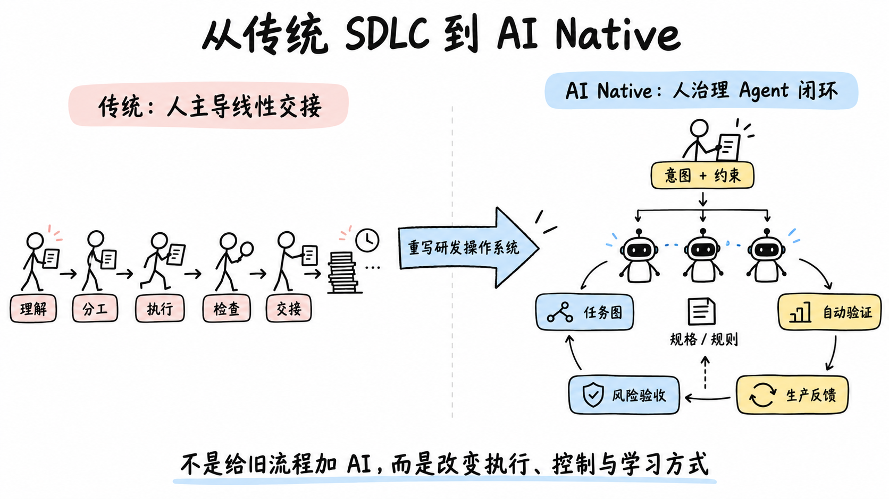
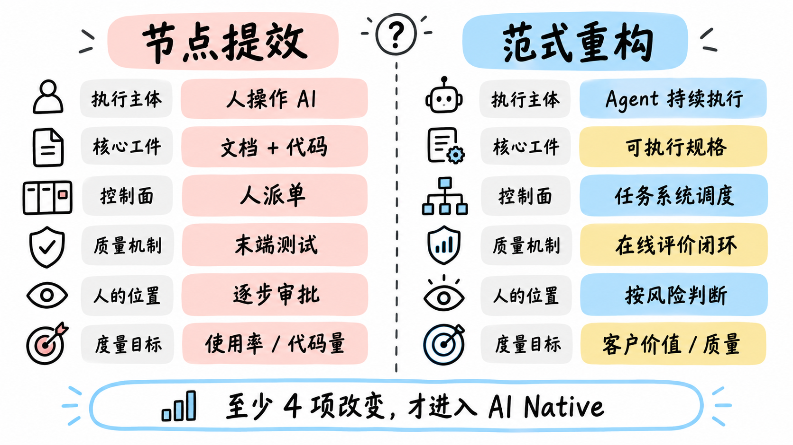
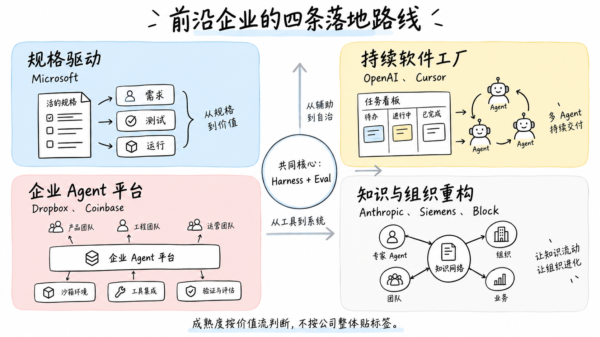
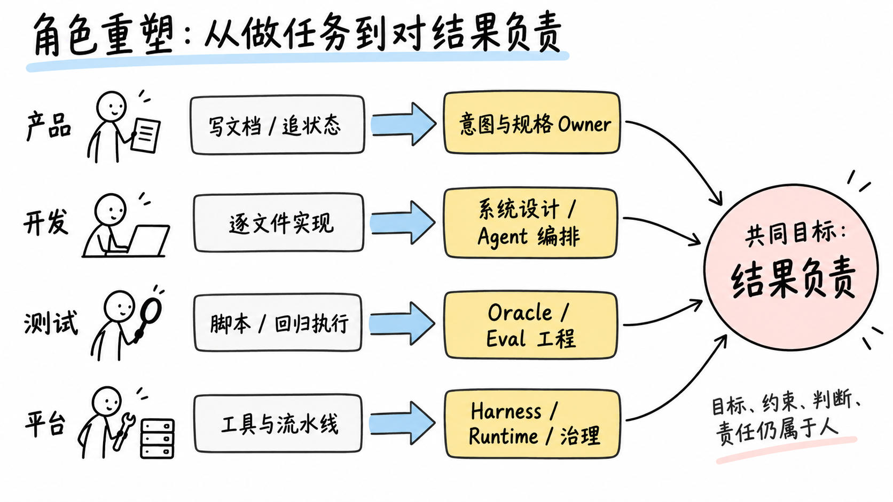
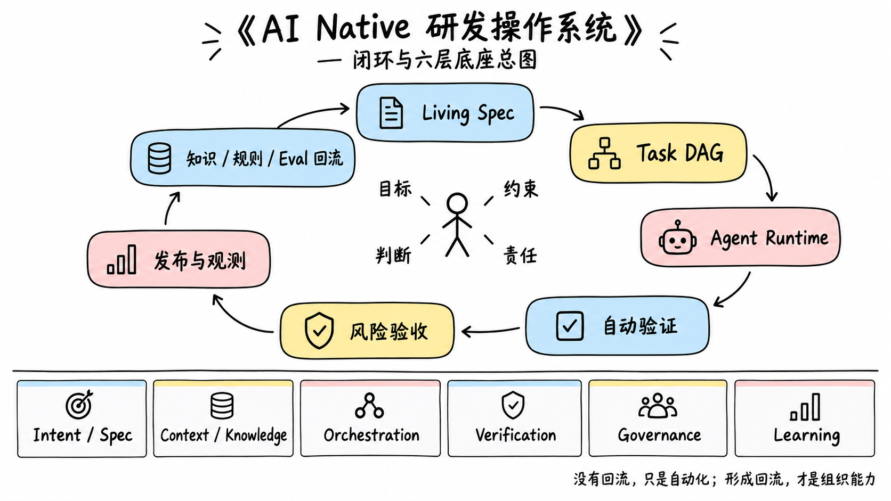

# AI Native 软件研发新范式

## 面向管理决策与落地团队的行业洞察精炼版

> 研究范围：OpenAI、Anthropic、Microsoft、Cursor、Coinbase、Dropbox、Siemens、Block 等已公开采用 AI Native 研发实践的企业  
> 适用读者：管理者，以及产品、开发、测试、平台团队  
> 版本：2026 年 9 月  
> 详细企业案例、数据口径、风险反证和完整来源见《AI-Native软件研发新范式行业深度调研-2026》

---

## 一、3 分钟读懂

### 一句话定义

> **AI Native 软件研发，是以可执行意图为核心工件、以 Agent 为主要执行主体、以 Harness 为生产基础设施、以自动验证和风险分级治理形成反馈闭环，由人负责目标、约束、判断与责任的研发操作系统。**

### 核心判断

这不是“在需求、开发、测试各加一个 AI 工具”，而是把研发从：

`人理解 → 人分工 → 人执行 → 人检查 → 人交接`

重构为：

`人定义意图与约束 → 系统形成任务图 → Agent 并行执行 → 环境自动验证 → 人按风险验收 → 生产信号回流`

### 管理层需要记住的 5 个结论

1. **行业已经出现真实的端到端重构，但只发生在少数价值流。** 企业整体不会一夜进入 AI Native；同一家公司可以在依赖升级上高度自治，在核心交易上仍保留严格人审。
2. **代码生成不是分水岭。** 分水岭是执行主体、核心工件、流程控制面、质量闭环和权责是否一起改变。
3. **新的核心资产不是某个模型，而是企业 Harness。** 它把规格、知识、工具、沙箱、测试、权限、观测和恢复机制组合成 Agent 可工作的环境。
4. **人的价值上移，而不是简单退出。** 人从逐步执行与审批，转向定义意图、设计系统、设定政策、裁决例外并承担结果。
5. **转型不应以 AI 使用率或代码量衡量。** 应追踪从意图到客户价值的周期、一次通过率、返工、生产质量、认知负担和组织学习速度。

### 建议主管做出的三个决策

- 把转型目标从“全员使用 AI”改为“选择 1–2 条价值流，重构端到端闭环”。
- 建立跨产品、研发、QA、平台的共同转型单元，而不是让各职能独立采购和优化工具。
- 同时立项 Living Spec、Harness、Eval 与风险治理；只推进编码 Agent，会把瓶颈推向评审、测试和发布。

---

## 二、真正的范式变化：六个判断维度

| 维度 | 传统流程 + AI 工具 | AI Native 研发系统 |
|---|---|---|
| 执行主体 | 人逐步操作 AI | Agent 接收目标并持续执行 |
| 核心工件 | 需求文档与代码 | 可执行、版本化的规格与验收 |
| 流程控制面 | 人派单、跟进、交接 | 任务系统直接调度 Agent 与环境 |
| 质量机制 | 编码后的测试与末端评审 | 生成—评价在线循环，生产反馈回流 |
| 人的位置 | 参与每一步、审批每一关 | 设政策、按风险抽查、处理异常 |
| 度量目标 | 使用率、代码量、PR 数 | 客户结果、周期、质量、返工、负担 |

一个方案若主要回答“每个传统节点用哪个 AI”，仍是 AI-assisted SDLC。上述六项中至少四项发生实质改变，才应称为 AI Native；否则容易出现局部速度更快、系统吞吐反而下降。

---

## 三、前沿企业怎么落地：四条路线，而非一个模板

### 1. 规格驱动：让意图不在交接中丢失

Microsoft 以 Living Spec 串联需求、架构、开发、测试和运行，并用 constitution 固化工程原则。这里的关键不是“AI 帮 PM 写需求”，而是规格成为持续有效、可被 Agent 执行和验证的控制工件。

**适合借鉴：** 大型组织、跨职能交接多、需求和实现经常漂移的场景。

### 2. 持续软件工厂：让任务系统直接驱动执行

OpenAI 与 Cursor 把 Agent 从 IDE 内的助手推进为异步、并行、持续工作的执行者。任务、隔离环境、测试、日志和恢复机制组合成运行系统；人更多负责环境设计、意图表达和结果验收。

**适合借鉴：** greenfield、新功能实验、内部工具、迁移与维护等可验证工作。

### 3. 企业 Agent 平台：把零散能力变成公共基础设施

Dropbox 的 Nova 和 Coinbase 的内部平台，将模型、工具、沙箱、权限、验证、技能和运行记录统一起来。它们解决的不是单次生成质量，而是企业范围内的可靠运行、复用、审计和恢复。

**适合借鉴：** 已有大量团队自发使用 AI，需要从“个人技巧”进入“组织能力”的企业。

### 4. 知识与组织重构：让专业知识进入执行网络

Anthropic 强调长时任务的 Harness 与 evaluator；Siemens 用代码知识图谱支撑遗留现代化；Block 进一步设想以客户信号和 execution graph 重写组织的信息路由。

**适合借鉴：** 复杂遗留系统、强领域知识、长期任务，以及更远期的组织形态探索。

### 横向判断

| 企业 | 最值得借鉴的机制 | 当前边界 |
|---|---|---|
| OpenAI | Repo 即知识与规则系统；任务系统成为 Agent 控制面 | 主要证据来自新建产品团队 |
| Anthropic | 长任务 Harness、generator-evaluator、分级自治 | 多数员工可完全放手的工作仍有限 |
| Microsoft | Living Spec、constitution、端到端可追踪 | 需要强平台和治理能力支撑 |
| Cursor | 持久项目上下文与并行 Agent | 软件工厂形态仍快速演进 |
| Coinbase | 并行 Agent、设计到代码、QA Agent、技能产品化 | 高风险架构仍强调人工判断 |
| Dropbox | 企业统一 Agent 平台、CI 多轮验证与恢复 | 最终发布权有意保留在人侧 |
| Siemens | 知识图谱 + 专业 Agent 的窄域闭环 | 强依赖领域建模与人工关口 |
| Block | 从流程重构继续上推到组织操作系统 | 目前更多是组织级愿景 |

结论不是选择一家照抄，而是组合它们的成熟机制。

---

## 四、端到端闭环：流程阶段没有消失，但边界被打散

传统的需求、设计、开发、测试、发布仍然存在，但不再是人按部门依次交接的阶段，而成为一个持续运行的生成—评价—学习系统。

1. **机会发现：** Agent 持续读取客户反馈、运营指标与生产信号；人决定战略和优先级。
2. **可执行规格：** 人与 Agent 共同明确目标、非目标、规则、边界、风险和验收条件。
3. **任务图：** 系统将规格拆成有依赖关系的 Task DAG，为 Agent 分配隔离环境并行执行。
4. **生成—评价：** 实现、测试、安全、设计和架构 evaluator 同时工作，失败证据自动触发下一轮修改。
5. **风险分级验收：** 低风险、可逆、证据充分的变更可自动通过；中高风险升级给相应 owner。
6. **生产回流：** 日志、trace、SLO、用户反馈和人工纠正转化为新 Eval、规则、Skill 或参考实现。

真正的闭环必须改善下一轮执行。经验若只留在个人 prompt 里，就没有形成组织能力。

---

## 五、角色重塑：不是减少角色，而是重新分配权责

| 团队 | 正在弱化 | 升值的责任 | 新定位 |
|---|---|---|---|
| 产品 | 文档搬运、拆票、追状态 | 机会判断、规格所有权、成功标准、实验设计 | Intent / Spec Owner |
| 开发 | 样板代码、逐文件实现、手工迁移 | 问题分解、系统设计、Agent 编排、验证与责任 | Outcome Engineer |
| 测试 | 重复脚本和人工回归 | Oracle、场景模型、评估集、对抗测试、异常裁决 | Eval / Quality Engineer |
| 平台 / SRE | 工具拼接、重复排障 | Agent Runtime、沙箱、权限、观测、恢复与成本 | Harness Platform Team |
| 架构 / 安全 | 原则文档和末端审批 | 把架构与政策编码成可执行约束 | Constitution / Governance Owner |
| 管理者 | 派任务、汇总状态、信息中转 | 目标取舍、系统吞吐、人才成长、冲突与责任 | Flow Owner / Player-coach |

三个常见误区：

- 工程师不会只剩“写 Prompt”；长期价值在领域判断、系统设计和可复用 Harness。
- QA 不应被简单取消；执行会自动化，但“什么叫正确”变得更重要。
- 管理不会自然消失；信息中转会收缩，目标冲突、人才成长和责任承担仍需人完成。

---

## 六、建议的目标态：一套可学习的研发操作系统

### 最小闭环

`Living Spec → Task DAG → 隔离 Agent Runtime → 自动验证证据 → 风险分级验收 → 发布与生产观测 → 规则 / 知识 / Eval 回流`

### 六层底座

1. **Intent / Spec：** Living Spec、验收条件、non-goals、架构原则、风险策略。
2. **Context / Knowledge：** Repo、代码图谱、文档、设计系统、生产信息，以及 freshness 与 owner。
3. **Orchestration：** Session、worktree、sandbox、Task DAG、并发、重试、恢复和 handoff。
4. **Verification：** 确定性测试、UI 证据、日志指标、evaluator、评估集与回归。
5. **Governance：** 最小权限、数据分级、风险政策、执行审计、预算和停止条件。
6. **Learning：** 把人工纠正和生产失败持续转化为测试、规则、Skill、参考实现和知识更新。

建议组合：用 Microsoft SDD 解决意图不丢失，用 OpenAI Harness Engineering 解决可靠执行，用 Dropbox Nova 解决企业级运行，用 Coinbase 的 Skills / References / Evals 产品化组织经验，用 Anthropic 的 evaluator 和分级自治控制长任务风险。

---

## 七、落地路线：不要改造整条 SDLC，先重构一条价值流

### 阶段 0：建立共同基线（2–4 周）

- 选择 1–2 个可验证、可逆、数据风险可控的价值流；例如依赖升级、内部工具、小型业务实验或稳定的缺陷修复。
- 测出当前 lead time、等待时间、一次通过率、返工、逃逸缺陷和工程师认知负担。
- 明确产品、开发、QA、平台与安全的共同 owner，不以单团队 AI 使用率为目标。

### 阶段 1：形成最小闭环（4–8 周）

- 建立 Living Spec 模板与可执行验收条件。
- 打通 Agent 隔离环境、必要工具、自动验证和运行记录。
- 定义风险分级：哪些自动、哪些抽查、哪些必须由谁批准。
- 每次人工纠正至少沉淀为一项可复用资产：测试、规则、Skill、示例或文档。

### 阶段 2：从单任务扩展到价值流（8–16 周）

- 由任务系统驱动多个 Agent，支持依赖、并行、重试、停止与恢复。
- 把产品反馈、生产日志和 SLO 接入闭环。
- 建立跨模型、确定性测试和人工专家组成的异构验证，避免生成与评价共同犯错。

### 阶段 3：平台化与组织化

- 沉淀统一 Harness 平台、Eval 平台、权限策略与成本可观测性。
- 调整角色职责、绩效与人才培养，不再奖励代码量和“忙碌度”。
- 按价值流评估成熟度，成熟一条再扩一条，避免宣布全公司“一步到位”。

### 建议采用的阶段门

| 阶段门 | 进入条件 | 核心证据 |
|---|---|---|
| 可辅助 | 知识可访问，数据合规 | 使用质量、人工接受率 |
| 可委托 | 任务边界清晰，存在 oracle | 任务成功率、返工、成本 |
| 可并行 | 环境隔离，冲突和恢复可控 | 端到端周期、队列等待 |
| 可自治 | 风险低且可逆，验证充分 | 生产质量、异常升级率 |
| 可规模化 | 知识回流、治理和平台稳定 | 客户结果、组织学习速度 |

---

## 八、风险与护栏：速度不是唯一方向

- **局部加速可能降低系统吞吐。** DORA 认为 AI 更像放大器；只提高编码速度，会把瓶颈推向评审、测试和发布。
- **公开案例存在选择偏差。** 前沿公司、前沿用户和 AI 友好任务不能直接换算成本企业 ROI。
- **生产力测量仍不稳定。** METR 的不同时期实验结果变化明显，说明工具能力、使用方式和任务结构都会改变结论。
- **自动评审可能相关性失误。** 高风险系统应组合确定性测试、不同模型、形式约束、canary 与领域专家。
- **初级人才培养可能断层。** 必须设计受控实践、调试和评审路径，而不是只训练 Agent 操作。
- **Agent 会放大仓库熵。** 需要架构约束、文档治理、技术债扫描和持续重构。
- **安全边界已经扩展。** Prompt injection、仓库指令、工具权限、凭据和供应链文件都进入研发威胁面。

---

## 九、下一步：用这份基线对照内部方案

对照现有方案时，不先问“用了哪些工具”，而问以下十个问题：

1. North Star 是代码提效、交付周期、客户验证速度，还是新增业务容量？
2. 是否存在可版本化、可执行、包含验收的 Living Spec？
3. 业务、架构、设计、安全和运行知识的事实源在哪里，谁保证 freshness？
4. Agent 的工作单元是片段、PR、任务、项目，还是长期价值流？
5. 谁创建任务、调度 Agent、处理依赖、重试、中止与恢复？
6. 每类任务的确定性 oracle、评估集和生产证据是什么？
7. 如何按风险、可逆性、数据敏感度和影响面动态放权？
8. 产品、开发、QA、平台和管理者的新责任与绩效是否同步改变？
9. 人工纠错如何进入测试、规则、Skill、参考实现和知识库？
10. 是否从采用、产出一直追踪到客户 Impact，并同时观察质量和团队健康？

最终应产出四份结果：现状—目标映射、范式判定、目标 operating model、分阶段路线图。行业案例用于验证和补足内部方案，而不是替代组织自己的经验。

---

## 十、关键来源

- [OpenAI：Harness Engineering](https://openai.com/index/harness-engineering/)
- [OpenAI：Symphony](https://openai.com/index/open-source-codex-orchestration-symphony/)
- [Anthropic：How AI Is Transforming Work at Anthropic](https://www.anthropic.com/research/how-ai-is-transforming-work-at-anthropic)
- [Microsoft：AI-native 与规格驱动研发](https://www.microsoft.com/insidetrack/blog/engineering-the-frontier-firm-sharing-our-ai-native-approach-to-software-development/)
- [Cursor：The Third Era of Software Development](https://cursor.com/blog/third-era)
- [Coinbase：多 Agent 并行研发](https://www.coinbase.com/blog/coding-had-a-concurrency-problem-how-mux-helped-solve-it)
- [Dropbox：Nova 企业 Agent 平台](https://dropbox.tech/machine-learning/introducing-nova-our-internal-platform-for-coding-agents)
- [Siemens：知识图谱与 Agent 工作流](https://cloud.google.com/blog/products/ai-machine-learning/how-siemens-sliced-the-elephant-modernizing-legacy-code-with-agentic-workflows)
- [Block：From Hierarchy to Intelligence](https://block.xyz/inside/from-hierarchy-to-intelligence)
- [DORA 2025](https://dora.dev/research/2025/dora-report/)
- [METR：2026 follow-up](https://metr.org/blog/2026-02-24-uplift-update/)

> 完整逐案分析、原始数据、证据等级与更多来源，见《AI-Native软件研发新范式行业深度调研-2026.md》。
