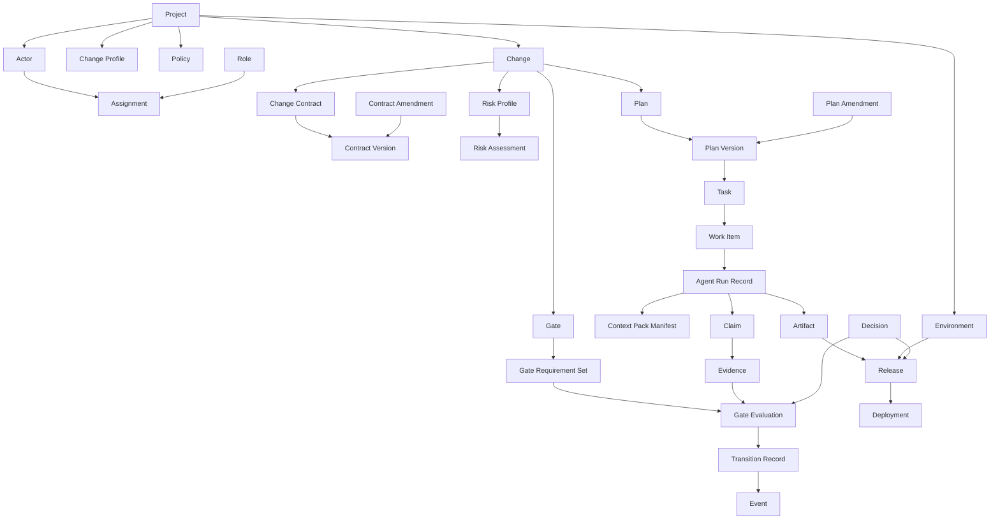
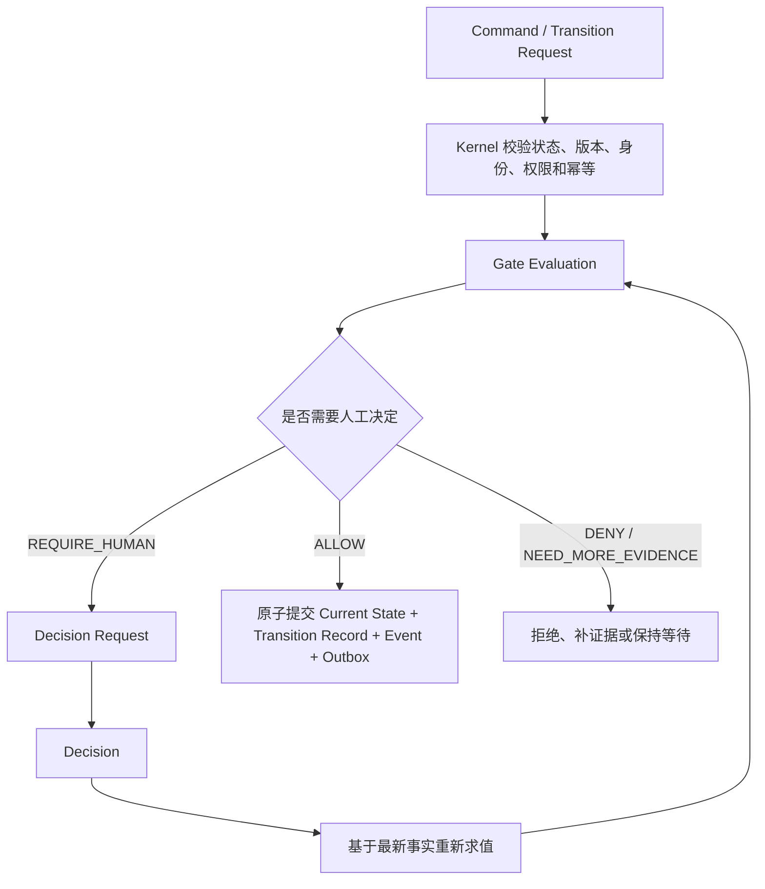

# Cimi Change Protocol 核心领域模型 v0.1

> 状态：领域模型讨论确认稿  
> 日期：2026-09-18  
> 范围：定义 Cimi Change Protocol 的统一语言、核心对象、聚合边界、身份与版本关系、权威关系及 V1 最小对象目录；不包含字段级 Schema、数据库表、目录结构、传输格式和具体技术栈。

## 1. 文档定位

本文回答“CimiLoop 用哪些稳定领域对象表达一次 Change，以及这些对象如何关联、演化和保持可审计”。

本文承接：

- `docs/architecture/CimiLoop整体能力架构-v0.1.md`；
- `docs/plans/2026-09-18-cimiloop-capability-architecture-discussion-plan.md`；
- `docs/plans/2026-09-17-cimiloop-ai-native研发操作模型-v0.1.md`；
- `docs/articles/02-CimiLoop-AI-Native软件研发流程规范-v0.1.md`。

本文不重新讨论已经确认的六个一级能力域。它在这些能力边界之内，进一步定义 Cimi Change Protocol 的领域语义。

## 2. 核心建模原则

1. **Change 是生命周期状态权威**：Change 是独立交付、责任、验证和生命周期单元，只有 Kernel 可以迁移其状态；
2. **聚合边界独立**：Project、Change、Contract、Plan、Work Item 等对象维护各自一致性，通过稳定引用协作；
3. **历史不可改写**：Contract/Plan 旧版本、Run、Evidence、Decision、Evaluation、Transition、Deployment 和 Event 永久保留；
4. **请求不等于事实**：Command 表达行动意图，Event 表达已经提交的事实；
5. **决定不等于迁移**：Decision 是 Gate 的输入，Kernel 必须基于最新事实重新求值后才能迁移；
6. **证据不等于结论**：Evidence 描述观察事实，Gate Evaluation 基于明确要求对事实求值；
7. **精确版本引用**：下游对象引用创建或执行时实际依据的上游版本，不自动追随最新版；
8. **大对象留在权威来源**：代码、文档、Transcript、工具日志和真实制品不复制进核心协议，以 External Reference 和 Digest 关联；
9. **运行机制不污染业务协议**：Lease、Lock、Heartbeat 和 Outbox 等属于 Kernel Runtime Protocol；
10. **Read Model 不是事实权威**：Change Room、Timeline、Queue 和 Board 可以重建，不能反向修改领域事实。

## 3. 统一语言

| 术语 | 中文解释 | 核心语义 |
|---|---|---|
| Project | 项目 | Change、Policy、Actor 和 Environment 的治理边界 |
| Change | 变更 | 独立交付、责任、验证和生命周期单元 |
| Change Room | 变更协作空间 | 与 Change 一一对应的交互与查询投影，不是事实聚合 |
| Change Contract | 变更契约 | 当前被授权的意图、范围、验收与约束 |
| Plan | 执行计划 | 当前被授权的实施方式、Task DAG 与验证策略 |
| Task | 任务 | Plan 中具有稳定身份的持久工作节点 |
| Work Item | 工作项 | Kernel 下发的一次有边界执行授权 |
| Agent Run | Agent 运行 | Runtime 执行一个 Work Item 的一次实际尝试 |
| Artifact | 工件 | 以稳定 ID 与 Digest 标识的不可变候选交付物或引用 |
| Claim | 主张 | 需要被证明或反驳的明确命题 |
| Evidence | 证据 | 支持、反驳或无法判定 Claim 的事实或原始事实引用 |
| Gate | 关卡 | 稳定、具名的准入规则定义 |
| Gate Requirement Set | 关卡要求集 | 某次 Gate 在具体上下文中的版本化要求 |
| Gate Evaluation | 关卡求值 | 基于当时版本、证据、决策和规则的一次不可变判断 |
| Decision Request | 决策请求 | 系统请求指定 Human Role 回答的结构化问题 |
| Decision | 决策 | 具备资格的 Actor 以明确 acting role 作出的正式决定 |
| Transition | 状态迁移 | Kernel 基于有效 Gate Evaluation 提交的生命周期变化 |
| Event | 事件 | 已经提交、不可改写的领域事实 |
| Release | 发布 | 将指定 Artifact 晋升到指定 Environment 的受控发布对象 |
| Deployment | 部署 | 执行一个 Release 的一次外部尝试 |
| Failure | 失败 | 一次已经发生的不可变失败事实 |
| Blocker | 阻塞项 | 当前阻止推进且具有解除条件的领域对象 |
| Feedback | 反馈 | 关联具体对象、但不具有授权效力的结构化意见 |
| Learning Candidate | 学习候选 | 从执行、纠正、例外或复盘中产生的改进提案 |

## 4. 协议对象三层分类

### 4.1 Authoritative Domain Objects：权威领域对象

表达当前有效的业务约束、身份、授权和状态，例如：

- Project、Change；
- Change Profile、Policy、Environment；
- Change Contract、Plan、Task、Risk Profile；
- Actor、Role、Assignment；
- Work Item、Release、Blocker。

这类对象由对应聚合规则维护，不能通过 Read Model 或 Adapter 直接写入。

### 4.2 Immutable Records：不可变事实记录

表达一次已经发生的行为、观察、判断或状态变化，例如：

- Risk Assessment、Agent Run Record；
- Artifact、Claim、Evidence；
- Decision、Gate Evaluation、Transition Record；
- Deployment、Failure、Feedback、Event、Learning Candidate。

同一业务过程可以产生多条记录，新记录不得覆盖旧记录。

### 4.3 Derived Read Models：派生查询模型

用于交互和查询，包括：

- Change Room；
- Timeline；
- Attention Queue；
- Decision Inbox；
- Lifecycle Board。

Read Model 可以删除并从协议事实重建。它们不是状态、授权、证据或决策的权威来源。

## 5. V1 最小对象目录

### 5.1 项目与治理基础对象

- Project；
- Change Profile；
- Policy；
- Environment；
- Actor；
- Role；
- Assignment。

### 5.2 Change 定义与计划对象

- Change；
- Change Relationship；
- Change Contract；
- Contract Amendment；
- Risk Profile；
- Risk Assessment；
- Plan；
- Plan Amendment；
- Task。

### 5.3 执行与交付对象

- Work Item；
- Agent Run Record；
- Context Pack Manifest；
- Artifact；
- Release；
- Deployment。

### 5.4 信任、Gate 与授权对象

- Claim；
- Evidence；
- Gate；
- Gate Requirement Set；
- Gate Evaluation；
- Decision Request；
- Decision；
- Policy Exception；
- Transition Record。

Approval 不单独建模。Intent Decision、Execution Plan Decision、Release Decision 和 Exception Decision 都是统一 Decision 的具体类型。

### 5.5 协作、异常与审计对象

- Event；
- Failure；
- Blocker；
- Feedback；
- Conversation Summary（可选）；
- Learning Candidate。

### 5.6 通用协议构件

- External Reference：指向 Git、Runtime、CI/CD、DevOps、Artifact Registry 等外部权威事实；
- Command Envelope：所有写入请求共用的命令外壳，承载 Actor、acting role、作用域、幂等键和期望 Aggregate Revision 等通用语义。

## 6. 核心对象关系

图中的箭头表达主要领域关联，不表示对象必须内嵌存储，也不表示任意对象可以直接修改下游状态。

## 7. 聚合边界

### 7.1 Project、Change 与 Change Room

- Project 与 Change 分别是聚合根；
- Change 必须归属一个 Project，但拥有独立生命周期和并发边界；
- Project 管理项目级治理和跨 Change 关系，不承载单个 Change 的运行状态；
- Change Room 与 Change 一一对应，但只是交互与查询投影；
- Change Room 组合展示 Contract、Plan、Run、Evidence、Decision 和 Timeline，不拥有这些对象，也不能直接写 Store。

### 7.2 Change Contract

- Contract 从属于 Change，但作为独立版本化聚合维护；
- Contract 拥有稳定 Contract ID 和不可变 Contract Version；
- Change 只保存当前生效 Contract Version 的精确引用；
- Contract Amendment 是独立修订提案，不等于正式版本；
- Amendment 被批准后，Kernel 才基于父版本生成新 Contract Version 并切换当前指针；
- 被拒绝或撤回的 Amendment 保留审计记录，但不占正式版本号。

### 7.3 Plan 与 Task DAG

- Plan 从属于 Change，但作为独立版本化聚合维护；
- Plan Version 必须绑定授权它的 Contract Version；
- Task 是 Plan 中的持久实体，Task 依赖构成该 Plan Version 的 DAG；
- Plan Amendment 被批准后产生新 Plan Version；
- Task 含义和责任边界不变时沿用稳定 Task ID；
- Task 拆分、合并或目标边界变化时创建新 Task ID，并使用 `supersedes`、`split-from`、`merged-from` 表达谱系。

### 7.4 Work Item 与 Agent Run

- Work Item 是一次有边界执行授权，是独立调度聚合；
- Agent Run 是执行某个 Work Item 的一次独立尝试；
- 同一授权边界下重试时保留 Work Item，创建新 Agent Run；
- Contract/Plan Version、目标、范围、权限、验证策略、预算或停止条件变化时，必须创建新 Work Item；
- 验证失败后的修复使用 Repair Work Item，并关联失败 Evidence、原 Work Item 和受影响 Task；
- Run 成功只表示本次尝试结束，不能直接改变 Task 或 Change 状态。

### 7.5 Risk Profile

- Risk Profile 是从属于 Change 的独立权威对象，不内嵌于 Contract Version；
- 每次重新评估产生不可变 Risk Assessment，Change 指向当前有效结果；
- Agent 可以建议风险，但风险降低必须由 Policy 指定的 Human Role 确认；
- 风险变化可以重新解析 Gate Requirement Set，但不自动产生 Contract Version。

### 7.6 Release 与 Deployment

- Environment 是 Project 级稳定目标定义；
- Release 从属于 Change，绑定 Contract Version、Artifact ID 与 Digest、Environment、Release Package、Recovery Strategy 和 Release Decision；
- Release Owner 批准具体 Release，而不是通用生产权限；
- Deployment 是执行某个 Release 的一次不可变外部尝试；
- Artifact、Environment、发布范围或 Recovery Strategy 实质变化时，必须创建新 Release 或重新取得 Release Decision。

## 8. 身份、版本与引用

### 8.1 主要业务版本

CimiLoop 面向用户的主要业务版本只有：

- Contract Version：回答“当前被授权做什么”；
- Plan Version：回答“当前被授权如何实施”。

Artifact 使用不可变 Artifact ID 与 Digest，不使用可原地修改的 Artifact Version。Decision、Evidence、Gate Evaluation、Work Item、Agent Run、Deployment 和 Event 每次发生都创建独立记录 ID，不增加用户可见业务版本号。

### 8.2 内部技术标识

- Aggregate Revision：用于乐观并发控制；
- Schema Version：用于协议结构演进；
- Event Sequence：用于确定事件顺序；
- Digest：用于验证不可变内容是否一致。

这些标识与 Contract/Plan 业务版本严格分离，不能混用，也不能用时间戳代替。

### 8.3 跨聚合引用

- 跨聚合关系使用稳定对象 ID；
- 引用 Contract、Plan 等版本化业务对象时必须同时引用精确业务版本；
- 引用 Artifact 时同时保存 Artifact ID 与 Digest；
- 引用不可变事实记录时使用其稳定记录 ID；
- 历史对象保持原引用，不自动追随 Change 的当前 Contract/Plan；
- 反向关系和组合视图由 Read Model 构建，不维护跨聚合双向可变对象图。

## 9. 版本变化与影响评估

Contract 或 Plan 产生新版本后，不执行全量级联失效。Kernel 根据对象依赖、修改范围、目标版本和 Policy 对下游对象执行可审计的影响评估：

- `Valid`：新版本没有影响，仍可用于当前流程；
- `Stale`：历史事实保留，但不能继续作为当前 Gate 的依据；
- `Superseded`：已有明确的新对象取代它。

Agent 和 Evaluator 可以提交影响建议，最终判断由 Kernel 根据确定性规则和必要的 Human Decision 作出。每次判断必须记录旧版本、新版本、受影响对象、结论和规则依据。

## 10. Command、Gate、Decision 与 Transition

### 10.1 Command 与 Event

- Command 表达 Actor 请求系统执行的动作，可能被接受或拒绝；
- Transition Request 是具有生命周期语义的领域 Command，不是独立写入通道；
- Event 表达已经提交的事实，一经记录不得改写；
- Command 不能作为动作已经发生的证据，Event 不能被当作再次执行动作的指令。

### 10.2 Gate、Requirement Set 与 Evaluation

- Gate 回答“检查什么”，本身不保存某个 Change 的通过状态；
- Gate Requirement Set 回答“这次在具体上下文中要求什么”；
- Gate Evaluation 回答“基于当时事实得到什么结果”；
- 同一 Gate 可以产生多次 Evaluation，旧结果不得覆盖；
- 有效输入完全相同时复用原 Evaluation；有效输入变化时创建新 Evaluation，并通过 `re-evaluates` 关联前次记录。

### 10.3 Decision

- Gate 返回 REQUIRE_HUMAN 时创建 Decision Request；
- Human 通过统一 Command 提交 Decision；
- Kernel 校验 Actor、acting role、Assignment、Policy、作用域和目标版本；
- Decision 记录后必须基于最新状态、版本、风险、Evidence 和 Policy 重新执行 Gate Evaluation；
- Decision 不能直接修改状态，过期 Decision 不能授权已经变化的 Contract、Artifact、Environment 或操作范围。

### 10.4 Transition Record、Current State 与 Event

- 成功迁移创建不可变 Transition Record；
- Transition Record 记录起始状态、迁移动作、目标状态、版本、请求、Gate Evaluation 和 Decision；
- Change Current State 保存当前位置与最新成功 Transition 引用；
- ChangeTransitioned Event 传播迁移已经提交的事实；
- 被拒绝或条件不足的请求不创建成功 Transition Record，但保留 Command 处理结果与 Gate Evaluation。

## 11. Claim、Evidence 与 Gate

- Claim 是可明确判断的命题，不等于 Agent 自述；
- Evidence 是支持、反驳或无法判定 Claim 的不可变观察或原始事实引用；
- Artifact 是被评价的候选工件，不等于其正确性证据；
- Gate Requirement Set 声明必须满足哪些 Claim、接受哪些 Evidence 类型及适用条件；
- Gate Evaluation 绑定 Requirement Set、Contract/Plan Version、Artifact Digest、Risk Assessment、Policy Snapshot、Decision 和当时有效 Evidence；
- 原始日志、文件存在或 Run 成功不能自动视为有效 Evidence。

## 12. Profile、Policy 与求值快照

### 12.1 Change Profile

- Change Profile 是 Project Policy 管理的版本化规则定义，不是写死枚举；
- 标准 Profile 包括 Feature、Bugfix、Incident、Security Fix、Migration、Experiment、Tech Debt 和 Ops Change；
- Change 引用精确 Profile ID 与版本；
- 新 Profile Version 不得静默改变运行中的 Change，升级必须显式执行影响评估。

### 12.2 Project Policy

- Project Policy 是项目级版本化权威定义；
- 创建 Work Item、执行 Gate Evaluation、校验 Decision 或授权外部副作用时保存实际 Policy Snapshot；
- 新 Policy 默认作用于新 Change；运行中 Change 必须执行影响评估；
- 新安全或合规红线可以阻止尚未执行的操作，但必须记录来源、命中结果和影响范围；
- 历史记录继续引用当时 Policy Snapshot，不因规则升级被改写；
- Policy Exception 是独立、有限范围、带有效期与补偿措施的记录，不修改原 Policy。

## 13. 跨 Change 关系

Change 之间只有显式关系，不形成可级联控制的父子聚合。基础关系包括：

- `depends-on`；
- `blocks`；
- `spawned`；
- `supersedes`；
- `related-to`。

每个 Change 保持独立 Owner、Contract、Plan、生命周期和证据链。一个 Change 的关闭、归档或取消不能级联改变关联 Change。

### 13.1 依赖与 Blocked

- `depends-on` 首先约束具体 Task 或 Work Item 的 Ready 状态；
- Change 仍有其他可推进工作时保持 Active；
- 只有没有任何可推进工作且原因确实是未满足依赖时，才设置 `flow_condition = Blocked`；
- 依赖必须声明可确定求值的满足条件，不能只写“等待另一个 Change 完成”。

### 13.2 Supersede

- `supersedes` 关系首先表达取代提案，不直接改变旧 Change 状态；
- Kernel 必须核对活动 Work Item、Run、Artifact、Deployment、外部副作用和未完成事项；
- 必须明确工作转移、历史 Evidence 引用以及停止、清理或补偿方式；
- 经责任角色确认且 Gate 返回 ALLOW 后，Kernel 才将旧 Change 迁移到 Superseded；
- 旧 Change 历史永久保留，不迁移或重写为新 Change 的历史。

## 14. 异常、协作与学习

### 14.1 Failure、Blocker 与 Attention Item

- Failure 是不可变失败事实；
- Blocker 是当前仍阻止推进且可以解除的条件；
- Attention Item 是由 Failure、Blocker、Evidence 缺口、Risk 变化等事实派生的 Read Model；
- Blocker 解除后保留历史，Attention Item 可以从当前视图消失。

### 14.2 Feedback 与 Conversation

- 结构化 Feedback 必须关联具体 Contract、Plan、Task、Artifact、Evidence 或 Agent Run；
- Feedback 不具有授权效力，不能替代 Decision；
- Conversation 原文留在 Runtime 或外部协作系统；
- 有长期价值的内容可以形成 Conversation Summary 与 External Reference；
- 自然语言中的同意不能被默认推断为正式批准。

### 14.3 Learning Candidate

Learning Candidate 记录从失败、人工纠正、Policy Exception 和复盘中形成的改进提案。它可以指向 Contract、Policy、Eval、Skill、Harness、Codebase 或 New Change，但不能自动修改全局规则或知识。

## 15. 关闭、归档与清除

- Close 表示业务流程结束并停止正常调度，历史仍然可查询；
- Archive 表示从默认工作视图隐藏，不改变关闭状态；
- Project 或 Change 的关闭与归档不得级联删除任何历史对象；
- V1 不提供常规 Hard Delete；
- 未来因隐私、合规或密钥泄漏需要清除内容时，必须执行独立受控 Purge/Redaction；
- 清除或脱敏后仍保留不含敏感内容的审计占位记录，说明授权、范围、原因和时间。

## 16. Core、Runtime 与 Adapter Protocol

### 16.1 Cimi Change Protocol

定义可跨 Solo/Team、Store 和 Runtime 移植的业务事实、稳定身份、版本、关系和审计语义。

### 16.2 Kernel Runtime Protocol

定义运行协调对象，包括：

- Work Item Lease；
- Resource Lock；
- Scheduler Checkpoint；
- Outbox Task；
- Heartbeat；
- Reconciliation 状态。

这些对象不进入默认 Change Timeline，但关键结果必须提升为 Event、Evidence、Failure 或其他业务事实。

### 16.3 Adapter Protocol

定义：

- 外部执行请求与结果；
- External Reference；
- Capability 与版本；
- 权限与健康状态；
- Idempotency；
- Reconciliation 能力。

Adapter 只能通过 Command、Query 和 Event 与 Kernel 协作，不能直接修改核心 Store。

## 17. Manifest 与外部权威内容

### 17.1 Agent Run Record

核心协议保存 Run 摘要、版本引用、结果、Artifact、Evidence、Failure 和原始日志引用。完整 Transcript、内部推理、工具调用和命令输出留在 Runtime。凭据和密钥不得进入可移植记录。

### 17.2 Context Pack Manifest

核心协议只保存不可变 Manifest，记录：

- Contract、Plan、Task、Policy、Role 和 Work Item 引用；
- 每项上下文来源的位置、版本或 Digest；
- Canonical、Derived、Reference 或 Runtime Observation 权威级别；
- 生成时间、组装规则版本和整体 Digest。

原始内容继续由 Git、文件或知识平台保存。来源不可访问时标记为 Unavailable，不声称仍可完整重放。

## 18. V1 非核心对象

以下内容不属于 Cimi Change Protocol V1 的核心事实对象：

- Worktree、Lease、Resource Lock、Heartbeat、Outbox；
- 完整 Conversation、Transcript、工具调用与命令输出；
- 真实代码、文档、大型日志和二进制制品内容；
- Attention Item、Timeline、Decision Inbox、Lifecycle Board；
- 组织账号后台、通用工作流设计器和通用策略平台。

它们由 Runtime、Adapter、外部权威系统或 Derived Read Model 承担。

## 19. 下一步设计边界

本文确认的是领域语义和聚合边界。下一步字段级 Schema 设计必须在不改变本文语义的前提下，继续定义：

1. 通用 ID、External Reference、Digest、Source 与时间语义；
2. Contract、Plan、Task、Risk、Work Item 和 Run 的最小字段；
3. Claim、Evidence、Gate Requirement Set 与 Gate Evaluation Schema；
4. Decision Request、Decision、Transition Record 与 Event Envelope；
5. Release、Deployment、Failure、Blocker 和 Feedback Schema；
6. Schema Version 演进与兼容规则；
7. Export/Import Manifest 及对象引用完整性。

字段设计不得把 Read Model、Store 表结构或某个外部框架的格式反向固化为领域模型。
