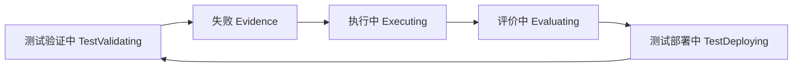

# CimiLoop Change 端到端状态机 v0.1

> 状态：讨论确认稿
> 日期：2026-09-19  
> 范围：定义 Change 从创建、契约、规划、执行、评价、测试、生产发布到关闭的主流程、多维状态、Gate、异常与恢复语义；不包含字段级 Schema、页面布局和具体 Runtime/DevOps 实现。

## 1. 文档定位

本文回答“一个 Change 如何被创建、授权、执行、验证、发布、恢复并关闭”。

本文承接：

- `docs/architecture/CimiLoop整体能力架构-v0.1.md`；
- `docs/architecture/CimiChangeProtocol核心领域模型-v0.1.md`；
- `docs/articles/02-CimiLoop-AI-Native软件研发流程规范-v0.1.md`。

本文把既有 N1–N5 价值流程转化为 Kernel 可执行的状态机。N1–N5 仍用于组织理解和责任划分，不直接作为数据库状态。

## 2. 状态模型总览

Change 同时拥有四个正交状态维度：

| 维度 | 中文解释 | 回答的问题 |
|---|---|---|
| `lifecycle_state` | 生命周期状态 | Change 当前位于主流程的哪个位置 |
| `flow_condition` | 运行状况 | 当前是否活跃、等待决定、暂停、阻塞或失败 |
| `delivery_status` | 交付状态 | 软件是否已实现、验证、发布和关闭 |
| `outcome_status` | 结果状态 | 预期业务或用户结果是否已经被观察和验证 |

等待决定（AwaitingDecision）、暂停（Paused）、阻塞（Blocked）和失败（Failed）不覆盖生命周期位置。条件解除后，Change 从原位置继续。

## 3. 主生命周期

```mermaid
flowchart LR
    Draft[草稿 Draft]
    IntentReady[意图就绪 IntentReady]
    Planned[已规划 Planned]
    Executing[执行中 Executing]
    Evaluating[评价中 Evaluating]
    TestDeploying[测试部署中 TestDeploying]
    TestValidating[测试验证中 TestValidating]
    ReleaseReady[发布就绪 ReleaseReady]
    ProductionDeploying[生产部署中 ProductionDeploying]
    ReleaseVerified[发布已验证 ReleaseVerified]
    DeliveryClosed[交付已关闭 DeliveryClosed]

    Draft --> IntentReady --> Planned --> Executing --> Evaluating
    Evaluating --> TestDeploying --> TestValidating --> ReleaseReady
    ReleaseReady --> ProductionDeploying --> ReleaseVerified --> DeliveryClosed
    Evaluating -->|评价失败，创建修复工作项| Executing
    TestValidating -->|测试失败，创建修复工作项| Executing
```



### 3.1 生命周期状态定义

| 状态 | 中文含义 | 最低进入事实 |
|---|---|---|
| Draft | 草稿 | Change ID、Human Change Owner、初始诉求来源 |
| IntentReady | 意图就绪 | 正式 Contract Version 与 Profile 已获批准 |
| Planned | 已规划 | 当前 Plan Version 与验证策略已获批准 |
| Executing | 执行中 | 至少一个有效 Work Item 已可执行或正在执行 |
| Evaluating | 评价中 | 完整 Artifact Candidate 与 Delivery Evidence 已提交 |
| TestDeploying | 测试部署中 | Change 级评价和 Gate 允许部署测试环境 |
| TestValidating | 测试验证中 | 测试环境 Deployment 成功且可开始环境验收 |
| ReleaseReady | 发布就绪 | Test Evidence Package 完整，Release Package 已准备 |
| ProductionDeploying | 生产部署中 | 针对具体 Release 的生产授权有效 |
| ReleaseVerified | 发布已验证 | 生产部署与即时验证成功 |
| DeliveryClosed | 交付已关闭 | 证据、已知问题、例外和学习候选完成归档 |

### 3.2 非正常终止状态

以下状态属于生命周期终止位置，但不在正常交付主路径中：

| 状态 | 中文含义 | 进入条件 |
|---|---|---|
| Cancelled | 已取消 | Change Owner 决定不再继续，且运行、副作用、清理与补偿已经核对完成 |
| Superseded | 已被取代 | 新 Change 的取代关系、工作转移和副作用处置经确认且 Gate 允许 |

Kernel 不再为终止状态创建正常 Work Item。Rollback 和 Compensation 是受控动作、Evidence 与 Event，不作为“把历史倒回过去”的生命周期状态。

## 4. 运行状况

| `flow_condition` | 中文解释 | 语义 |
|---|---|---|
| Active | 活跃 | Kernel 可以继续判断和调度下一步 |
| AwaitingDecision | 等待决定 | 已产生 Decision Request，等待指定 Human Role |
| Paused | 已暂停 | 经明确命令停止新调度，保留原生命周期位置 |
| Blocked | 已阻塞 | 存在当前无法解除的外部条件、依赖或规则冲突 |
| Failed | 已失败 | 当前授权和恢复预算内无法继续，需要升级处理 |

运行状况变化必须记录原因、责任方、恢复条件和来源状态。解除后不创建虚假的生命周期跳转，而是在原 `lifecycle_state` 上恢复 Active。

## 5. Change 创建与 N1 意图契约

### 5.1 创建边界

普通对话、头脑风暴和 Agent 的未确认建议不自动创建 Change。

```text
用户明确请求创建，或确认 Agent 的创建建议
→ 创建 Draft Change
→ 生成稳定 Change ID
→ 指定唯一 Human Change Owner
→ 保存原始诉求摘要与来源引用
→ 建立 Change Room
```

Draft 允许 Contract、Risk、Profile 和 Owner 信息尚未完整，但不允许没有归属的正式实现工作。

### 5.2 暂定 Profile

- Agent 根据当前信息建议暂定类型（Provisional Profile）；
- 暂定 Profile 用于选择澄清问题、风险维度和候选路径；
- Human 可以在 Draft 阶段修正；
- Intent Decision 批准 Contract 时同时确认正式 Profile ID 与版本；
- 正式 Profile 后续变化走 Contract Amendment。

### 5.3 Draft 阶段允许的工作

- 意图、预期结果、非目标和验收标准澄清；
- 风险画像与约束识别；
- 只读代码和知识分析；
- 明确授权、范围受限且不能混入正式实现的 Spike；
- Contract Candidate、Risk Assessment、Feedback、Evidence 和 Decision Package 准备。

Contract 未授权前不得进入正式实现。

### 5.4 意图审核

| 决策结果 | 中文解释 | 系统行为 |
|---|---|---|
| approve | 批准 | 固化 Contract Version，确认 Profile，重新执行 Gate，允许后进入 IntentReady |
| request_changes | 请求修改 | 保持 `Draft + Active`，生成 Feedback，继续修改同一 Contract Candidate |
| reject | 拒绝 | 保持 Draft，进入 Paused，由 Change Owner 明确选择修改恢复或取消 |

首个 Contract Candidate 只有批准后才成为正式 Contract v1。审核中的修改不产生多个正式业务版本。

## 6. N2 规划

### 6.1 自动启动

Change 进入意图就绪（IntentReady）后，只要不存在 Blocker、Paused、预算或能力限制，Kernel 默认自动创建规划工作项（Planning Work Item）。Project Policy 可以配置在意图批准后暂停。

### 6.2 全局覆盖与滚动细化

初始 Plan 必须：

- 覆盖整个 Change 的主要范围；
- 建立完整高层 Task DAG；
- 标明关键依赖、风险、验证策略和恢复考虑；
- 将近期 Task 细化到可以产生 Work Item 的程度。

较远 Task 可以滚动细化。内部实现细节调整只需记录；改变 Task 边界、依赖、权限、风险、预算或验证策略时必须提交 Plan Amendment。

### 6.3 计划审核

技术负责人（Technical Owner）批准的是完整 Plan Version，而不是逐个批准普通 Task。

| 决策结果 | 系统行为 |
|---|---|
| 批准（approve） | 固化 Plan Version；Gate 允许后进入 Planned |
| 请求修改（request changes） | 保持 IntentReady，生成 Feedback，继续修改 Plan Candidate |
| 拒绝（reject） | 保持 IntentReady 并进入 Paused，由 Change Owner 和 Technical Owner 决定重做、调整或取消 |

## 7. N2 执行与评价

### 7.1 从 Planned 到 Executing

进入已规划（Planned）后，Kernel 计算可执行任务（Ready Task）。只有满足以下条件的 Task 才能产生 Work Item：

- 前置依赖已满足；
- 执行范围已细化；
- 输入版本明确；
- 权限、预算和停止条件明确；
- Resource Lock 和 Runtime 可用；
- 不存在阻断 Gate 或 Blocker。

创建首个可执行 Work Item 后，Change 进入执行中（Executing）。

### 7.2 Task 级循环

Task、Work Item 和 Agent Run 维护局部执行状态，不驱动 Change 在 Executing 与 Evaluating 之间频繁切换。

```text
Ready Task
→ Work Item
→ Agent Run
→ 任务级验证
→ Artifact / Claim / Evidence / Failure
→ 成功、重试、修复或升级
```

- 同一授权边界内的瞬时重试：原 Work Item 下创建新 Agent Run；
- 授权、范围或版本变化：创建新 Work Item；
- 验证发现实现缺陷：创建 Repair Work Item；
- 外部结果未知：先执行状态核对（Reconciliation），不得直接重试。

### 7.3 进入 Change 级评价

满足以下条件后才能执行 `Executing → Evaluating`：

- 当前 Plan 的所有阻塞 Task 已完成；
- 形成完整且不可变的 Artifact Candidate；
- 任务级确定性验证已完成；
- Executor 已提交 Claims 与 Delivery Evidence；
- Contract、Plan 和 Risk 仍然有效；
- 没有未授权变化。

### 7.4 独立评价

Evaluator 使用独立 Session，从 Contract 推导验收场景、边界和反例，并检查实现、测试和追踪关系。

- 评价通过且 Gate 允许：进入 TestDeploying；
- 评价失败：生成 Failure/Evidence，返回 Executing，创建 Repair Work Item；
- 证据不足：保持 Evaluating 或回到授权的证据生成活动；
- 风险、契约或规则冲突：设置 AwaitingDecision 或 Blocked。

Evaluator 不直接修复生产代码。

## 8. N4 测试环境验证

### 8.1 测试部署

Change 级评价通过后，不增加重复人工审批。Kernel 创建测试环境 Release/Deployment 工作：

```text
Evaluating
→ Gate ALLOW
→ TestDeploying
→ 测试 Deployment 成功
→ TestValidating
```

测试环境必须使用指定 Artifact ID 与 Digest。

### 8.2 测试验证与修复循环

测试验证可以包含验收、集成、契约、端到端、视觉、性能、兼容、迁移、安全和必要人工体验检查。



代码变化后必须生成新的 Artifact，重新执行评价和测试部署，不能沿用旧 Artifact 的通过结论。

达到修复、时间或成本预算后，Change 保持原生命周期位置并进入等待决定（AwaitingDecision）。

### 8.3 进入 ReleaseReady

`TestValidating → ReleaseReady` 至少要求：

- 测试环境使用拟发布的同一 Artifact；
- 必需环境验证通过；
- 失败循环关闭或转化为明确残余风险；
- Contract、Plan、Risk 和 Policy 引用有效；
- Test Evidence Package 完整；
- 生产 Checklist、恢复策略和即时验证步骤已准备；
- 不存在阻断生产发布的 Policy。

## 9. N4 生产发布

### 9.1 ReleaseReady 与发布决定

进入发布就绪（ReleaseReady）后创建具体 Release 和生产发布决策请求（Decision Request）。等待期间：

```text
lifecycle_state = ReleaseReady
flow_condition = AwaitingDecision
```

Release Owner 批准的是指定 Artifact、目标 Environment、发布范围、时间窗口和恢复策略，不是通用生产权限。

| 决策结果 | 系统行为 |
|---|---|
| 批准（approve） | 重新执行 Gate，仍有效时进入 ProductionDeploying |
| 请求修改（request changes） | 保持 ReleaseReady，更新 Release Package 后重新审核 |
| 拒绝（reject） | 保持 ReleaseReady，进入 Paused，由 Change Owner 决定修订、延期或取消 |

### 9.2 生产部署与即时验证

```text
ProductionDeploying
→ 触发一次性、范围化 Deployment
→ 查询外部状态并记录结果
→ 执行目标版本、健康、核心路径和配置检查
→ 成功：ReleaseVerified
→ 失败：执行授权的 Recovery Strategy 或升级
```

重复部署前必须核对外部状态。生产凭据留在 DevOps 平台，不能进入 Prompt、Event 或 Artifact。

### 9.3 恢复语义

Rollback、Roll-forward、Feature Disable、Traffic Shift、Data Restore 和 Manual Recovery 都是新的受控动作与 Event，不把历史倒回过去。

- 恢复成功：记录 Recovery Evidence；由 Change Owner 决定修复后重发、结束交付或创建 Incident Change；
- 恢复超出授权：进入 AwaitingDecision；
- 无法恢复：`flow_condition = Failed`，创建升级事项；
- 已发生且不可逆的副作用只能补偿，不能声明从未发生。

## 10. N5 关闭与学习

### 10.1 ReleaseVerified 的含义

发布已验证（ReleaseVerified）只表示生产部署与即时验证通过，不表示长期稳定，也不表示业务价值已经验证。

典型状态：

```text
delivery_status = ProductionVerified
outcome_status = NotObserved
```

### 10.2 关闭条件

进入交付已关闭（DeliveryClosed）必须确认：

- 生产即时验证完成，或 Profile 明确允许不进入生产；
- 必需 Decision、Evidence、Transition 和 Deployment 记录完整；
- 已知问题、残余风险、人工干预和 Policy Exception 可追踪；
- Learning Candidate 已完成分类；
- 未完成事项进入 Backlog 或独立新 Change；
- Change Owner 未要求继续交付活动。

学习候选尚未实施不阻塞当前 Change 关闭。

### 10.3 结果观察

DeliveryClosed 后可以继续补充 Outcome Evidence，并更新结果状态：

- NotObserved：未观察；
- Observing：观察中；
- Validated：结果已验证；
- Invalidated：结果未达到预期；
- Inconclusive：证据不足以判断。

结果未达到预期时创建新 Change，不重写原 Change 的交付历史。

## 11. Gate 与运行状况

每次关键迁移均执行 Gate Evaluation：

| Gate 结果 | 中文解释 | 生命周期与运行状况 |
|---|---|---|
| ALLOW | 允许 | 原子提交 Transition、Current State、Event 与 Outbox |
| REQUIRE_HUMAN | 需要人工决定 | 生命周期位置不变，`flow_condition = AwaitingDecision` |
| NEED_MORE_EVIDENCE | 需要更多证据 | 生命周期位置不变，创建或恢复证据生成活动 |
| DENY | 当前禁止 | 生命周期位置不变；按原因进入 Blocked、Paused 或保持 Active |

Human Decision 不能直接迁移状态。Decision 记录后，Kernel 必须基于最新状态、版本、风险、Evidence 和 Policy 重新求值。

## 12. Pause、Resume、Cancel 与 Supersede

### 12.1 暂停与恢复

- 暂停（Pause）停止创建新 Work Item；
- 已运行工作按 Policy 安全停止、完成或核对；
- `lifecycle_state` 保持不变，`flow_condition = Paused`；
- 恢复（Resume）校验版本、权限、Lease 和外部状态后回到 Active。

### 12.2 取消

取消（Cancel）不是立即设置终止状态：

1. 停止新调度；
2. 处理中 Run；
3. 核对外部副作用；
4. 完成清理或补偿；
5. 记录取消原因与 Decision；
6. Kernel 执行终止迁移。

已经 Cancelled 的 Change 不恢复原历史继续执行；如需重新开展，创建新 Change 并建立关系。

### 12.3 取代

取代（Supersede）先建立取代提案，核对旧 Change 的运行、副作用、未完成事项和责任后，经 Gate 才把旧 Change 迁移为 Superseded。新旧 Change 保持独立历史。

## 13. 跨 Change 依赖

`depends-on` 首先影响具体 Task/Work Item 的 Ready 状态，不自动阻塞整个 Change。

- 仍有可推进工作：`flow_condition = Active`；
- 没有任何可推进工作且原因是依赖未满足：`flow_condition = Blocked`；
- 依赖必须声明可判定条件，例如目标 Change 达到指定状态、产生指定 Artifact 或完成指定 Task。

## 14. Profile 路径差异

| Profile | 路径差异 |
|---|---|
| Feature | 完整意图、计划、测试与生产发布路径 |
| Bugfix | 契约较轻，但风险和回归证据不能因标签降级 |
| Incident | 使用压缩应急路径；执行前保留最小应急 Contract、Decision、Gate 与一次性权限，恢复后强制补齐详细 Plan、Evidence、核对与复盘 |
| Security Fix | 强化职责分离、安全 Evidence 和披露约束 |
| Migration | 强化兼容、数据校验、dry-run 和恢复演练 |
| Experiment | 可以在契约授权的验证终点进入 N5，不要求生产发布 |
| Tech Debt | 强调行为不变和结构目标；行为变化必须修订 Contract |
| Ops Change | 强化外部副作用、目标环境、配置与恢复检查 |

Profile 可以缩短活动或增加 Gate，不能绕过核心架构不变量。

## 15. 默认 A1 监督模式中的人工决定

V1 至少保留三项明确人工决定：

1. 意图负责人（Intent Owner）批准 Contract Version 与正式 Profile；
2. 技术负责人（Technical Owner）批准 Plan Version 与验证策略；
3. 发布负责人（Release Owner）批准具体 Artifact 的生产 Release。

高风险、不可逆、数据、安全或合规场景可以由 Policy 增加额外决定。普通 Task、测试部署和满足既有授权的自动修复不重复增加人工点击。

## 16. 状态迁移矩阵

| 当前生命周期 | 请求动作 | 主要 Gate | 成功生命周期 | 条件不足或失败 |
|---|---|---|---|---|
| Draft | 批准契约 | Intent Decision、Contract、Risk、Profile | IntentReady | Draft + Active/Paused/AwaitingDecision |
| IntentReady | 批准计划 | Plan Decision、覆盖、风险、验证策略 | Planned | IntentReady + Active/Paused/AwaitingDecision |
| Planned | 开始执行 | Ready Task、权限、资源、版本 | Executing | Planned + Blocked/Paused |
| Executing | 提交候选交付 | Task 完成、Artifact、Delivery Evidence | Evaluating | Executing + Active/Blocked |
| Evaluating | 部署测试 | 独立评价、确定性验证、风险 | TestDeploying | Executing 或 Evaluating + AwaitingDecision |
| TestDeploying | 开始测试验证 | Deployment 事实与 Artifact Digest | TestValidating | TestDeploying/Executing + Failed/Blocked |
| TestValidating | 提交生产发布 | Test Evidence、恢复策略、Policy | ReleaseReady | Executing 或 TestValidating + AwaitingDecision |
| ReleaseReady | 部署生产 | Release Decision、Artifact、Environment | ProductionDeploying | ReleaseReady + Paused/AwaitingDecision |
| ProductionDeploying | 确认发布 | Deployment 与即时验证 Evidence | ReleaseVerified | ProductionDeploying + AwaitingDecision/Failed |
| ReleaseVerified 或 Profile 终点 | 关闭 Change | 完整性、已知问题、学习分类 | DeliveryClosed | 保持原生命周期 + Blocked |

## 17. Kernel 原子提交边界

成功迁移必须在同一事务中提交：

- Change Current State 与 Aggregate Revision；
- Transition Record；
- ChangeTransitioned Event；
- 后续 Outbox Task。

外部副作用在事务提交后执行。外部结果通过新的 Event、Evidence、Deployment 或 Failure 回传，不回滚已经提交的历史事实。

## 18. 后续验证场景

在进入角色权限矩阵前，应使用以下场景验证状态机：

1. 普通 Feature 正常发布；
2. Bugfix 在独立评价失败后修复；
3. 测试环境失败并多次重建 Artifact；
4. Release Decision 等待期间 Contract 或 Artifact 变化；
5. 生产 Deployment 结果未知，需要 Reconciliation；
6. 生产验证失败并执行 Rollback 或 Roll-forward；
7. Incident 使用应急路径后补契约；
8. Experiment 不进入生产而正常关闭；
9. Change 被暂停、取消或另一个 Change 取代；
10. 跨 Change 依赖只阻塞部分 Task。

## 19. 场景核对结果

| 场景 | 结果 | 关键路径或待补规则 |
|---|---|---|
| 普通 Feature 正常发布 | 通过 | Draft → IntentReady → Planned → Executing → Evaluating → TestDeploying → TestValidating → ReleaseReady → ProductionDeploying → ReleaseVerified → DeliveryClosed |
| Bugfix 在独立评价失败 | 通过 | Evaluating → Failure Evidence → Executing；创建 Repair Work Item，形成新 Artifact 后重新评价 |
| 测试环境失败并重建制品 | 通过 | TestValidating → Executing → Evaluating → TestDeploying；旧 Artifact Evidence 不适用于新 Digest |
| 等待发布决定期间 Artifact 变化 | 通过 | 原 Release Decision 过期；保留 ReleaseReady，创建新 Release 或重新审核 |
| 生产 Deployment 结果未知 | 通过但需明确恢复细节 | 保持 ProductionDeploying，停止重复操作，打开 Blocker 并优先执行 Reconciliation |
| 生产验证失败并恢复 | 通过但需明确恢复后的去向 | Recovery 成功后记录 Evidence，等待 Change Owner 决定修复重发、结束或创建 Incident |
| Incident 应急恢复 | 通过 | 压缩各阶段停留时间和文档重量，但不跳过 Contract、Plan、Gate、Decision、Transition 与 Event 的语义 |
| Experiment 不进入生产 | 通过 | 在 Contract 授权的 TestValidating/假设验证终点进入 N5，再关闭为 DeliveryClosed |
| Pause、Cancel、Supersede | 通过 | 全部采用向前动作、核对和 Event，不回写或删除历史 |
| 跨 Change 依赖只阻塞部分 Task | 通过 | 未满足依赖只影响相关 Task Ready 状态；无其他工作时才把 Change 标记 Blocked |

### 19.1 外部结果未知

当 CI/CD、部署或其他外部副作用返回未知结果时：

1. Change 保持原生命周期位置；
2. 打开“外部状态未知”Blocker，停止同类操作重试；
3. Kernel 创建 Reconciliation 工作；
4. 核对为成功时继续采集验证 Evidence；
5. 核对为未执行时，按原 Work Item 授权决定是否安全重试；
6. 核对为失败时进入恢复或修复路径；
7. 超出核对预算仍未知时设置 `flow_condition = AwaitingDecision`，由责任角色决定人工核查、继续等待或补偿。

### 19.2 生产恢复后的断点

生产恢复动作成功只说明系统回到已知安全状态，不自动表示 Change 已完成：

- 原 lifecycle state 和失败/恢复历史保留；
- 当前停止新的生产动作并进入等待决定（AwaitingDecision）；
- 选择修复重发时回到执行中（Executing），产生新 Artifact 并重新走完整验证；
- 选择结束本次交付时必须记录未交付结论、残余影响和后续 Change；
- 需要事故治理时创建独立 Incident Change，并通过 `spawned` 或 `related-to` 关联。

### 19.3 Incident 压缩应急路径

Incident 不从草稿（Draft）无语义跳转到执行中（Executing），而是采用“压缩流程、不跳过语义”的应急路径：

```text
Draft
→ 最小应急 Contract 获得授权
→ IntentReady
→ 最小应急 Plan 与一次性权限获得授权
→ Planned
→ Executing
→ ProductionDeploying
→ ReleaseVerified
```

各状态可以在同一操作会话内快速通过，不要求按普通 Feature 的文档重量和等待时长执行，但必须保留对应的 Transition、Gate Evaluation、Decision 和 Event。进入执行前至少明确：

1. 事故指挥者（Incident Commander）或变更负责人（Change Owner）；
2. 已知影响与应急恢复目标；
3. 允许操作的系统、范围和有效时限；
4. 停止条件、恢复策略或补偿策略；
5. 一次性生产操作权限。

恢复后必须完成：

1. 补齐详细 Contract 与 Plan，但不得改写执行前已经形成的最小授权事实；
2. 核对实际执行、外部副作用、Artifact、Deployment 与环境现状；
3. 补齐 Evidence、Decision 理由和完整时间线；
4. 完成复盘并记录残余风险、纠正措施和后续责任；
5. 将超出本次应急恢复范围的永久修复创建为独立 Bugfix 或 Change，并建立关系。

因此，Incident 压缩的是活动与材料，不压缩授权、状态权威和审计语义；事后补录不能替代事前最小授权。
