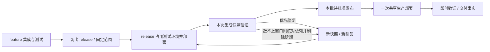
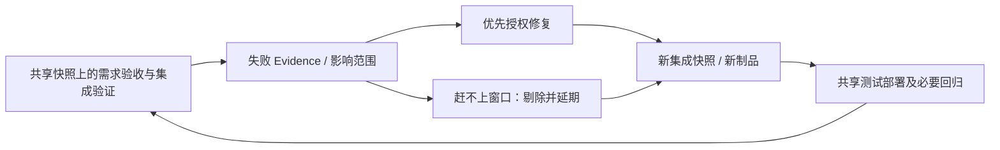

# CimiLoop Change 端到端状态机 v0.1

> 状态：讨论确认稿
> 日期：2026-09-19  
> 修订：2026-09-28，需求 / 缺陷与共享发布双流程；文件名保留以维持引用。
> 范围：定义 Change 从创建、契约、规划、执行、评价、测试、生产发布到关闭的主流程、多维状态、Gate、异常与恢复语义；不包含字段级 Schema、页面布局和具体 Runtime/DevOps 实现。

业务语义依据 `docs/plans/2026-09-28-cimiloop-requirement-bug-unified-model-design.md`。本次只修订文档；新增阶段与英文标识是逻辑说明，不是已冻结或已实现的 Schema。已拆分、延期的协议表达及完整状态映射仍待设计。

## 1. 文档定位

本文回答“需求 / 缺陷如何从一句话录入开始澄清和实施，以及如何参与多个需求共同构建、测试和发布的过程”。

本文承接：

- `docs/architecture/CimiLoop整体能力架构-v0.1.md`；
- `docs/architecture/CimiChangeProtocol核心领域模型-v0.1.md`；
- [AI Native 软件研发流程](AI-Native软件研发流程-v0.1.md)。

早期流程规范中的状态表仅作历史参考，不覆盖本文需求进度与共享发布双流程，也不因保留历史表而冻结协议枚举。

本文把现行 N1–N5 主线组织为需求进度与共享发布两条关联的逻辑流程。N3 共同集成与发布准备、N4 发布验证与生产交付分别承接 feature 早期集成及 release 最终交付；风险检查与授权贯穿主线，不单独作为第三阶段。N1–N5 用于理解和责任划分，不直接作为数据库状态；具体可执行状态枚举及 Schema 映射尚待设计。

## 2. 状态模型总览

需求 / 缺陷就是内部 Change，不维护第二份交付身份。Change 同时拥有四个正交状态维度；项目级发布另有自身的部署进度，不能塞进每个 Change 后重复触发部署：

| 维度 | 中文解释 | 回答的问题 |
|---|---|---|
| `lifecycle_state` | 生命周期状态 | Change 当前位于主流程的哪个位置 |
| `flow_condition` | 运行状况 | 当前是否活跃、等待决定、暂停、阻塞或失败 |
| `delivery_status` | 交付状态 | 软件是否已实现、验证、发布和关闭 |
| `outcome_status` | 结果状态 | 预期业务或用户结果是否已经被观察和验证 |

等待决定（AwaitingDecision）、暂停（Paused）、阻塞（Blocked）和失败（Failed）不覆盖生命周期位置。条件解除后，Change 从原位置继续。

## 3. 主生命周期

以下先表达需求侧逻辑阶段。目标版本是可选规划信息，不是任一阶段的准入条件；测试和生产部署状态属于共享发布流程。


```mermaid
flowchart LR
    Draft[草稿 Draft]
    IntentReady[意图就绪 IntentReady]
    Planned[已规划 Planned]
    Executing[执行中 Executing]
    Evaluating[评价中 Evaluating]
    ReadyIntegration[待集成 / 协议名待定]
    TestValidating[测试验证中 TestValidating]
    ReleaseReady[发布就绪 ReleaseReady]
    ReleaseVerified[发布已验证 ReleaseVerified]
    DeliveryClosed[交付已关闭 DeliveryClosed]

    Draft --> IntentReady --> Planned --> Executing --> Evaluating
    Evaluating --> ReadyIntegration --> TestValidating --> ReleaseReady
    ReleaseReady -->|关联的发布达到交付终点且本需求验收满足| ReleaseVerified --> DeliveryClosed
    Evaluating -->|评价失败，创建修复工作项| Executing
    TestValidating -->|测试失败，创建修复工作项| Executing
```

### 3.1 生命周期状态定义

| 状态 | 中文含义 | 最低进入事实 |
|---|---|---|
| Draft | 待澄清的草稿 | 同一需求 / 缺陷身份、负责人和一句话原始诉求；不要求目标版本 |
| IntentReady | 意图就绪 | 正式 Contract Version 与 Profile 已获批准 |
| Planned | 已规划 | 当前 Plan Version 与验证策略已获批准 |
| Executing | 执行中 | 至少一个有效 Work Item 已可执行或正在执行 |
| Evaluating | 本需求实现评价中 | 固定实现来源、产物及自检 Evidence 已提交 |
| 待集成（协议名待定） | 可纳入共享集成 | 需求级独立评价和合入检查通过，尚未等同环境验证通过 |
| TestValidating | 本需求测试验证中 | 关联发布快照实际纳入本需求，测试部署及实际环境内容已核对 |
| ReleaseReady | 本需求待发布 | 当前拟发布快照上的必要验收满足，等待共享发布授权 / 部署 |
| ReleaseVerified | 约定交付终点已验证 | 当前范围确已交付且本需求验收满足，不因同批部署成功就自动进入 |
| DeliveryClosed | 交付已关闭 | 证据、已知问题、例外和学习候选完成归档 |

### 3.2 非正常终止状态

以下状态属于生命周期终止位置，但不在正常交付主路径中：

| 状态 | 中文含义 | 进入条件 |
|---|---|---|
| Cancelled | 已取消 | Change Owner 决定不再继续，且运行、副作用、清理与补偿已经核对完成 |
| Superseded | 已被取代 | 新 Change 的取代关系、工作转移和副作用处置经确认且 Gate 允许 |

Kernel 不再为终止状态创建正常 Work Item。Rollback 和 Compensation 是受控动作、Evidence 与 Event，不作为“把历史倒回过去”的生命周期状态。

已拆分是原记录的业务处理结论，不能算已交付；它对应新的终态还是处理标记仍待确认。拆分新记录保持平级独立身份和来源，不级联状态。延期也不是终止：保留身份与进度，从本次发布移出并安排后续目标版本（可以暂未指定）。

### 3.3 共享发布流程


```mermaid
flowchart LR
    Feature["feature 集成与测试"] --> Freeze["切出 release / 固定范围"]
    Freeze --> TestDeploying["release 占用测试环境并部署"]
    TestDeploying --> TestValidation["本次集成快照验证"]
    TestValidation --> ReleaseReady["本批待批准发布"]
    ReleaseReady --> ProductionDeploying["一次共享生产部署"]
    ProductionDeploying --> Verified["即时验证 / 交付事实"]
    TestValidation -->|优先修复| Rebuild["新快照 / 新制品"]
    TestValidation -->|赶不上窗口则核对依赖并剔除延期| Rebuild
    Rebuild --> TestDeploying
```

TestDeploying / ProductionDeploying 在这里表示项目级共享部署阶段，不是每条 Change 发起各自部署的状态。一次发布可包含多个 Change；同一 Change 可参与多个测试快照。部署结果先作为发布事实记录，再由 Kernel 对实际纳入且满足验收的需求分别求值，不能对整池批量置为完成。

冻结后测试环境切到 release，暂停 feature 覆盖；feature 可继续开发与合入。环境切换须防止旧的排队或在途 feature 部署覆盖，释放时机与取消 / 失败恢复规则尚待明确。

## 4. 运行状况

| `flow_condition` | 中文解释 | 语义 |
|---|---|---|
| Active | 活跃 | Kernel 可以继续判断和调度下一步 |
| AwaitingDecision | 等待决定 | 已产生 Decision Request，等待指定 Human Role |
| Paused | 已暂停 | 经明确命令停止新调度，保留原生命周期位置 |
| Blocked | 已阻塞 | 存在当前无法解除的外部条件、依赖或规则冲突 |
| Failed | 已失败 | 当前授权和恢复预算内无法继续，需要升级处理 |

运行状况变化必须记录原因、责任方、恢复条件和来源状态。解除后不创建虚假的生命周期跳转，而是在原 `lifecycle_state` 上恢复 Active。

## 5. Change 创建与 N1 意图契约

### 5.1 创建边界

普通对话、头脑风暴和 Agent 的未确认建议不自动创建 Change。

```text
用户明确请求创建，或确认 Agent 的创建建议
→ 录入需求或缺陷，创建 Draft Change
→ 生成贯穿澄清与交付的稳定业务身份
→ 指定唯一 Human Change Owner
→ 保存原始诉求摘要与来源引用
→ 建立 Change Room
```

Draft 允许 Contract、Risk、Profile 和 Owner 信息尚未完整，但不允许没有归属的正式实现工作。

最初允许只有一句话诉求，不强制目标版本或完整验收标准；责任归属可由有效项目配置解析，但不得制造无人负责的正式执行。

澄清结果可以细化原记录、经人确认拆为多个独立需求，或暂缓 / 不采纳。拆分保留原文与来源，原记录标记已拆分；技术分工仍拆成 Task，不变成子需求。

### 5.2 暂定 Profile

- Agent 根据当前信息建议暂定类型（Provisional Profile）；
- 暂定 Profile 用于选择澄清问题、风险维度和候选路径；
- Human 可以在 Draft 阶段修正；
- Intent Decision 批准 Contract 时同时确认正式 Profile ID 与版本；
- 正式 Profile 后续变化走 Contract Amendment。

### 5.3 Draft 阶段允许的工作

- 意图、预期结果、非目标和验收标准澄清；
- 风险画像与约束识别；
- 只读代码和知识分析；
- 明确授权、范围受限且不能混入正式实现的 Spike；
- Contract Candidate、Risk Assessment、Feedback、Evidence 和 Decision Package 准备。

Contract 未授权前不得进入正式实现。

### 5.4 意图审核

| 决策结果 | 中文解释 | 系统行为 |
|---|---|---|
| approve | 批准 | 固化 Contract Version，确认 Profile，重新执行 Gate，允许后进入 IntentReady |
| request_changes | 请求修改 | 保持 `Draft + Active`，生成 Feedback，继续修改同一 Contract Candidate |
| reject | 拒绝 | 保持 Draft，进入 Paused，由 Change Owner 明确选择修改恢复或取消 |

首个 Contract Candidate 只有批准后才成为正式 Contract v1。审核中的修改不产生多个正式业务版本。

## 6. N2 规划

### 6.1 自动启动

Change 进入意图就绪（IntentReady）后，只要不存在 Blocker、Paused、预算或能力限制，Kernel 默认自动创建规划工作项（Planning Work Item）。Project Policy 可以配置在意图批准后暂停。

### 6.2 全局覆盖与滚动细化

初始 Plan 必须：

- 覆盖整个 Change 的主要范围；
- 建立完整高层 Task DAG；
- 标明关键依赖、风险、验证策略和恢复考虑；
- 完成 Knowledge Impact Assessment，并将必需的产品、业务、技术、运维或沟通知识更新纳入 Task DAG；
- 将近期 Task 细化到可以产生 Work Item 的程度。

较远 Task 可以滚动细化。内部实现细节调整只需记录；改变 Task 边界、依赖、权限、风险、预算或验证策略时必须提交 Plan Amendment。

### 6.3 计划审核

技术负责人（Technical Owner）批准的是完整 Plan Version，而不是逐个批准普通 Task。

| 决策结果 | 系统行为 |
|---|---|
| 批准（approve） | 固化 Plan Version；Gate 允许后进入 Planned |
| 请求修改（request changes） | 保持 IntentReady，生成 Feedback，继续修改 Plan Candidate |
| 拒绝（reject） | 保持 IntentReady 并进入 Paused，由 Change Owner 和 Technical Owner 决定重做、调整或取消 |

## 7. N2 执行与评价

### 7.1 从 Planned 到 Executing

进入已规划（Planned）后，Kernel 计算可执行任务（Ready Task）。只有满足以下条件的 Task 才能产生 Work Item：

- 前置依赖已满足；
- 执行范围已细化；
- 输入版本明确；
- 权限、预算和停止条件明确；
- Resource Lock 和 Runtime 可用；
- 不存在阻断 Gate 或 Blocker。

创建首个可执行 Work Item 后，Change 进入执行中（Executing）。

### 7.2 Task 级循环

Task、Work Item 和 Agent Run 维护局部执行状态，不驱动 Change 在 Executing 与 Evaluating 之间频繁切换。

```text
Ready Task
→ Work Item
→ Agent Run
→ 任务级验证
→ Artifact / Claim / Evidence / Failure
→ 成功、重试、修复或升级
```

- 同一授权边界内的瞬时重试：原 Work Item 下创建新 Agent Run；
- 授权、范围或版本变化：创建新 Work Item；
- 验证发现实现缺陷：创建 Repair Work Item；
- 外部结果未知：先执行状态核对（Reconciliation），不得直接重试。

### 7.3 进入 Change 级评价

满足以下条件后才能执行 `Executing → Evaluating`：

- 当前 Plan 的所有阻塞 Task 已完成；
- 形成固定的实现来源及任务产物；可有局部 Artifact，不强制每条需求独自形成最终生产包；
- 任务级确定性验证已完成；
- Executor 已提交 Claims 与 Delivery Evidence；
- Contract、Plan 和 Risk 仍然有效；
- 没有未授权变化。

### 7.4 独立评价

Evaluator 使用独立 Session，从 Contract 推导验收场景、边界和反例，并检查实现、测试和追踪关系。

- 评价通过且合入 Gate 允许：进入待集成，参与授权的共享 Integration 工作；不能直接为每条需求单独部署测试环境；
- 评价失败：生成 Failure/Evidence，返回 Executing，创建 Repair Work Item；
- 证据不足：保持 Evaluating 或回到授权的证据生成活动；
- 风险、契约或规则冲突：设置 AwaitingDecision 或 Blocked。

Evaluator 不直接修复生产代码。

## 8. N3 共同集成与 N4 测试环境验证

### 8.1 N3：feature 共同集成与早期测试部署

需求级评价通过后，在授权的 Integration 工作中合入共享 feature。项目级构建固定集成提交和实际纳入清单，再获得测试环境 Release/Deployment 授权；普通测试部署无需重复人工批准，高风险仍由 Policy 限定：

```text
需求评价通过 → 待集成 → 合入 feature
→ 固定集成提交 / 发布快照 / Artifact / 实际纳入清单
→ 共享测试 Gate 与环境占用检查 → 一次测试部署
→ 核对实际 Digest → 各纳入需求开始 TestValidating
```

测试环境必须使用指定 Artifact ID 与 Digest。

N3 持续集成阶段可由 feature 更新测试环境，产品和测试参与早期联合验证。阶段产物是确定的集成快照、实际纳入清单和已知问题，不是最终 release 已通过的结论。多条需求在此汇合，未纳入本批的需求继续保留自身进度。

### 8.2 N4：release 验证与修复循环

feature 环境中的产品、测试验证属于 N3 早期反馈，不构成正式产品 / 发布验收。正式验收针对 N4 固定的 release 候选及其实际纳入范围进行；N3 证据经变更影响和适用性判断后可以复用，不自动继承，也不要求无差别重测。

N4 从确定的 feature 快照切出 release，固定本次范围；同一测试环境切换为 release 占用，暂停 feature 对该环境的部署覆盖，包含新发起、排队和在途的任务，但不停止 feature 开发、合入和构建。release 的最终快照与先前 feature 已测快照不同时，必须验证实际拟发布内容。

测试验证可以包含验收、集成、契约、端到端、视觉、性能、兼容、迁移、安全和必要人工体验检查。


```mermaid
flowchart LR
    TestValidating["共享快照上的需求验收与集成验证"]
    Failure["失败 Evidence / 影响范围"]
    Repair["优先授权修复"]
    Defer["赶不上窗口：剔除并延期"]
    Rebuild["新集成快照 / 新制品"]
    TestDeploying["共享测试部署及必要回归"]
    TestValidating --> Failure --> Repair --> Rebuild
    Failure --> Defer --> Rebuild
    Rebuild --> TestDeploying --> TestValidating
```

代码变化后必须生成新的 Artifact，重新执行评价和测试部署，不能沿用旧 Artifact 的通过结论。

达到修复、时间或成本预算后，Change 保持原生命周期位置并进入等待决定（AwaitingDecision）。

发布窗口内先评估并修复；最终无法按时修复并验证时，从 release 实际内容中剔除并延期，保留原需求身份。需要核对其他需求的代码、接口和数据依赖；不能只取消清单勾选。若无法安全剔除并完成回归，本批也不能放行。未受影响需求不必退回开发，但旧证据在新快照上的适用性必须明确评估。

### 8.3 N4：进入 ReleaseReady

`TestValidating → ReleaseReady` 至少要求：

- 测试环境使用当前 release 拟发布的同一 Artifact，且实际纳入清单包含本需求；
- 必需环境验证通过；
- 失败循环关闭或转化为明确残余风险；
- Contract、Plan、Risk 和 Policy 引用有效；
- Test Evidence Package 完整；
- 所有被 Policy 标记为发布前必需的 Knowledge Task 已完成并具有有效 Evidence；
- 生产 Checklist、恢复策略和即时验证步骤已准备；
- 不存在阻断生产发布的 Policy。

## 9. N4 生产发布

### 9.1 ReleaseReady 与发布决定

本需求进入发布就绪（ReleaseReady）后关联到本批项目级 Release。生产发布 Decision Request 按共享 Release 创建一次，而非每条需求重复创建。需求详情显示等待本批发布，不因此产生独立部署动作：

```text
需求侧：ReleaseReady，关联具体共享发布记录
发布侧：等待 Release Owner 的生产发布决定
```

Release Owner 批准的是指定 Artifact、目标 Environment、发布范围、时间窗口和恢复策略，不是通用生产权限。

| 决策结果 | 系统行为 |
|---|---|
| 批准（approve） | 核对实际纳入范围、共享集成证据和环境后，发布流程进入 ProductionDeploying |
| 请求修改（request changes） | 保持 ReleaseReady，更新 Release Package 后重新审核 |
| 拒绝（reject） | 本批暂停生产动作；发布范围调整与延期须与受影响需求负责人核对，不能单条需求绕过本批批准 |

### 9.2 生产部署与即时验证

```text
ProductionDeploying
→ 触发一次性、范围化 Deployment
→ 查询外部状态并记录结果
→ 执行实际发布制品、健康、核心路径和配置检查（不是核对规划目标版本名称）
→ 成功：记录共享发布已验证事实，再核验各实际交付需求进入 ReleaseVerified
→ 失败：执行授权的 Recovery Strategy 或升级
```

重复部署前必须核对外部状态。生产凭据留在 DevOps 平台，不能进入 Prompt、Event 或 Artifact。

### 9.3 恢复语义

Rollback、Roll-forward、Feature Disable、Traffic Shift、Data Restore 和 Manual Recovery 都是新的受控动作与 Event，不把历史倒回过去。

- 恢复成功：记录本批 Recovery Evidence；Release Owner 统筹本批后续发布，受影响 Change Owner 各自决定修复、延期、结束未交付或关联事故处理；
- 恢复超出授权：进入 AwaitingDecision；
- 无法恢复：`flow_condition = Failed`，创建升级事项；
- 已发生且不可逆的副作用只能补偿，不能声明从未发生。

## 10. N5 关闭与学习

### 10.1 ReleaseVerified 的含义

发布流程的即时验证成功不表示长期稳定或业务价值已验证。需求侧只有实际纳入、必要验收满足且达到约定交付终点，才进入 ReleaseVerified 并可显示已完成；延期或仅完成开发的记录不能随整批部署置为完成。DeliveryClosed 是其后审计、知识和学习义务的闭环，不是把已拆分 / 已取消统计成交付成功。

典型状态：

```text
delivery_status = ProductionVerified
outcome_status = NotObserved
```

### 10.2 关闭条件

进入交付已关闭（DeliveryClosed）必须确认：

- 生产即时验证完成，或 Profile 明确允许不进入生产；
- 必需 Decision、Evidence、Transition 和 Deployment 记录完整；
- 已知问题、残余风险、人工干预和 Policy Exception 可追踪；
- Knowledge Impact Assessment 完整；所有 Mandatory Knowledge Task 已完成、确认无影响，或具有有效 Policy Exception/关联后续 Change；
- 知识更新 Evidence 能定位到权威载体、版本/revision、Owner 与对应 Contract/Plan；
- Learning Candidate 已完成分类；
- 未完成事项进入 Backlog 或独立新 Change；
- Change Owner 未要求继续交付活动。

学习候选尚未实施不阻塞当前 Change 关闭。

### 10.3 结果观察

DeliveryClosed 后可以继续补充 Outcome Evidence，并更新结果状态：

- NotObserved：未观察；
- Observing：观察中；
- Validated：结果已验证；
- Invalidated：结果未达到预期；
- Inconclusive：证据不足以判断。

结果未达到预期时创建新 Change，不重写原 Change 的交付历史。

## 11. Gate 与运行状况

每次关键迁移均执行 Gate Evaluation：

| Gate 结果 | 中文解释 | 生命周期与运行状况 |
|---|---|---|
| ALLOW | 允许 | 原子提交 Transition、Current State、Event 与 Outbox |
| REQUIRE_HUMAN | 需要人工决定 | 生命周期位置不变，`flow_condition = AwaitingDecision` |
| NEED_MORE_EVIDENCE | 需要更多证据 | 生命周期位置不变，创建或恢复证据生成活动 |
| DENY | 当前禁止 | 生命周期位置不变；按原因进入 Blocked、Paused 或保持 Active |

Human Decision 不能直接迁移状态。Decision 记录后，Kernel 必须基于最新状态、版本、风险、Evidence 和 Policy 重新求值。

## 12. Pause、Resume、Cancel 与 Supersede

### 12.1 暂停与恢复

- 暂停（Pause）停止创建新 Work Item；
- 已运行工作按 Policy 安全停止、完成或核对；
- `lifecycle_state` 保持不变，`flow_condition = Paused`；
- 恢复（Resume）校验版本、权限、Lease 和外部状态后回到 Active。

### 12.2 取消

取消（Cancel）不是立即设置终止状态：

1. 停止新调度；
2. 处理中 Run；
3. 核对外部副作用；
4. 完成清理或补偿；
5. 记录取消原因与 Decision；
6. Kernel 执行终止迁移。

终止历史不能改写；重新打开的业务入口及身份规则仍待统一。取消单条需求不自动撤销整批发布，已合入内容需核对并受控调整真实发布范围，不能只改需求状态。

### 12.3 取代

取代（Supersede）先建立取代提案，核对旧 Change 的运行、副作用、未完成事项和责任后，经 Gate 才把旧 Change 迁移为 Superseded。新旧 Change 保持独立历史。

## 13. 跨 Change 依赖

`depends-on` 首先影响具体 Task/Work Item 的 Ready 状态，不自动阻塞整个 Change。

- 仍有可推进工作：`flow_condition = Active`；
- 没有任何可推进工作且原因是依赖未满足：`flow_condition = Blocked`；
- 依赖必须声明可判定条件，例如目标 Change 达到指定状态、产生指定 Artifact 或完成指定 Task。

## 14. Profile 路径差异

| Profile | 路径差异 |
|---|---|
| Feature | 完整意图、计划、测试与生产发布路径 |
| Bugfix | 契约较轻，但风险和回归证据不能因标签降级 |
| Incident | 使用压缩应急路径；执行前保留最小应急 Contract、Decision、Gate 与一次性权限，恢复后强制补齐详细 Plan、Evidence、核对与复盘 |
| Security Fix | 强化职责分离、安全 Evidence 和披露约束 |
| Migration | 强化兼容、数据校验、dry-run 和恢复演练 |
| Experiment | 可以在契约授权的验证终点进入 N5，不要求生产发布 |
| Tech Debt | 强调行为不变和结构目标；行为变化必须修订 Contract |
| Ops Change | 强化外部副作用、目标环境、配置与恢复检查 |

Profile 可以缩短活动或增加 Gate，不能绕过核心架构不变量。

## 15. 默认 A1 监督模式中的人工决定

V1 至少保留三项明确人工决定：

1. 意图负责人（Intent Owner）批准 Contract Version 与正式 Profile；
2. 技术负责人（Technical Owner）批准 Plan Version 与验证策略；
3. 发布负责人（Release Owner）批准包含实际纳入清单的具体共享 Artifact 生产 Release，而非逐条需求重复批准同一部署。

高风险、不可逆、数据、安全或合规场景可以由 Policy 增加额外决定。普通 Task、测试部署和满足既有授权的自动修复不重复增加人工点击。

## 16. 状态迁移矩阵

| 当前生命周期 | 请求动作 | 主要 Gate | 成功生命周期 | 条件不足或失败 |
|---|---|---|---|---|
| Draft | 批准契约 | Intent Decision、Contract、Risk、Profile | IntentReady | Draft + Active/Paused/AwaitingDecision |
| IntentReady | 批准计划 | Plan Decision、覆盖、风险、验证策略 | Planned | IntentReady + Active/Paused/AwaitingDecision |
| Planned | 开始执行 | Ready Task、权限、资源、版本 | Executing | Planned + Blocked/Paused |
| Executing | 提交候选交付 | Task 完成、Artifact、Delivery Evidence | Evaluating | Executing + Active/Blocked |
| Evaluating | 纳入集成 | 独立评价、合入授权、依赖 | 待集成（协议名待定） | Executing 或 Evaluating + AwaitingDecision |
| 待集成 | 参与测试验证 | 实际纳入、共享 Deployment、Artifact 与环境核对 | TestValidating | 待集成 + Blocked / AwaitingDecision |
| TestValidating | 确认本需求在当前发布快照的验收 | Test Evidence、实际纳入、Policy 与必要知识义务 | ReleaseReady | 受影响修复或 TestValidating + AwaitingDecision |
| ReleaseReady | 关联生产交付事实 | 共享发布授权、实际纳入、本需求验收、即时验证 | ReleaseVerified | ReleaseReady 或相关修复 / 延期路径 |
| ReleaseVerified 或 Profile 终点 | 关闭 Change | 完整性、知识义务、已知问题、学习分类 | DeliveryClosed | 保持原生命周期 + Blocked |

## 17. Kernel 原子提交边界

以下是单个 Change 状态迁移的提交边界；发布 / Deployment 先提交共享事实，随后通过可重试、幂等的关联求值分别迁移各需求，不假设所有 Change 必须跨聚合一次写完，更不能用一次部署触发四次相同外部动作。

成功迁移必须在同一事务中提交：

- Change Current State 与 Aggregate Revision；
- Transition Record；
- ChangeTransitioned Event；
- 后续 Outbox Task。

外部副作用在事务提交后执行。外部结果通过新的 Event、Evidence、Deployment 或 Failure 回传，不回滚已经提交的历史事实。

## 18. 后续验证场景

在进入角色权限矩阵前，应使用以下场景验证状态机：

1. 普通 Feature 正常发布；
2. Bugfix 在独立评价失败后修复；
3. 测试环境失败并多次重建 Artifact；
4. Release Decision 等待期间 Contract 或 Artifact 变化；
5. 生产 Deployment 结果未知，需要 Reconciliation；
6. 生产验证失败并执行 Rollback 或 Roll-forward；
7. Incident 使用应急路径后补契约；
8. Experiment 不进入生产而正常关闭；
9. Change 被暂停、取消或另一个 Change 取代；
10. 跨 Change 依赖只阻塞部分 Task。
11. 一句话录入后细化或平级拆分，已拆分不计为交付；无目标版本也可进入实施。
12. 四条需求逐批合入 feature，共用构建和测试部署；一条延期后在 release 剔除、重建与回归。
13. release 占用测试环境时阻止旧 feature 部署覆盖；整批部署成功不误完成延期需求。

## 19. 场景语义核对（文档检查，非实现测试）

| 场景 | 结果 | 关键路径或待补规则 |
|---|---|---|
| 普通需求共同发布 | 语义可表达 | Draft → IntentReady → Planned → Executing → Evaluating → 待集成 → TestValidating → ReleaseReady；共享发布达到终点后核验 → ReleaseVerified → DeliveryClosed |
| Bugfix 在独立评价失败 | 通过 | Evaluating → Failure Evidence → Executing；创建 Repair Work Item，形成新 Artifact 后重新评价 |
| 测试环境失败并重建制品 | 语义可表达 | 受影响需求修复，共享快照重建与测试；旧 Artifact 通过结论不自动适用于新 Digest |
| 等待发布决定期间 Artifact 变化 | 通过 | 原 Release Decision 过期；保留 ReleaseReady，创建新 Release 或重新审核 |
| 生产 Deployment 结果未知 | 语义可表达，恢复细节待定 | 共享发布保持部署待核对位置，各需求不误报完成；停止重复操作，先 Reconciliation |
| 生产验证失败并恢复 | 通过但需明确恢复后的去向 | Recovery 成功后记录 Evidence，等待 Change Owner 决定修复重发、结束或创建 Incident |
| Incident 应急恢复 | 通过 | 压缩各阶段停留时间和文档重量，但不跳过 Contract、Plan、Gate、Decision、Transition 与 Event 的语义 |
| Experiment 不进入生产 | 通过 | 在 Contract 授权的 TestValidating/假设验证终点进入 N5，再关闭为 DeliveryClosed |
| Pause、Cancel、Supersede | 通过 | 全部采用向前动作、核对和 Event，不回写或删除历史 |
| 跨 Change 依赖只阻塞部分 Task | 通过 | 未满足依赖只影响相关 Task Ready 状态；无其他工作时才把 Change 标记 Blocked |
| 一句话需求平级拆分 | 语义可表达，协议表示待定 | 保留来源；原记录已拆分，新记录独立；不级联关闭 |
| 四需求同包，一条延期 | 语义可表达 | 本次范围核对后剔除、重建并回归；延期需求保留身份，不能计为本批已完成 |
| 测试环境从 feature 切到 release | 语义可表达，调度实现待定 | 核对在途部署并禁止旧 feature 覆盖；冻结期间仍可开发合入 feature |

### 19.1 外部结果未知

当 CI/CD、部署或其他外部副作用返回未知结果时：

1. Change 保持原生命周期位置；
2. 打开“外部状态未知”Blocker，停止同类操作重试；
3. Kernel 创建 Reconciliation 工作；
4. 核对为成功时继续采集验证 Evidence；
5. 核对为未执行时，按原 Work Item 授权决定是否安全重试；
6. 核对为失败时进入恢复或修复路径；
7. 超出核对预算仍未知时设置 `flow_condition = AwaitingDecision`，由责任角色决定人工核查、继续等待或补偿。

### 19.2 生产恢复后的断点

共享生产恢复动作成功只说明系统回到已知安全状态，不自动表示任何 Change 已完成。由 Release Owner 统筹发布侧动作，各受影响需求分别关联处理结论：

- 原 lifecycle state 和失败/恢复历史保留；
- 当前停止新的生产动作并进入等待决定（AwaitingDecision）；
- 选择修复重发时回到执行中（Executing），产生新 Artifact 并重新走完整验证；
- 选择结束本次交付时必须记录未交付结论、残余影响和后续 Change；
- 需要事故治理时创建独立 Incident Change，并通过 `spawned` 或 `related-to` 关联。

### 19.3 Incident 压缩应急路径

Incident 不从草稿（Draft）无语义跳转到执行中（Executing），而是采用“压缩流程、不跳过语义”的应急路径：

```text
Draft
→ 最小应急 Contract 获得授权
→ IntentReady
→ 最小应急 Plan 与一次性权限获得授权
→ Planned
→ Executing
→ 关联获准的项目级应急发布 / 操作与一次性权限
→ 共享部署 / 操作即时验证
→ 核验本需求或事故约定终点后 ReleaseVerified
```

各状态可以在同一操作会话内快速通过，不要求按普通 Feature 的文档重量和等待时长执行，但必须保留对应的 Transition、Gate Evaluation、Decision 和 Event。进入执行前至少明确：

1. 事故指挥者（Incident Commander）或变更负责人（Change Owner）；
2. 已知影响与应急恢复目标；
3. 允许操作的系统、范围和有效时限；
4. 停止条件、恢复策略或补偿策略；
5. 一次性生产操作权限。

恢复后必须完成：

1. 补齐详细 Contract 与 Plan，但不得改写执行前已经形成的最小授权事实；
2. 核对实际执行、外部副作用、Artifact、Deployment 与环境现状；
3. 补齐 Evidence、Decision 理由和完整时间线；
4. 完成复盘并记录残余风险、纠正措施和后续责任；
5. 将超出本次应急恢复范围的永久修复创建为独立 Bugfix 或 Change，并建立关系。

因此，Incident 压缩的是活动与材料，不压缩授权、状态权威和审计语义；事后补录不能替代事前最小授权。

## 20. 本次未冻结的细节

- 新增待集成阶段、已拆分 / 延期的最终协议枚举与业务状态映射；
- 部分拆分、合并、重新打开与既有历史迁移；
- 发布版本的完整状态机、环境占用释放及失败 / 取消恢复；
- release 修复回流、延期代码保留和生产基线同步。

这些细节不得通过文档示意图被默认为已实现或已获授权的自动行为。
