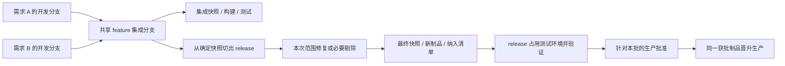

# CimiLoop 工程交付与 DevOps 模型 v0.1

> 状态：讨论确认稿
> 日期：2026-09-19
> 修订：2026-09-28，多个需求共同集成、release 发布与共享测试环境；文件名保留。
> 范围：定义 Workspace、Source Snapshot、Artifact、Environment、Release、Deployment、Recovery 与 Reconciliation 的权威边界和生命周期；不规定具体 Git 平台、CI/CD 产品、云厂商或部署技术。

## 1. 文档定位

业务流程依据 [AI Native 软件研发流程](AI-Native软件研发流程-v0.1.md)。本文解释承载该流程的工程边界，不将当前分支策略宣称为所有 AI Native 团队必须采用的方式。

本文回答“多个需求 / 缺陷如何隔离实现、共同合入 feature，再由 release 固定本次发布范围，完成测试验证和同制品生产晋升”。

本次依据 `docs/plans/2026-09-28-cimiloop-requirement-bug-unified-model-design.md` 同步文档，不表示现有代码或流水线已调整。目标版本、实际发布版本和环境授权必须区分；具体字段、状态枚举及迁移另行设计。

本文承接：

- `docs/architecture/CimiLoop整体能力架构-v0.1.md`；
- `docs/architecture/CimiChangeProtocol核心领域模型-v0.1.md`；
- `docs/architecture/CimiLoopChange端到端状态机-v0.1.md`；
- `docs/architecture/CimiLoop能力装配模型-v0.1.md`；
- `docs/architecture/CimiLoop验证与证据模型-v0.1.md`。

CimiLoop 是 Runtime-neutral Harness，不替代 Git、构建系统、Artifact Registry 或 DevOps 平台。它负责授权、编排、关联、Gate、恢复决策与审计。

## 2. 核心原则

1. **隔离执行**：Agent 不直接修改主工作区；进入实施后默认一个需求 / 缺陷（内部 Change）一个隔离 Worktree，录入与澄清不要求立即分配工作区。
2. **授权先于动作**：任何构建、部署、恢复和环境变更都必须来自有效 Work Item 或 Release 授权。
3. **构建一次、逐环境晋升**：测试验证和生产部署使用同一 Artifact ID 与 Digest。
4. **制品不可变**：修复或重新构建产生新 Artifact，不在原对象上覆盖内容。
5. **Release 与 Deployment 分离**：Release 表达“允许部署什么、到哪里、在什么边界内”；Deployment 表达“一次实际尝试”。
6. **外部事实留在外部权威系统**：CimiLoop 保存领域关联、摘要、Digest 与 External Reference，不复制所有日志或制品。
7. **结果未知先核对**：外部副作用状态未知时先 Reconciliation，不盲目重试。
8. **恢复是向前动作**：Rollback、Roll-forward 和 Compensation 都创建新动作、记录与 Evidence，不回写历史。
9. **权限最小化**：生产权限一次性、范围化、限时，并绑定具体 Release 与 Artifact。
10. **即时验证不等于长期成功**：ReleaseVerified 只表示生产部署和即时检查通过。
11. **共享发布不复制部署**：一个发布版本可纳入多个 Change，一次环境部署只记录一个共享 Deployment；各需求验收与交付分别核验。
12. **冻结范围、保护环境**：feature 持续集成；release 固定本次范围并占用测试环境，冻结期间暂停 feature 覆盖，但不停止开发合入。
13. **先修复、后延期**：问题优先修复；无法按上线窗口修复并验证则核对依赖、从 release 实际内容剔除、重建并回归，不能只调整需求清单。

## 3. 交付语义链

```text
各需求 / 缺陷 → 授权计划与任务 → 隔离分支 / Worktree → 自检与独立评价
→ 授权合入 feature → 固定集成 Source Snapshot → Build / Artifact / 纳入清单
→ 共享测试 Release / Deployment → 产品与测试验证
→ 从确定快照切出 release，固定本次范围并占用测试环境
→ 必要修复 / 剔除 → 新快照、新制品及必要回归
→ Production Release Decision → 同一获批 Artifact 晋升生产
→ 共享 Production Deployment / Immediate Verification
→ 按实际纳入与验收核验各需求已交付，或进入本批 Recovery
```

Task 和 Run 可以多次产生中间结果；只有具备固定来源、完整性和构建 Evidence 的不可变输出才能成为可晋升 Artifact Candidate。

目标版本是可空的规划归属。发布版本固定集成快照、Artifact 与实际纳入清单，不等于目标版本名称或可变分支头；从 feature 到 release 的实际内容不同则必须验证最终发布制品。

## 4. Workspace 与 Worktree

### 4.1 Workspace 不是领域事实权威

Workspace/Worktree 是 Kernel Runtime Protocol 中的执行资源，不是 Cimi Change Protocol 的聚合根。Git 负责源代码历史，Runtime/Workspace Adapter 负责实际目录与进程，CimiLoop 负责其与 Change、Work Item 和 Run 的绑定。

### 4.2 默认隔离策略

- 每个进入实施的 Change 默认拥有一个隔离 Worktree；
- 同一 Change 的顺序 Task 共享该 Worktree，以保持连续实现上下文；
- 只有 Task 依赖、文件范围和集成策略明确时，才创建并行子 Worktree；
- 并行子 Worktree 必须绑定具体 Task/Work Item，并声明整合目标；
- Agent 不直接在主工作区或未授权目录中修改文件；
- Worktree 的创建、占用、释放和异常恢复由 Lease 与 Resource Lock 控制。

### 4.3 并行与整合

并行执行不意味着自动安全合并：

1. 每个子 Worktree 产生独立来源引用和局部验证结果；
2. 合并冲突、接口不兼容或跨 Task 影响形成 Failure/Blocker；
3. 集成必须在授权的 Integration Work Item 中完成；
4. 本需求局部产物从固定来源构建；最终集成 Artifact 从项目级共享快照构建，关联全部实际纳入来源；
5. 子 Worktree 的局部测试不能替代集成 Artifact 的评价。

### 4.4 多需求集成与 release 分支



各开发分支以共享 feature 为集成基线，合入前完成自检和需求级评价。项目级 Integration / Build Work Item 固定多需求来源与授权范围，不必为整合动作伪造额外需求或为每条需求重复部署。

release 固定本次发布范围，不表示禁止修复或剔除；每次内容变化生成新的精确提交 / 快照与制品。feature 的后续合入不自动进入 release。具体 PR / Merge / Squash 操作、release 修复回流和延期代码保留仍由后续 SCM Policy 设计，不能擅自同步剔除破坏后续研发。

## 5. Source Snapshot

Source Snapshot（源快照）是 Artifact 构建输入的不可变引用，至少在语义上固定：

- Repository 与精确 Git Commit/Tree；
- 必要的子模块、依赖锁文件和生成输入；
- 构建配置与构建脚本版本；
- 来源 Change 及各自精确 Contract/Plan、Task / Work Item / Run 引用；集成构建可关联多个 Change，并记录基线与本次差异；
- 未提交内容的内容 Digest（仅用于允许的中间构建）。

可发布 Artifact 必须来自可重建的不可变 Source Snapshot。脏工作区可以用于开发期自检，但不能仅凭“当前目录内容”成为生产 Release 的来源。

是否使用 PR、Merge Commit、Squash、Rebase 或直接提交属于 SCM Policy；CimiLoop 只要求最终来源可固定、可追踪且经过必要 Gate。

## 6. Artifact 模型

Artifact 是不可变的候选交付物或交付物 Manifest。它可以代表二进制包、容器镜像、静态资产、配置包、迁移包，或多个组件组成的不可变集合。

### 6.1 Artifact 身份

- 每次有效内容变化创建新 Artifact ID；
- Artifact 使用 Digest 固定内容，不提供可原地修改的业务版本；
- 多组件交付使用一个不可变 Artifact Manifest 固定全部成员及各自 Digest；
- 同一内容可以被多个 Change 或 Release 引用，但不能更改其历史来源；
- 最终发布制品可以共同实现多条需求，清单必须反映实际代码纳入，不能用目标版本规划清单冒充；
- Artifact 元数据不包含凭据或可变签名 URL。

### 6.2 构建来源与证明

Artifact 必须关联：

- Source Snapshot；
- Build Work Item、Run 与 Capability Binding；
- 构建工具和环境摘要；
- 构建结果与原始记录 External Reference；
- 内容 Digest 与必要供应链 Evidence；
- 实际纳入需求的精确 Contract/Plan Version 及集成验证范围。

Build success 只证明构建动作成功，不证明 Artifact 满足 Contract。它仍需任务级验证、独立评价和环境验证。

### 6.3 修复与重建

- 代码、配置、依赖或构建输入改变后产生新 Artifact；
- 即使来源代码未变，导致输出 Digest 变化的重建也产生新 Artifact；
- 修复后不得把旧测试结果直接关联到新 Digest；
- 新旧 Artifact 通过来源和取代关系追踪，不覆盖或删除旧对象。

## 7. Environment 模型

Environment 是 Project 级稳定目标定义，表达测试、预发布、生产等部署边界，而不是一次部署结果。

Environment 至少在语义上声明：

- 稳定 Environment ID、类别和责任 Owner；
- 允许的部署与恢复能力；
- 数据、安全、网络和地域边界；
- 生产或非生产属性；
- 并发、维护窗口和资源锁规则；
- DevOps/Environment Adapter 引用；
- 必需 Gate、Evidence 与职责分离要求。

环境的实时资源状态由 DevOps/Environment Provider 负责。CimiLoop 保存最后核对事实和 Evidence，但不把缓存状态冒充外部当前事实。

### 7.1 共享测试环境的阶段占用

| 阶段 | 允许更新测试环境的来源 | feature 的其他活动 |
|---|---|---|
| 持续集成 | 当前获准的 feature 集成构建 | 正常开发、合入与构建 |
| 发布验证 | 当前 release 范围内的指定制品 | 可继续开发、合入与构建，但暂停覆盖测试环境 |

切换前核对已运行的部署，切换后在实际执行边界重新检查环境占用与授权；旧的排队 feature 流水线不能晚到覆盖 release。无法确认在途操作已停止或结束时进入核对 / 等待，不能宣称环境已安全切换。只关闭自动触发入口不足以保护环境。

测试 Evidence 固定实际 Artifact、Environment 与配置。占用的 Runtime Lock / Lease 不是新的需求对象，但关键切换、拒绝覆盖及核对结果必须可审计。验证结束后何时恢复 feature，及取消 / 失败后的释放规则尚待明确，不能每次 Deployment 结束就自动释放。

## 8. Release 模型

Release 是 Project 范围内、面向一个目标 Environment 的共享部署授权边界；一个确定发布版本可以实际纳入多个 Change。它回答：

> 允许把哪个不可变 Artifact，在什么时间、范围和策略下部署到哪个 Environment？

Release 绑定：

- 发布版本 / 精确集成快照、实际纳入清单，以及各需求精确 Contract/Plan 与 Risk Assessment；
- Artifact ID 与 Digest；
- 目标 Environment；
- 发布范围、流量、租户或资源边界；
- 时间窗口与失效时间；
- 部署策略、即时验证步骤和成功条件；
- 停止条件与 Recovery Strategy；
- Evidence Package、Policy Snapshot 与必要 Decision。

Artifact、Environment、发布范围、关键配置、时间窗口或 Recovery Strategy 发生实质变化时，必须创建新 Release 或重新取得 Release Decision，不能沿用旧批准。

同一发布版本的测试和生产授权分别绑定对应 Environment，不把一个测试授权当作生产权限；一次共享部署不为各需求复制多个 Deployment。发布版本的字段和独立物理对象尚待设计，本节确认语义而非新增 Schema。

### 8.1 测试 Release

测试环境 Release 在必要需求级评价、共享构建 / 集成 Gate 和环境占用检查通过后可以由 Kernel 自动授权，不重复增加人工点击；Policy 指定的高风险测试环境除外。单条需求通过自检不是整包可部署的充分条件。

### 8.2 生产 Release

生产 Release 必须由 Release Owner 明确返回批准、请求修改或拒绝。批准只针对该 Release，不形成通用生产权限。

Release Decision 写入后，Kernel 使用最新 Artifact、Environment、Risk、Policy 与 Evidence 重新执行 Gate；只有 ALLOW 才生成一次性部署授权。

## 9. Deployment 模型

Deployment 是执行某个 Release 的一次不可变外部尝试。一个 Release 可以在允许的重试边界内关联多个 Deployment，但每次尝试都有独立身份、幂等键、状态和外部引用。

Deployment 记录或关联：

- Release 与 Artifact Digest；
- 目标 Environment 和部署范围；
- 触发 Actor、Work Item 与一次性权限；
- DevOps Adapter、Pipeline/Operation External Reference；
- 幂等键、请求时间和外部发生时间；
- 已知结果、失败、未知状态与后续核对；
- 即时验证和 Recovery 关系。

Deployment 的过程状态可以通过 Event 与 Read Model 展示；历史尝试和结果不能被后续重试覆盖。

## 10. 测试环境闭环

```text
当前阶段获准的集成 Artifact 与实际纳入清单
→ Test Release
→ Test Deployment
→ Test Validation
→ 成功：ReleaseReady
→ 失败：Failure / Refutes Evidence
→ Repair Work Item
→ 新 Source Snapshot / 新 Artifact
→ 独立评价
→ 新 Test Deployment
```

测试循环遵循：

- 指定 Artifact ID/Digest 与实际部署目标必须一致；
- 测试 Evidence 绑定 Environment、配置与 Artifact；
- 测试失败不直接在部署环境中进行未经记录的热修复；
- 任何实现修复都回到授权的 Workspace/Work Item，生成新 Artifact；
- 达到修复、成本或时间预算时进入 AwaitingDecision；
- 旧 Artifact 的通过结论不能自动转移到新 Artifact。

验收以各纳入需求为单位，集成健康及公共约束以当前整包为单位。一次 Deployment 成功不等于所有需求验收通过；feature 早期测试通过也不自动证明改变后的 release 候选通过。

### 10.1 修复优先与延期剔除

1. 产品 / 测试报告问题并关联失败 Evidence、当前制品和受影响需求。
2. 先判断能否在约定窗口内完成修复与验证；获准修复在 Workspace / release 来源中受控完成，产生新快照和制品。
3. 最终无法按时修复则记录延期结论，保留需求身份、已有进度及原目标版本规划历史，调整后续归属；下个版本未明确时允许为空。
4. 核对其他需求对被剔除代码、接口、配置、迁移和数据的依赖；必要时调整相关范围，不能只删一行需求清单。
5. 从 release 实际发布来源移除受影响内容，受控重建并更新实际纳入清单，不修改旧制品或历史测试。
6. 对新制品完成受影响回归和必要集成检查；旧 Evidence 的复用需有明确适用性判断，不机械要求所有测试重跑，也不无条件继承通过结论。
7. 对当前范围与制品重新核验生产授权。若剔除或验证无法安全按时完成，本批不得强行放行。

例如 B1 含 A、B、C、D；D 延期后 B2 实际只含 A、B、C。B1 的历史保留，B2 通过并获批后才晋升生产，D 不能因 B2 成功被标记完成。Feature Disable 是另一种须明确授权及验证的范围控制，不能默认等同于代码已剔除。

## 11. 制品晋升

生产发布使用已经在测试环境验证的同一 Artifact Digest：

```text
Tested Artifact Digest
→ Production Release Decision
→ Digest / Registry / Provenance 再核对
→ Production Deployment
```

生产前允许改变的是环境特定的外部配置，不允许重新构建应用制品。配置必须：

- 由 Environment/Release 明确引用并固定版本或 Digest；
- 接受独立的 Policy 与风险检查；
- 在即时验证中核对实际生效值或版本；
- 发生实质变化时使相关环境 Evidence 或 Release Decision 失效。

如果平台无法直接晋升同一物理对象，迁移/复制过程必须验证源与目标 Digest 一致；Digest 不一致视为新的 Artifact，不能沿用原生产批准。

## 12. 生产部署与即时验证

生产路径为：

```text
ReleaseReady / AwaitingDecision
→ Release Owner approve
→ Kernel 重新执行 Gate
→ ProductionDeploying
→ 一次性 Deployment
→ 查询并记录外部结果
→ 实际发布快照 / Digest、健康、配置和核心路径即时验证
→ 共享发布已验证或 Recovery，再分别核验实际纳入需求的交付终点
```

即时验证至少按 Release Requirement 检查：

- 实际 Artifact Digest 与发布版本快照（不是规划目标版本名称）；
- 基础健康与关键依赖；
- 核心路径冒烟；
- 配置和迁移结果；
- 发布范围、流量或租户；
- 必要人工 Checklist；
- 已知异常与残余风险。

ReleaseVerified 不声明长期稳定、SLO 达标或业务价值已经实现。长期 Outcome Evidence 可以在 DeliveryClosed 后继续补充。

需求显示已完成需要自身必要验收通过且达到约定交付终点。共享发布成功只能作为输入事实；未纳入、延期、已拆分及仅完成自检的记录不能随整批成功而完成。

## 13. 外部结果未知与 Reconciliation

当调用超时、连接中断或 Adapter 无法确认外部操作结果时：

1. 共享 Deployment 保持结果未知，发布流程与受影响 Change 不误报成功或完成；
2. Kernel 打开“外部状态未知”Blocker，停止同类操作重试；
3. 创建 Reconciliation Work Item，绑定原请求、幂等键和外部引用；
4. 优先查询实际资源、Pipeline、版本、Digest 和副作用；
5. 核对为成功时继续即时验证；
6. 核对为未执行时，才可在授权和预算内安全重试；
7. 核对为失败时进入恢复或修复；
8. 超出核对预算仍未知时进入 AwaitingDecision。

更换 Adapter、Runtime 或 Pipeline 不能绕过 Reconciliation，因为未知的是外部世界是否已经发生变化。

## 14. Recovery 与 Compensation

Recovery Strategy 可以包括：

- Rollback（版本回退）；
- Roll-forward（向前修复）；
- Feature Disable（功能关闭）；
- Traffic Shift（流量切换）；
- Data Restore（数据恢复）；
- Compensation（业务补偿）；
- Manual Recovery（人工恢复）。

### 14.1 预授权恢复

若 Release 已固定恢复目标、范围、停止条件和验证方式，部署失败后 Kernel 可以创建对应 Recovery Work Item 和 Deployment/Operation，而无需重复等待普通发布审批。

恢复动作仍必须：

- 使用独立身份、幂等键和权限；
- 关联失败 Deployment；
- 记录外部结果和 Recovery Evidence；
- 核对系统是否回到已知安全状态；
- 在超出预授权范围时立即进入 AwaitingDecision。

### 14.2 超出范围的恢复

目标 Artifact、数据操作、权限、影响范围或风险超出 Release 预授权时，必须取得新的 Decision、Policy Exception 或 Incident 应急授权。

不可逆副作用只能通过补偿或前向修复处理。任何恢复成功都不能删除原 Deployment、Failure 或已发生副作用。

### 14.3 恢复后的流程断点

恢复成功只说明系统回到已知安全状态：

- 原失败和恢复历史保留；
- 共享发布暂停新的生产动作并等待 Release Owner 统筹，受影响 Change 分别关联处理结论；
- 修复重发时回到 Executing，产生新 Artifact 并重走评价和测试；
- 结束本次交付时记录未交付结论、残余影响和后续 Change；
- 需要事故治理时创建独立 Incident Change。

## 15. 权威边界

| 系统 | 第一权威事实 | CimiLoop 的责任 |
|---|---|---|
| Git / SCM | Commit、Tree、Branch、Diff 和合并历史 | 关联 Change/Task/Artifact，执行 Gate 与审计 |
| Workspace / Runtime | 当前工作目录、进程、命令和原始 Session | 授权 Work Item，记录 Run、摘要和引用 |
| Build / CI | 构建与测试原始执行结果 | 转换为 Artifact、Evidence、Failure 和 Event |
| Artifact Registry | 制品内容、Digest、存储位置和可用性 | 维护领域 Artifact 身份、来源和晋升关系 |
| DevOps / Environment Provider | Pipeline、资源和部署的外部实际状态 | 管理 Release、Deployment、核对、Gate 和恢复闭环 |
| CimiLoop Kernel | Change 进度、共享发布授权、Decision、Gate、Transition 和关联历史 | 唯一执行状态迁移与调度决策，防止重复部署和误完成 |

Adapter 只能通过 Command、Query 和 Event 与 Kernel 协作，不能直接修改 Change State、Release Decision 或 Gate 结果。

## 16. 权限、凭据与审计

- Work Item 声明允许的仓库、目录、命令、网络、环境和副作用；
- Workspace、Environment 与部署目标使用 Resource Lock 避免冲突操作；
- Agent 只获得触发被授权操作的能力，不获得通用生产管理员权限；
- 凭据由 Runtime、CI/CD 或 DevOps Secret Store 管理；
- Prompt、Context Pack、Event、Artifact 元数据和普通日志不得包含真实秘密；
- 每次外部操作记录 Actor、acting role、Work Item、Capability Binding、Policy Snapshot、幂等键和外部引用；
- 权限过期或撤销后禁止新调用，进行中不可中断操作按 Policy 安全完成或停止。

## 17. V1 边界

V1 必须实现：

- 每个进入实施的 Change 默认一个隔离 Worktree；
- Work Item 驱动的 Agent Runtime 执行；V1 首个 Runtime 从 Claude Code 或 OpenCode 中选择；
- 不可变 Source Snapshot 与 Artifact/Digest；
- 测试部署、验证、修复和重建循环；
- 多需求合入 feature、release 固定范围、实际纳入清单与共享集成验证；
- 测试环境切到 release 后暂停 feature 覆盖，保护排队及在途部署边界；
- 修复优先、无法按期修复时剔除延期，并重新构建、必要回归及核验授权；
- 测试到生产的同 Digest 晋升；
- Environment、Release 与 Deployment 分离；
- Release Owner 的生产发布 Decision；
- build、deploy、status、verify、recover、reconcile Adapter 能力；
- 外部结果未知时的 Blocker 与 Reconciliation；
- 预授权 Recovery 和超范围升级；
- 生产即时验证与 ReleaseVerified。

V1 不承诺：

- 自建 Git 托管、Artifact Registry 或 CI/CD 平台；
- 统一替代现有 DevOps 控制面；
- 自动选择复杂蓝绿、金丝雀或多集群策略；
- 长期生产日志、Trace、SLO 和业务指标平台；
- 跨组织、多区域、大规模发布编排；
- 具体云厂商、Pipeline 或容器平台绑定。

## 18. Kernel 不变量

1. Agent 不直接修改主工作区，所有工程动作来自 Work Item。
2. 可发布 Artifact 必须关联不可变 Source Snapshot、构建来源和 Digest。
3. Artifact 内容变化必须创建新 Artifact，不能覆盖旧对象。
4. 生产部署必须使用测试通过并获批的同一 Artifact Digest。
5. Release 必须绑定 Artifact、Environment、范围、窗口、验证与 Recovery Strategy。
6. Deployment 是一次独立尝试，后续重试不能覆盖历史结果。
7. 生产权限一次性且范围化，凭据不得进入 CimiLoop 内容记录。
8. 外部结果未知时必须先 Reconciliation，不得盲目重试。
9. Recovery 和 Compensation 创建新动作与 Event，不回滚历史记录。
10. ReleaseVerified 只表示即时验证通过，不表示长期稳定或业务 Outcome 已实现。
11. 共享发布属于项目范围，不能为每条需求重复部署，也不能因整批成功自动完成未纳入需求。
12. 环境占用必须在实际执行边界核对，旧 feature 部署不能覆盖 release 验证环境。
13. 目标版本规划变化不能替代实际代码剔除；延期、已拆分与已交付分别记录。

## 19. 阶段结论

本模型采用“需求隔离实施 → 多需求 feature 集成 → release 固定本次范围及测试环境占用 → 不可变快照与集成制品验证 → 同制品生产晋升 → 各需求交付核验”的链路，以项目级 Release 管共享授权、Deployment 管一次尝试、Reconciliation 管未知外部状态。

上述语义已经确认。后续 Git、Runtime、CI/CD、Artifact Registry、DevOps 与云平台选型只能作为 Adapter/Provider 接入，不得改变隔离执行、制品不可变、同 Digest 晋升、授权先行和未知结果先核对等核心约束。

发布对象完整字段与状态机、release 修复回流、延期代码保留、生产基线同步、测试环境占用释放及取消 / 失败恢复规则尚待确定。本次文档同步不等于这些实现细节或实际流水线配置已完成。
