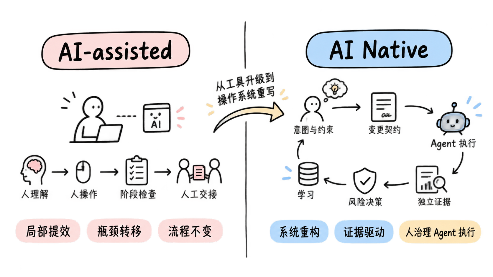
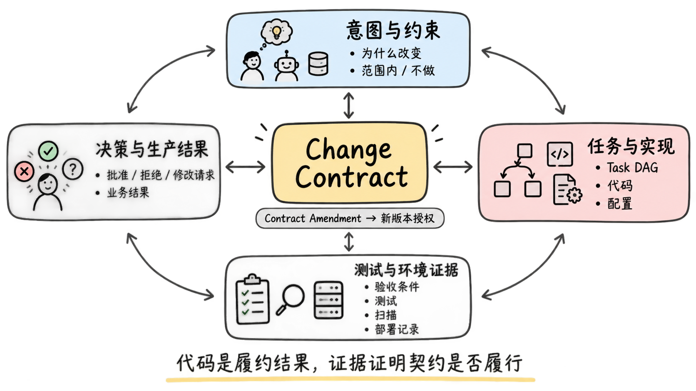
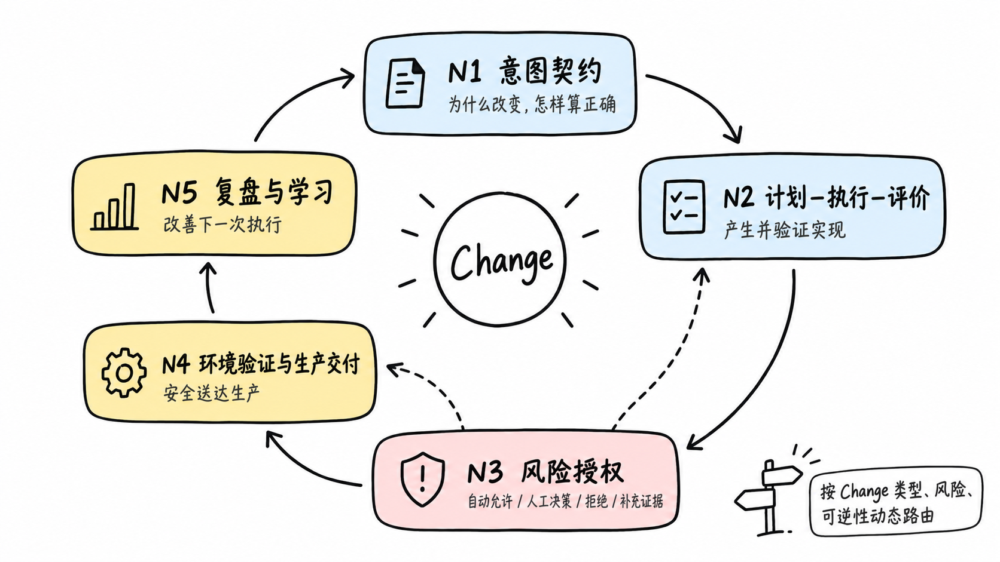
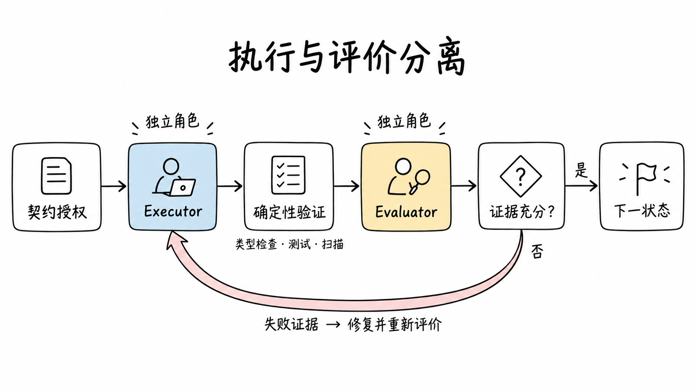
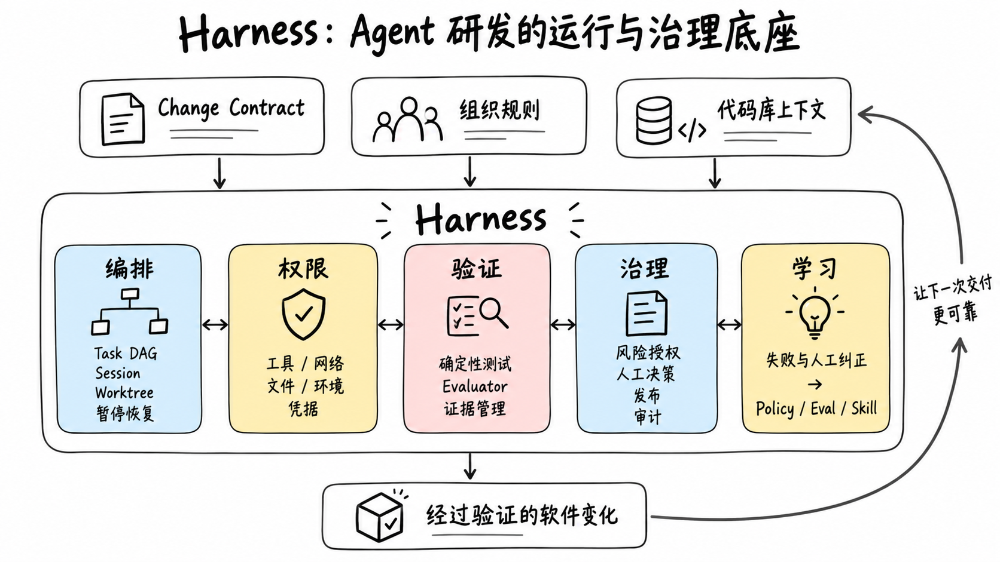

# AI Native 软件研发新范式：从人执行流程到人治理 Agent 研发闭环

> AI Native 不是在传统研发流程中增加更多 AI 工具，而是重新定义软件变化如何被描述、授权、执行、验证、发布和学习。

过去的软件研发流程，是围绕人的协作能力设计的：需求被写成文档，任务被分配给人，代码由人实现，测试和评审负责检查，最终经过多次交接进入生产。

当 Agent 可以持续理解上下文、调用工具、修改系统并根据环境反馈自行纠错时，继续把它安放在某个流程节点，反而低估了它带来的变化。新的核心问题不再是“AI 能帮开发者写多少代码”，而是：能否把一次软件变更转化为一份可执行的契约，让 Agent 在授权范围内持续完成，让证据驱动状态流转，让人只在意图、风险与例外处作出判断并承担责任。

这不是一次工具升级，而是软件研发操作系统的重写。

## 一、从 AI-assisted 到 AI Native，分界线不在代码生成率

今天，大多数团队已经在使用 AI：产品经理让 AI 整理需求，工程师用它生成代码，测试人员用它补充用例，运维人员用它分析日志。这些实践有价值，但它们大多仍属于 **AI-assisted（AI 辅助研发）**：流程没有改变，AI 只是帮助原有角色更快完成原有动作。

传统系统仍然按照同一条链路运转：

```text
人理解需求
→ 人拆解和分工
→ 人操作工具完成实现
→ 人在阶段末检查
→ 人把结果交接给下一个角色
```

局部效率提高之后，瓶颈通常只是向下游转移。代码生成得更快，评审队列可能更长；提交数量增加，测试、发布和故障处理可能承受更大压力。团队看起来更忙、产出更多，却未必更快地把正确价值交付给用户。

AI Native 的变化发生在系统层，而不是工具层：

```text
人定义意图、约束与责任
→ 系统形成可执行的变更契约和任务图
→ Agent 在授权范围内持续执行
→ 测试与环境产生独立证据
→ 系统依据风险和证据决定下一步
→ 人处理关键判断、例外和不可逆决策
→ 结果与纠正沉淀为下一次执行能力
```



判断一套研发方式是否真正进入 AI Native，至少要看六个方面是否同时改变：

| 维度 | 传统流程叠加 AI | AI Native 研发 |
|---|---|---|
| 主要执行者 | 人操作 AI 完成每一步 | Agent 接收授权后持续执行 |
| 核心工件 | 需求文档、任务单和代码 | 可执行、可验证、可版本化的变更契约 |
| 流程控制 | 人派单、催办和交接 | 状态、规则、证据与任务图驱动执行 |
| 质量机制 | 编码后的测试和末端评审 | 执行—评价循环与环境反馈 |
| 人的位置 | 参与和审批大多数步骤 | 定义意图、制定规则、裁决风险并承担责任 |
| 学习方式 | 经验留在个人和复盘文档中 | 纠正进入规则、评估、Skill 和 Harness |

只有编码方式变化，而工作单元、权责、验证和反馈没有变化，仍然是更高效的传统研发，而不是新的研发范式。

## 二、新范式的基本单元，不再是项目阶段，而是 Change

传统研发常以项目和阶段组织工作：需求阶段结束后进入设计，设计结束后进入开发，然后统一测试和发布。这种模式适合人类团队按专业职能批量交接，却不适合可以并行、异步、持续工作的 Agent。

AI Native 研发把 **Change（变更）** 作为最小的交付、验证和责任单元。一个 Change 可以是一项 Feature、一个 Bugfix、一次数据迁移、一项安全修复、一次实验，也可以是一次生产事故处置。

```text
产品或项目
└── 多个相互独立的 Change
    └── 每个 Change 包含一组有依赖关系的 Task
```

同一个项目中，不同 Change 可以同时处于意图澄清、实现、测试环境验证、生产发布或复盘状态。它们不需要等待整个项目一起“进入下一阶段”。这样一来，研发系统调度的不再是部门和人员，而是具有明确边界、风险和状态的变化。

这也意味着系统中不应存在脱离 Change 的“裸任务”。任何会修改代码、配置、数据或运行环境的工作，都必须能够回答：它属于哪一次变化，为什么发生，允许改变什么，怎样才算完成，谁对结果负责。

## 三、变更契约成为人、Agent 与系统的共同语言

Change 要能够被 Agent 持续执行，就不能只依赖一段自然语言需求。它需要一份 **Change Contract（变更契约）**：人、Agent 与系统对本次变化达成的、可执行且可验证的共同约定。

变更契约至少要回答：

- 为什么改变，期望产生什么结果；
- 哪些内容在范围内，哪些明确不做；
- 什么叫实现正确，如何验证；
- 必须遵守哪些业务、架构、安全和合规约束；
- 影响范围有多大，是否可逆；
- 需要哪些证据，谁拥有相应决策权。

代码不是契约本身，而是履行契约的一种结果；测试、扫描和部署记录也不是附属材料，而是证明契约是否得到履行的证据。

变更契约也不是冻结需求。新的事实出现后，可以通过 **Contract Amendment（契约修订）** 形成新版本，由对应责任人重新授权。未经批准就改变系统行为，属于未授权变化；经过授权的契约演化，则是正常学习，而不是“意图漂移”。

因此，AI Native 研发中的核心事实链不再是“需求文档最终被代码替代”，而是：

```text
意图与约束
↕
任务与实现
↕
测试与环境证据
↕
决策与生产结果
```



每一层都可追踪、可版本化，冲突时必须被识别和裁决，而不是默认让最新代码成为唯一真相。

## 四、流程没有消失，而是从线性流水线变成持续闭环

需求、开发、测试、发布和复盘仍然存在，但它们不再由不同角色依次接力。新的流程是围绕 Change 运行的动态闭环，可以概括为五个能力域：

| 能力域 | 中文含义 | 核心问题 |
|---|---|---|
| N1 | 意图契约 | 为什么改变，怎样算正确 |
| N2 | 计划—执行—评价 | 如何可靠地产生并验证实现 |
| N3 | 风险授权 | 当前风险和证据是否允许继续 |
| N4 | 环境验证与生产交付 | 如何把经过验证的制品安全送达生产 |
| N5 | 复盘与学习 | 本次执行如何改善下一次 |

N1–N5 不是要求所有 Change 依次排队通过的五个部门，也不是项目整体的五个大阶段。它们是一个 Change 生命周期中的五种核心能力。

其中，N3 风险授权尤其不是固定的一道审批门。它像贯穿全程的“状态流转检查”：在计划执行、测试部署、生产发布等关键变化发生前，根据 Change 类型、影响范围、可逆性、数据和安全风险、现有证据以及自治级别，得出四类结果：自动允许、请求人工决策、拒绝继续，或者要求补充证据。

不同类型的 Change 因此可以走不同路径。低风险 Bugfix 可以使用轻量契约并快速进入执行；数据迁移需要强化兼容与恢复证据；生产事故可以先恢复服务，再补齐契约和审计；只验证假设的 Experiment 也可以不进入生产。

统一的是协议、责任和证据要求，而不是所有工作都走同样重量的流程。



## 五、Agent 不只是生成代码，而是承担主要执行循环

在新范式中，Agent 的工作不会止于“根据提示生成一段实现”。它会围绕契约形成计划，读取代码库和规则，拆解具有依赖关系的 Task，修改代码，调用工具，执行验证，并在失败证据出现后继续修复。

但让同一个 Agent 同时负责实现和证明自己正确，会产生明显的相关性风险：它可能按照自己的理解生成代码，又按照同一理解生成测试，最后共同遗漏同一种错误。

因此，可靠的 AI Native 流程需要把执行与评价分开：

- **Executor（执行者）** 负责实现、修复和提交证据；
- **Evaluator（评价者）** 从变更契约独立推导验收场景、边界条件和反例，并判断证据是否充分；
- 类型检查、测试、扫描、部署结果等确定性工具提供不能被模型自述替代的事实；
- 高风险判断再升级给具备相应决策权的人。

典型循环不再是“AI 生成，人工逐行审查”，而是：

```text
契约授权
→ Agent 规划与执行
→ 独立评价和确定性验证
→ 失败证据返回执行者
→ 修复并重新评价
→ 证据充分后进入下一状态
```



Agent 可以持续执行，但不能无限循环。每个任务都需要权限边界、允许修改范围、预算、最大重试次数、停止条件和人工升级路径。自治不是取消控制，而是把控制从过程中的频繁指令，转化为执行前的授权边界和执行中的异常约束。

## 六、状态不再由“文件存在”或“Agent 说完成”决定

传统流程常用文档是否提交、代码是否合并、Pipeline 是否成功来判断进度。但这些信号只能证明某个动作发生过，不能证明 Change 已经达到下一状态。

AI Native 研发要求状态由独立证据驱动。例如，代码生成完成不代表实现正确；已有测试通过不代表验收条件被完整覆盖；生产部署成功也不代表业务结果已经实现。

因此要区分两类信息：

- **Evidence Package（证据包）** 回答“事实是什么”，例如测试结果、独立评价、制品摘要、部署记录和即时健康检查；
- **Decision Package（决策包）** 回答“是否允许继续”，把相关证据、剩余风险和待决事项提交给拥有决策权的人或规则系统。

这种分离使人的注意力从收集材料和检查过程，转向真正需要判断的问题。人作出的决定也不再只是聊天中的一句“可以”，而成为可追踪的批准、拒绝或修改请求，并记录原因、所需调整和风险观察。

系统也不采用“长时间无人回应就视为同意”。等待决策就是等待决策；规则例外必须有明确范围、批准人、补偿措施和失效时间。

## 七、Human in the Loop 不是每一步都让人点确认

AI Native 经常被误解为“无人研发”，另一种极端则是在 Agent 的每一步后面增加人工审批。这两种理解都没有解决真正的问题。

人的介入应该由风险、可逆性和证据决定，而不是由流程节点平均分配。可以把自治能力分为四级：

| 等级 | 模式 | 人与 Agent 的关系 |
|---|---|---|
| A0 | 影子模式 | Agent 只生成建议，不实施修改 |
| A1 | 监督模式 | Agent 执行，关键决策由人确认 |
| A2 | 受控自治 | 低风险自动推进，异常和高风险转人工 |
| A3 | 范围自治 | Agent 在明确授权范围内持续执行，仅异常时通知人 |

团队不应一开始就追求 A3。更稳妥的路径是从 A1 建立真实数据：在哪些 Change 类型中，Agent 的计划长期可靠；哪些证据足以预测生产结果；哪些人工判断经常改变结论。只有经过历史回放、评估和生产验证，才能逐步放宽某一类 Change 的某一种能力。

即使自治程度提高，意图、规则例外、不可逆操作和最终责任仍不能交给模型。Agent 可以拥有操作权，但不能成为责任主体。

## 八、角色重塑的本质，是重新分配决策权

当代码生产成本下降，稀缺资源会从“谁能写出更多代码”转向“谁能正确界定问题、建立评价标准、处理异常并为结果负责”。因此，角色重塑不是简单减少人数，也不是给传统岗位换一组更时髦的名称，而是重新分配决策权。

| 传统角色 | 正在弱化的工作 | AI Native 中升值的责任 |
|---|---|---|
| 产品经理 | 文档搬运、拆票、追进度 | 维护意图、成功标准、非目标与结果判断 |
| 研发工程师 | 样板实现、逐文件编码 | 领域建模、技术决策、Agent 编排、异常诊断与技术责任 |
| QA / 测试 | 重复脚本、人工回归 | 设计验收 Oracle、反例、评估集和独立评价机制 |
| 架构师 | 原则文档、末端评审 | 把架构原则编码为规则、测试和参考实现 |
| 安全与合规 | 逐项排队审批 | 定义权限、风险政策、红线、审计和例外机制 |
| DevOps / SRE | 命令执行和重复排障 | 建设 Agent 可使用的运行环境、观测、恢复和凭据边界 |
| 项目与研发管理 | 派任务、收状态、催交付 | 管理 Change 组合、在制品、跨 Change 依赖与系统吞吐 |

在这套模型中，一个人可以兼任多个角色，但角色所代表的决策权必须清晰：谁决定为什么做，谁批准技术计划，谁允许规则例外，谁批准生产发布，谁对单个 Change 的完整推进负责。

尤其需要保证，每个 Change 都有且只有一个人类 **Change Owner（变更负责人）**。Agent 可以承担大量执行动作，却不能填补责任真空。对于数据破坏、安全、权限和不可逆迁移等高风险 Change，还必须实现职责分离，不能让同一个人既推动变化又独自批准风险。

## 九、Harness 是新范式的生产基础设施

模型能力决定 Agent 理论上能做什么，**Harness（智能体运行与治理底座）** 决定它在一家企业里能否长期、可靠地完成工作。

Harness 不是若干 Prompt 或 Skills 的集合。它需要把以下能力组织成一个可运行系统：

- 变更契约、组织规则和代码库上下文；
- Task DAG、Session、Worktree、暂停、恢复和重试；
- 工具、网络、文件、环境和凭据权限；
- 确定性测试、独立 Evaluator 和证据管理；
- 风险授权、人工决策、生产发布与完整审计；
- 把失败和人工纠正转化为长期能力的学习机制。



Skill 仍然重要，但它只是 Harness 中可替换的执行组件。需求澄清、规划、TDD、界面验证、安全检查和部署都可以由不同 Skill 完成；真正控制流程的，应当是稳定的 Change 协议、状态规则、权限边界和证据要求。这样，模型或 Skill 被替换时，研发操作模型不需要随之重写。

## 十、交付生产不是闭环的终点

软件部署到生产环境，只能证明交付动作已经完成。它是否长期稳定、用户是否真正采用、业务结果是否出现，是另一组需要持续观察的问题。

因此，AI Native 研发要区分两个状态：

- **Delivery Status（交付状态）**：软件是否已经实现、验证并发布；
- **Outcome Status（结果状态）**：预期的用户或业务结果是否得到验证。

在缺少持续生产观测能力时，系统应该诚实记录“生产即时验证通过，但结果尚未观察”，而不是把 Pipeline 成功等同于价值实现。

真正的闭环还要求本次执行能够改善下一次执行。测试环境中的失败、Agent 的反复重试、人工修改的差异、生产异常和规则例外，都应被整理为学习候选：它可能需要修改契约模板、增加一条 Policy、补充一组 Eval、改进某个 Skill、修正 Harness，或者创建一个新的 Change。

这些建议不能由 Agent 自动修改全局规则并立即生效。它们仍需经过责任人批准、历史任务回放、回归检查和版本发布。一个能够修改自身的系统，同样需要防止把偶然经验或错误判断永久放大。

## 十一、AI Native 研发遵循的十条原则

综合以上变化，可以用十条原则概括这套新范式：

1. **以 Change 为最小交付和责任单元，而不是以项目阶段为核心。**
2. **所有系统修改都必须属于一份轻重适配的变更契约。**
3. **变更契约是可演化的授权版本，而不是冻结需求。**
4. **Agent 是主要执行者，人类是意图、规则、风险和结果的责任主体。**
5. **状态由独立证据驱动，不由文档存在或 Agent 自述驱动。**
6. **执行者与评价者分离，并优先使用可重复的确定性验证。**
7. **流程按 Change 类型、风险和可逆性动态路由，不追求一条统一重流程。**
8. **人类介入发生在关键决策和异常处，不平均分布在每个步骤。**
9. **测试和生产环境是 Agent 的反馈系统，不只是交付末端。**
10. **每次人工纠正和运行失败都应成为组织能力的候选增量。**

## 结语：从“人做、AI 帮”走向“人治理、Agent 执行”

AI Native 软件研发并不是让 AI 取代某个岗位，也不是追求一条完全无人参与的流水线。它真正改变的是软件研发的基本关系：意图如何成为授权，任务如何被持续执行，正确性如何被独立证明，风险如何决定权限，责任如何归属于人，经验又如何沉淀为下一次执行能力。

传统研发围绕人的执行和部门交接建立；新的研发系统围绕 Change、契约、Agent、证据与责任建立。

当产品、研发、测试、架构、安全、平台和管理者不再只是把 AI 插入自己的节点，而是共同重构这套操作系统时，组织才真正跨过 AI-assisted 与 AI Native 之间的分界线。

而这条分界线的最终标志，不是 AI 写出了多少代码，而是组织是否能够把一个真实意图，稳定地转化为经过验证的软件变化，并让每一次变化都使下一次交付更可靠。

---

## 参考实践

- [OpenAI：Harness engineering](https://openai.com/index/harness-engineering/)
- [OpenAI：Codex orchestration 与 Symphony](https://openai.com/index/open-source-codex-orchestration-symphony/)
- [Anthropic：长时间运行 Agent 的 Harness](https://www.anthropic.com/engineering/effective-harnesses-for-long-running-agents)
- [Anthropic：AI 如何改变内部工作](https://www.anthropic.com/research/how-ai-is-transforming-work-at-anthropic)
- [Microsoft：AI Native 与规格驱动研发](https://www.microsoft.com/insidetrack/blog/engineering-the-frontier-firm-sharing-our-ai-native-approach-to-software-development/)
- [Coinbase：多 Agent 并行研发](https://www.coinbase.com/blog/coding-had-a-concurrency-problem-how-mux-helped-solve-it)
- [Dropbox：Nova 企业级 Coding Agent 平台](https://dropbox.tech/machine-learning/introducing-nova-our-internal-platform-for-coding-agents)
- [DORA：AI-assisted Software Development 研究](https://dora.dev/research/2025/dora-report/)
