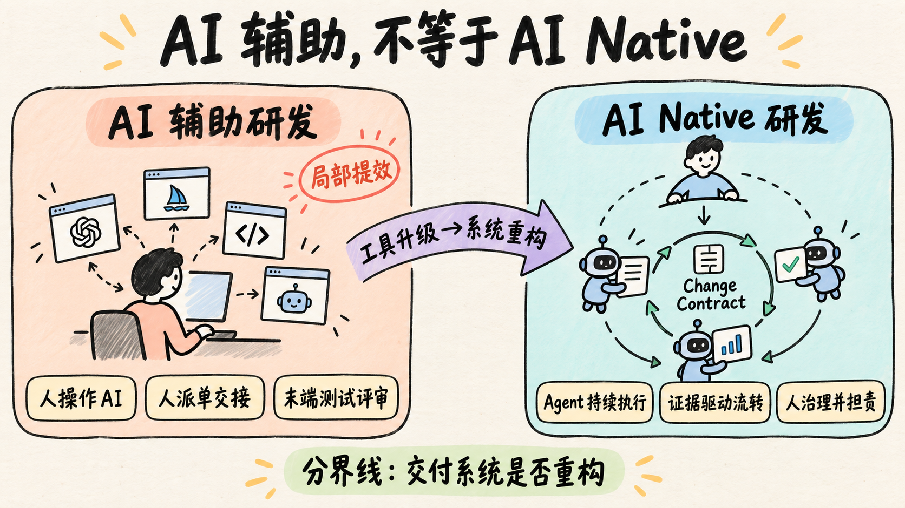
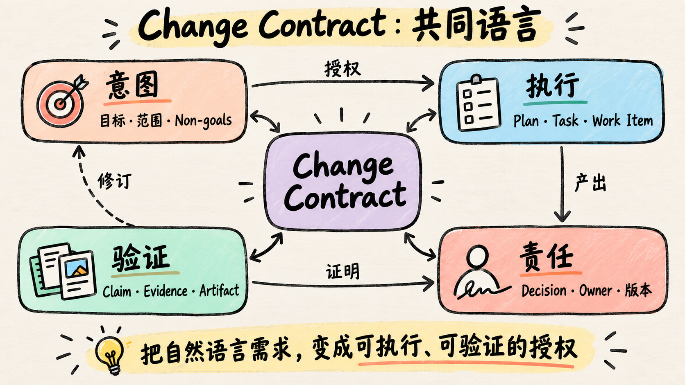
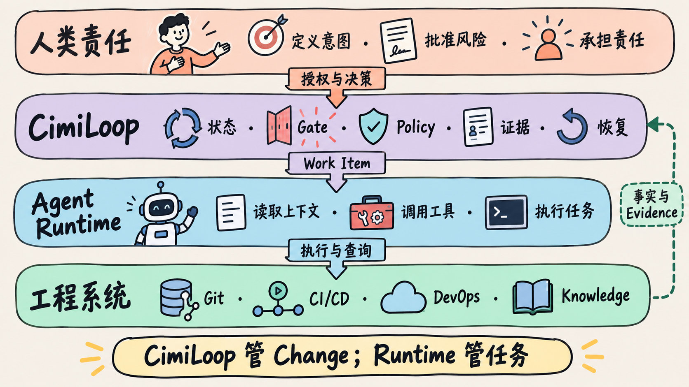
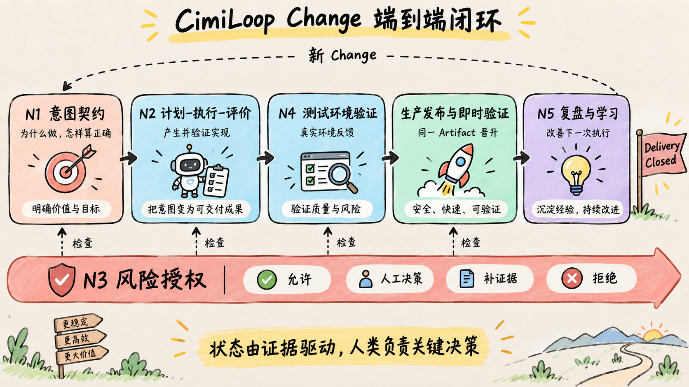
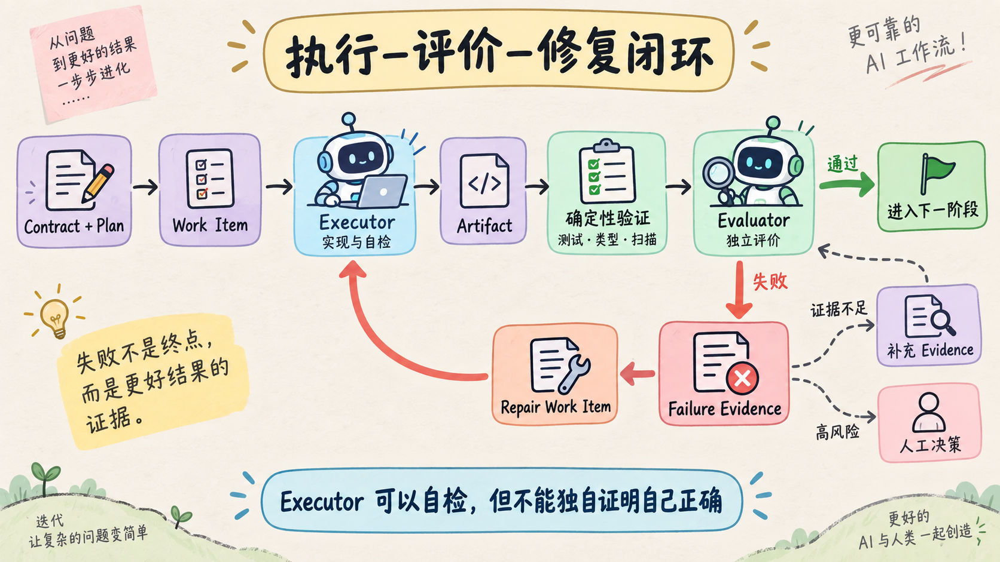
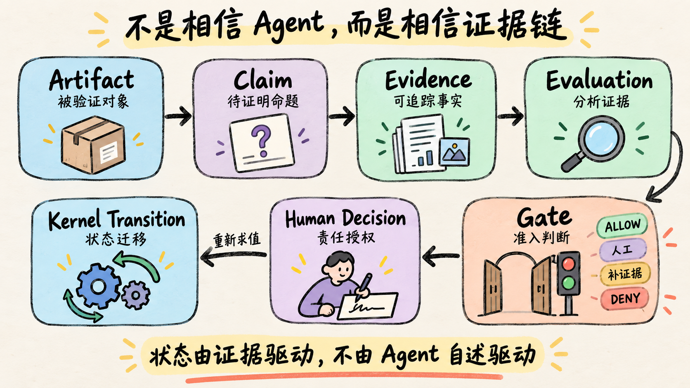
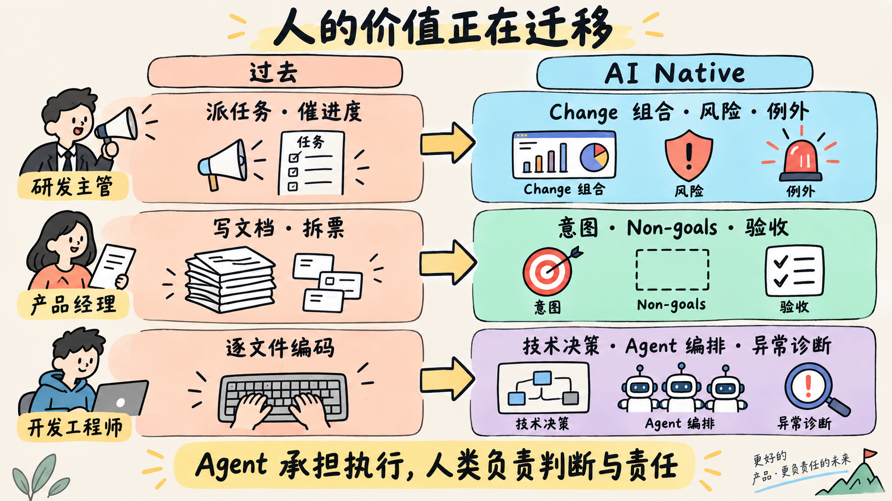
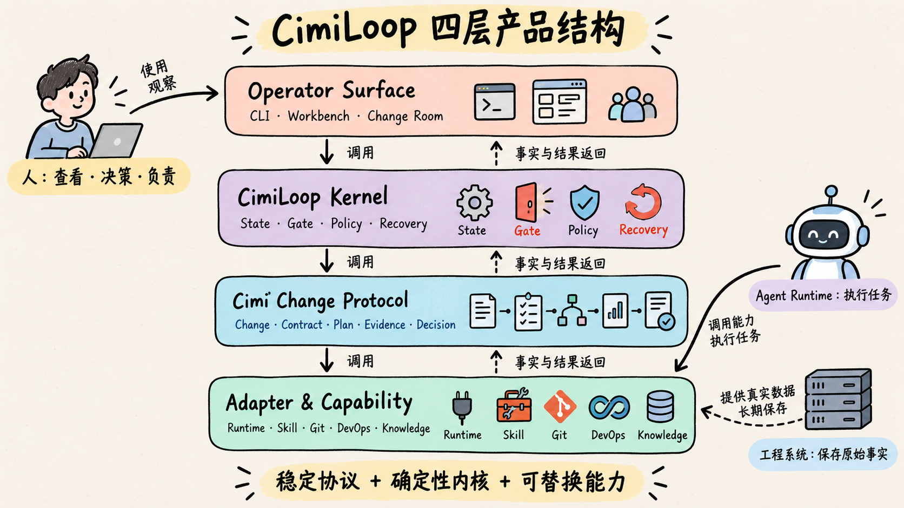

# 从 AI Native 新范式到 CimiLoop：让一次软件变更可信地走完

> 版本：v0.1  
> 面向对象：研发主管、产品经理、开发工程师及相关协作角色  
> 建议时长：45 分钟讲解 + 15 分钟讨论  
> 讲解目标：建立对 AI Native 软件研发新范式的共同认识，并说明 CimiLoop 为什么存在、如何运行、准备先解决什么问题。

## 开场：Agent 说“完成了”，我们敢发布吗？

先从一个很普通的需求开始：

> 给订单系统增加导出功能。

今天，一个编码 Agent 已经可以阅读代码、修改文件、补充测试，并在几十分钟后告诉我们：“功能已经完成，测试全部通过。”

这当然很有价值。但如果下一句话是“现在发布到生产”，我们通常还不敢直接点头。因为真实的软件交付还必须回答一系列问题：

- Agent 理解的是哪个版本的需求？
- 哪些内容在范围内，哪些明确不做？
- 谁确认这个理解可以进入实施？
- 管理员可以导出，有证据吗？
- 普通用户不能导出，有证据吗？
- 十万条订单的性能是否满足要求？
- 测试环境与生产环境使用的是不是同一个制品？
- 谁批准了这一个具体制品进入生产？
- 部署请求超时后，实际结果是成功、失败，还是未知？
- 生产验证失败时，应该回滚、关闭功能，还是向前修复？
- 产品文档、接口说明和运维手册是否同步更新？
- 几个月以后，我们还能不能解释这次变化为什么发生、如何验证、由谁批准？

这组问题揭示了一个关键区别：

> 编码 Agent 解决的是“当前任务怎样执行”；软件研发系统还必须解决“这次变化怎样被授权、验证、交付、恢复并关闭”。

今天介绍 CimiLoop，正是为了讨论后一类问题。

## 一、AI Native 不是给传统流程增加更多 AI 工具

现在很多团队已经在使用 AI。产品用 AI 整理需求，开发用 AI 生成代码，测试用 AI 补用例，运维用 AI 分析日志。这些实践能够提高局部效率，但大部分仍属于 **AI-assisted，也就是 AI 辅助研发**。

原来的流程并没有真正改变：

```text
人理解需求
→ 人拆解和派发任务
→ 人操作工具完成实现
→ 人在阶段末集中检查
→ 人把结果交接给下一个角色
```

AI 只是让某些节点更快。代码生成速度提高以后，瓶颈可能转移到评审、测试、发布和故障处理。我们会看到更多提交、更长的评审队列、更高的变更频率，却未必更快地把正确价值交付给用户。

AI Native 的变化发生在系统层：

```text
人定义意图、约束、规则与责任
→ 系统形成可执行、可验证的变更契约
→ Agent 在授权范围内持续计划、执行和修复
→ 测试与环境产生独立证据
→ 系统依据状态、风险和证据决定下一步
→ 人处理关键判断、例外和不可逆决策
→ 本次执行结果改善下一次执行能力
```

它不是简单地让 AI 写更多代码，而是重新分配软件研发中的执行权、决策权和责任。

可以用六个变化理解 AI-assisted 与 AI Native 的分界：

| 维度 | AI 辅助研发 | AI Native 研发 |
|---|---|---|
| 主要执行者 | 人操作 AI 完成每一步 | Agent 接受授权后持续执行 |
| 核心工作单元 | 项目阶段、需求单和任务单 | 可独立交付和验证的 Change |
| 核心工件 | 文档、任务和代码 | 可执行、可验证、可版本化的变更契约 |
| 流程控制 | 人派单、催办和交接 | 状态、规则、证据和任务图驱动 |
| 质量机制 | 末端测试与人工评审 | 执行—评价—修复闭环和环境反馈 |
| 人的位置 | 参与大多数执行步骤 | 定义意图、规则和风险，并承担责任 |



所以，判断一个团队是否进入 AI Native，不能只看代码中有多少内容由 AI 生成。真正的判断标准是：团队能否把一个真实意图稳定地转化为经过验证的软件变化，并且让整个过程可追踪、可控制、可恢复。

## 二、新范式的基本单元是 Change，而不是一次对话或一次提交

传统研发经常以阶段组织工作：需求、设计、开发、测试、发布。这个组织方式适合人类团队按专业分工批量交接，却不适合可以并行、异步、持续运行的 Agent。

AI Native 研发更适合以 **Change，也就是一次软件变更**，作为最小的交付、验证和责任单元。

一个 Change 可以是一项 Feature、一个 Bugfix、一次数据迁移、一项安全修复、一次实验，也可以是一次生产事故处置。同一个产品中，不同 Change 可以同时处于需求澄清、执行、测试验证、生产发布或复盘状态，不需要等待整个项目统一进入下一个阶段。

Change 也不等于常见的工程对象：

- 它不等于一个 Issue，因为一次 Change 可能关联多个 Issue；
- 它不等于一个 Git 分支或 PR，因为一次 Change 可能跨多个代码库和制品；
- 它不等于一个 Agent Session，因为一次 Change 可能包含规划、执行、评价和部署等多个 Session；
- 它不等于一次 Pipeline Run，因为一次 Change 可能经历多轮构建、测试和发布尝试。

Change 的价值在于建立了一条稳定主线：无论底层换了多少 Agent、模型、Skill、分支、流水线和环境，我们始终知道“这些动作属于哪一次变化，为什么发生，怎样才算正确，谁对它负责”。

## 三、Change Contract 是人、Agent 与系统的共同语言

只有一段自然语言需求，通常不足以支撑 Agent 长时间自主执行。它需要被整理成一份 **Change Contract，变更契约**。

变更契约至少回答六类问题：

1. 为什么要改变，期望产生什么结果；
2. 哪些内容在范围内，哪些明确不做；
3. 什么叫实现正确，如何验收；
4. 必须遵守哪些业务、技术、安全和合规约束；
5. 影响范围有多大，是否可逆；
6. 需要哪些证据，谁拥有相应决策权。

回到订单导出的例子，一份有效契约不能只写“增加导出功能”，而要明确：

- 只有管理员可以发起导出；
- 普通用户不可访问导出入口和接口；
- 导出内容不包含内部备注；
- 十万条订单必须采用异步导出，不阻塞在线请求；
- 本次不提供自定义字段模板；
- 权限、数据范围、性能和失败恢复都有对应验收方法。

代码是履行契约的结果，不是契约本身。测试、扫描、构建和部署记录也不只是附属材料，而是证明契约是否得到履行的 Evidence。

契约并不意味着需求永远冻结。新事实出现后，可以提出 Contract Amendment，经过对应责任人批准后形成新版本。未经批准就改变系统行为，是意图漂移；经过授权的契约演化，则是正常学习。



## 四、只有 Agent Runtime，还没有形成完整的软件交付系统

Claude Code、OpenCode、cimicode 等 Agent Runtime 已经很擅长理解上下文、修改代码、调用工具和执行测试。但 Runtime 的主要职责仍然是把一个当前任务执行出来。

它们不会天然成为以下事实的长期权威：

- 当前 Change 正处于哪个生命周期状态；
- 哪个 Contract 和 Plan 版本已经获得批准；
- 当前允许 Agent 修改什么、调用什么能力；
- 哪些 Claim 已经有充分 Evidence；
- 哪些 Decision 仍然有效；
- 哪个 Artifact 被批准进入哪个环境；
- 外部操作结果未知时应该核对还是重试；
- 失败后应当从哪个断点恢复；
- 当前 Change 是否已经满足关闭条件。

因此，AI Native 研发需要一个位于模型和工程系统之外的 **Harness**。模型决定 Agent 理论上能做什么；Harness 决定它在真实组织里能否长期、可靠、受控地完成工作。

这就是 CimiLoop 的位置。

## 五、用一句话认识 CimiLoop

> CimiLoop 是围绕一次软件 Change，管理它从意图澄清、计划、执行、验证、发布、知识更新、恢复到关闭全过程的 Runtime-neutral Harness。

更通俗地说：

> CimiLoop 管“这次变更如何可信地走完”；Agent Runtime 管“Agent 如何把当前任务执行出来”。

CimiLoop 不打算取代 Claude Code、OpenCode 或 cimicode，也不取代 Git、CI/CD、Artifact Registry、知识库或现有 Issue 系统。它把这些系统连接到同一个可信交付闭环中，同时保持各系统原有的事实权威。

这一区分非常重要。如果把 CimiLoop 理解为“再造一个编码 Agent”，它就会和模型能力竞赛；如果把它理解为“围绕 Change 的确定性治理与交付 Harness”，它就可以持续接入不同 Runtime、模型、Skill 和工程平台。



## 六、一次订单导出 Change 如何在 CimiLoop 中走完

CimiLoop 把一次 Change 的运行归纳为 N1–N5 五类能力。其中，N3 不是固定审批阶段，而是贯穿关键状态迁移的风险授权能力。



### N1：意图契约——先回答为什么做、怎样算正确

产品人员提出订单导出需求后，系统不会立刻授权 Agent 修改生产代码。首先要形成 Contract Candidate，明确目标、范围、Non-goals、验收标准、约束、风险和责任人。

Intent Owner 审核后，候选内容才成为正式、不可变的 Contract Version。正式实现必须绑定这个版本；如果目标、范围或验收标准发生变化，就必须形成新的契约修订。

这里人类的价值不是逐句润色文档，而是对意图和边界负责。

### N2：计划—执行—评价——让 Agent 持续工作，但不能自说自话

在契约获批后，Planner 形成 Plan 和 Task DAG，例如：

```text
T1 设计导出权限和异步任务方案
T2 实现导出服务
T3 增加权限、数据范围和性能测试
T4 更新 API 与产品说明
T5 准备部署和恢复方案
```

Technical Owner 批准 Plan 后，CimiLoop Kernel 才会为条件满足的 Task 创建 Work Item。Work Item 明确本次执行绑定的 Contract/Plan 版本、Workspace、权限、预算、停止条件和预期输出。

Executor Agent 在隔离 Worktree 中实现代码并进行自检。但“自己实现、自己证明正确”容易产生相关性风险，所以正式评价由上下文隔离的 Evaluator 完成。Evaluator 从契约重新推导验收场景、边界条件和反例，并结合测试、类型检查和扫描等确定性结果形成评价。

如果证据不足或发现错误，系统保留失败 Evidence，创建 Repair Work Item，让 Executor 修复后重新评价。Agent 可以持续循环，但必须受最大重试次数、预算、权限和人工升级条件约束。



### N3：风险授权——不是一道固定审批门

每次关键状态迁移前，Gate 都基于当前事实重新判断：

- Change 类型和风险等级；
- 当前 Contract、Plan 和 Artifact 版本；
- 已有 Evidence 是否充分、是否仍然适用；
- Project Policy 和环境规则；
- 是否存在有效的人类 Decision；
- 操作是否可逆，失败后能否恢复。

Gate 可以得到四类结果：

- `ALLOW`：满足条件，可以继续；
- `REQUIRE_HUMAN`：需要指定责任角色作出判断；
- `NEED_MORE_EVIDENCE`：证据不足，暂时不能继续；
- `DENY`：违反硬性规则，拒绝迁移。

因此，人类不是每一步都点确认。低风险、证据充分的动作可以自动推进；高风险、不可逆或出现异常时才把整理好的 Decision Package 交给正确的人。

### N4：环境验证与生产交付——同一个不可变制品逐级晋升

代码通过独立评价后，系统构建具有稳定 ID 和 Digest 的不可变 Artifact。测试环境验证的对象不是“某个分支的最新代码”，而是这个具体制品。

测试失败时，不能在环境里热改后直接发布。正确路径是返回源码修复、重新构建新 Artifact、重新评价和验证。测试通过后，系统形成生产发布决策包，其中包含拟发布制品、测试证据、已知问题、剩余风险、目标环境、恢复策略和即时验证步骤。

Release Owner 批准的是“这个 Artifact 在这个时间窗进入这个环境”，而不是给后续所有生产操作一张永久通行证。

生产部署完成后，还要核对实际 Digest、基础健康和核心路径。若外部调用超时导致结果未知，系统先执行 Reconciliation 查询真实状态，不能盲目重试。若即时验证失败，则按照事先授权的 Recovery Strategy 回滚、关闭功能、切换流量或向前修复；超出授权范围时立即暂停并升级。

### N5：复盘与学习——交付结束，但系统还要变得更可靠

一次 Change 中出现的失败、重试、人工修改、规则例外和环境异常，不应只留在聊天记录和复盘会议里。它们会形成 Learning Candidate，并被分类为：

- Contract 模板需要改进；
- Policy 或权限规则需要调整；
- Eval 和测试集需要补充；
- Skill 或执行方法需要改进；
- Harness 的调度、恢复或记录机制需要完善；
- Codebase 本身存在技术债；
- 需要创建一个新的 Change。

Agent 可以提出学习候选，但不能自动修改全局规则并立即生效。候选仍需经过 Owner 审核、历史回放、回归检查和版本发布。

至此，这次订单导出 Change 才真正完成了从意图到交付、再到组织学习的闭环。

## 七、CimiLoop 为什么值得信任：不是相信 Agent，而是相信证据链

CimiLoop 的可信交付链可以概括为：

```text
Artifact
→ Claim
→ Evidence
→ Evaluation
→ Gate Evaluation
→ Human Decision
→ Kernel Transition
```



这条链上的每一个概念都解决一个不同问题。

**Artifact** 是被验证的对象，例如订单服务某个确定 Digest 的制品。Artifact 存在，只能证明产生了结果，不能证明结果正确。

**Claim** 是明确、可验证或可反驳的命题，例如“普通用户不能导出订单”“导出文件不包含内部备注”。

**Evidence** 是支持、反驳或无法判断 Claim 的事实。它必须说明关联对象、Artifact Digest、环境、来源、范围和时间。

**Evaluation** 是对 Evidence 的分析；**Gate Evaluation** 是结合规则、版本、风险和 Decision 得出的一次准入判断。

**Human Decision** 记录某个具体 Actor 以明确责任角色，对精确对象和版本作出的批准、拒绝或修改要求。聊天中的一句“可以”不会自动变成正式授权。

最后，只有确定性的 **Kernel** 能执行正式状态迁移。即使刚刚有人批准，如果制品、证据、权限或 Policy 已经发生变化，Kernel 也必须重新求值，而不是使用过期批准继续推进。

这套机制的核心不是“不信任 AI”，而是把任何重要结论都放回可验证、可追踪的系统事实中。

## 八、对主管、产品和开发分别意味着什么

CimiLoop 不是只服务开发工程师的工具。它会改变不同角色在研发闭环中的关注点。

| 角色 | 过去经常投入的工作 | 在 CimiLoop 中更重要的责任 |
|---|---|---|
| 研发主管 | 派任务、催进度、收集状态 | 管理 Change 组合、风险、WIP、例外和系统吞吐 |
| 产品经理 | 写文档、拆票、反复解释需求 | 维护意图、Non-goals、验收标准和结果判断 |
| 开发工程师 | 逐文件编码、手工串联工具 | 领域建模、技术决策、Agent 编排、异常诊断和技术责任 |
| QA / 测试 | 重复回归和末端检查 | 设计 Claim、验收 Oracle、反例、评估集和独立评价 |
| 架构与平台 | 原则文档、末端评审、环境操作 | 将原则变成 Policy、Gate、Eval、能力和恢复机制 |



每个 Change 必须始终有且只有一个人类 Change Owner，负责推动闭环，但他不会因此自动拥有所有批准权。Intent Owner 对意图负责，Technical Owner 对技术计划负责，Release Owner 对生产发布负责，Policy Owner 对规则和例外负责。

在 Solo Mode 中，同一个人可以兼任多个角色，但每次正式 Decision 都记录 acting role。这样未来进入 Team Mode 时，可以自然拆分责任，而不需要重写历史。

## 九、CimiLoop 的产品和技术结构

从产品结构看，CimiLoop 包含四类构件：

```text
Operator Surface：CLI / Workbench / Change Room
        ↓
CimiLoop Kernel：State / Gate / Policy / Scheduling / Recovery
        ↓
Cimi Change Protocol：Change / Contract / Plan / Evidence / Decision / Event
        ↓
Adapter & Capability：Runtime / Skill / Git / DevOps / Knowledge
```



**Operator Surface** 让人查看当前焦点、处理 Attention Item、审核决策包，并理解 Change 如何走到当前状态。

**Kernel** 是确定性内核，维护生命周期状态、Gate、Policy、调度、幂等、失败处理、恢复和外部结果核对。页面和 Agent 都只能提交 Command，不能直接改状态。

**Cimi Change Protocol** 提供稳定的领域对象、身份、版本和关系，使不同 Runtime、模型和工程系统可以围绕同一种 Change 语义协作。

**Adapter & Capability** 负责接入 Agent Runtime、Skill、Tool、Git、CI/CD、Artifact Registry 和知识系统。流程声明需要什么语义能力，而不是写死某个产品实现。

进一步看，系统有六个一级能力域：

1. Interaction & Collaboration：人在哪里看、在哪里操作；
2. Change Lifecycle Kernel：Change 在哪里，下一步是否合法；
3. Intelligence & Context：谁来思考，使用哪些上下文和能力；
4. Engineering Execution & Delivery：代码、制品、环境和部署在哪里发生；
5. Trust & Governance：凭什么相信，凭什么允许继续；
6. Protocol, Data & Integration：事实如何稳定保存、引用和连接。

这六个能力域不是六个独立产品，更不是六个新的组织部门。它们共同服务同一条 Change 生命周期。

## 十、CimiLoop V1 为什么选择“窄范围、完整闭环”

CimiLoop V1 不追求一开始就成为组织级中央 Agent 平台，也不宣称已经实现完全自治。它选择默认 A1 监督模式：Agent 承担主要执行，人类批准意图、技术计划和具体生产发布，并处理异常与例外。

V1 要证明的不是“能不能再做一个代码生成 Demo”，而是能否在一个真实项目中完整走通：

```text
创建 Feature Change
→ 批准 Contract
→ 批准 Plan
→ Runtime 在隔离 Worktree 实现
→ 构建不可变 Artifact
→ 独立评价
→ 部署并验证测试环境
→ 批准具体生产 Release
→ 同一 Artifact Digest 晋升生产
→ 即时验证或按策略恢复
→ 完成知识义务
→ 关闭 Change
```

同时还必须覆盖评价失败、Evidence 失效、Decision 过期、外部结果未知、生产验证失败、Kernel 重启和权限变化等异常场景。

只有完整闭环稳定运行，并积累了足够真实数据以后，团队才有依据把某些低风险 Change 从 A1 提升到 A2 受控自治。自治不是给整个 Agent 一个永久等级，而是针对特定 Change Profile、特定代码库、特定能力和特定 Harness 版本逐项放开。

## 十一、现场如何演示 CimiLoop

如果只用文章和架构图，大家能够理解概念，但可能仍会把 CimiLoop 想象成“一个流程管理后台”。因此，建议为分享准备一个轻量可交互原型，但不要做成完整产品 Demo。

原型只需要演示一条订单导出 Change 的黄金路径，控制在 5–7 分钟：

1. **Project Workbench**：看到不同 Change 的状态，以及当前需要人关注的事项；
2. **创建 Change**：输入订单导出需求，形成 Contract Candidate；
3. **Change Room**：查看 Contract、Plan、Task DAG 和当前焦点；
4. **Agent Execution**：展示 Executor 运行、Artifact Candidate 和失败 Evidence；
5. **独立评价**：Evaluator 发现普通用户权限测试缺失，Change 返回修复；
6. **Release Decision**：测试通过后，主管看到具体 Artifact、风险、证据和恢复策略，并批准发布；
7. **Timeline**：最后展示这次 Change 从创建、修复、授权、发布到关闭的完整事实链。

这个原型最重要的不是视觉精美，而是让听众亲眼看到三件事：

- Agent 运行成功，不等于 Change 完成；
- 人看到的是整理好的决策包，而不是原始日志海洋；
- 每一次状态变化都能追溯到对应版本、证据、规则和责任人。

建议把它做成纯前端、固定数据、可点击的演示原型，不接真实 Runtime、数据库和 DevOps。这样可以低成本验证信息架构和讲解效果，也不会让现场演示被环境问题打断。

## 结语：CimiLoop 不是替人开发，而是重建软件变化的运行方式

AI Native 软件研发不是无人研发，也不是在传统流程的每个节点增加一个 AI 助手。它真正改变的是软件变化的基本关系：

- 意图如何成为授权；
- Agent 如何在边界内持续执行；
- 正确性如何被独立证明；
- 风险如何决定权限和人工介入；
- 制品如何安全地从测试进入生产；
- 失败如何恢复；
- 经验如何成为下一次执行能力；
- 最终责任如何始终归属于人。

传统研发围绕人的执行和部门交接建立；AI Native 研发围绕 Change、Contract、Agent、Evidence 和责任建立。

CimiLoop 的目标，就是为这套新关系提供一个确定性的运行与治理底座：不取代 Agent Runtime，不取代现有工程平台，而是让一次真实的软件 Change 能够可信、可控、可恢复地走完。

如果最终只能记住三句话，希望是：

> 第一，AI Native 的标志不是 AI 写了多少代码，而是 Agent 能否在治理下完成交付闭环。  
> 第二，CimiLoop 管一次 Change 如何可信地走完，Runtime 管当前任务如何执行。  
> 第三，状态由证据驱动，人类在意图、风险、例外和责任处发挥作用。

---

## 附录：45 分钟讲解节奏

| 时间 | 内容 | 建议方式 |
|---:|---|---|
| 0–5 分钟 | Agent 说完成了，我们敢发布吗 | 订单导出案例，连续提问 |
| 5–12 分钟 | AI-assisted 与 AI Native | 左右对比图 |
| 12–16 分钟 | Runtime 与 Harness 的缺口 | 一句话过桥 |
| 16–21 分钟 | CimiLoop 定义与边界 | 总览图 |
| 21–31 分钟 | N1–N5 端到端闭环 | 沿订单导出案例讲解 |
| 31–36 分钟 | Claim–Evidence 可信链 | 证据链图 |
| 36–40 分钟 | 四层产品结构与六个能力域 | 架构图，只讲职责 |
| 40–45 分钟 | V1、演进方向与三句话总结 | 收束并进入讨论 |

## 参考材料

- [AI Native 软件研发新范式](./01-AI-Native软件研发新范式.md)
- [CimiLoop AI Native 软件研发流程规范](./02-CimiLoop-AI-Native软件研发流程规范-v0.1.md)
- [CimiLoop 整体架构通俗解读](../architecture/CimiLoop整体架构通俗解读-v0.1.md)
- [CimiLoop 整体能力架构](../architecture/CimiLoop整体能力架构-v0.1.md)
- [CimiLoop Change 端到端状态机](../architecture/CimiLoopChange端到端状态机-v0.1.md)
- [CimiLoop 验证与证据模型](../architecture/CimiLoop验证与证据模型-v0.1.md)
